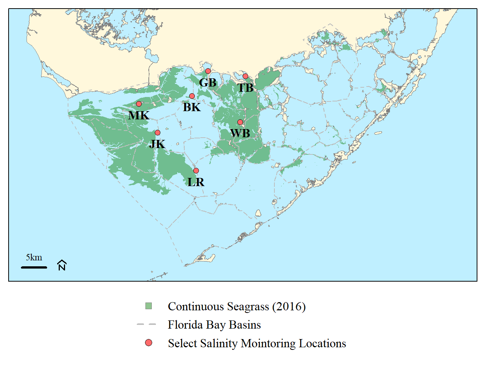

<!-- <style type="text/css"> -->

<!-- font-family: Arial -->

<!-- </stlye> -->

<!-- if stuck git push -f origin -->

<!-- git help https://medium.com/analytics-vidhya/tutorial-removing-large-files-from-git-78dbf4cf83a -->

------------------------------------------------------------------------

```{r date,echo=FALSE,message=FALSE,warning=FALSE}
up.date=format(Sys.time(),tz="America/New_York",usetz=T,"%F %R")
up.date=as.POSIXct(up.date,tz="America/New_York")

dst.check=lubridate::dst(as.POSIXct(up.date))

```

`r paste("Updated:",up.date, ifelse(dst.check==T,"EDT","EST"))`

<!--  -->

------------------------------------------------------------------------

## Purpose

This webpage/report is intended to aggregate information from different
agencies (i.e. USACE, SFWMD, FWC, USGS and NOAA) into one spot to help
inform local government agencies and stakeholders on conditions within
Lake Okeechobee, the Northern Estuaries and the Everglades ecosystem.
The data provided here should be considered preliminary and are subject
to change.

```{r setup, include=FALSE}
knitr::opts_chunk$set(echo=FALSE,
                      message=FALSE,
                      warning=FALSE,
                      fig.path="plots/",
                      dev.args = list(png = list(type = "cairo")))
# check.packages <- function(pkg){
#   new.pkg <- pkg[!(pkg %in% installed.packages()[, "Package"])]
#   if (length(new.pkg))
#     install.packages(new.pkg, dependencies = TRUE)
#   sapply(pkg, require, character.only = TRUE)
# }
# 
# pks.list=c("rmarkdown","knitr","reshape2","plyr","zoo","lubridate","flextable","magrittr","RcppRoll","dataRetrieval","downloadthis","stringi")
# 
# check.packages("remotes")
# # check.package.git("SwampThingPaul","AnalystHelper")
# ## Specific to AnalystHelper for GA actions issues
# pkg=c("AnalystHelper" )
# new.pkg=pkg[!(pkg %in% installed.packages()[, "Package"])]
# if(length(new.pkg)>0){
#   remotes::install_url("https://raw.githubusercontent.com/sccf-tech/CRE_Conditions/main/report/resource/AnalystHelper_0.1.2.tar.gz",
#                        upgrade=FALSE,quiet=TRUE)
# }

## Libraries
library(AnalystHelper)
# source("C:/Julian_LaCie/_GitHub/EvergladesConditions/report/select_AnalystHelper_source.R")
# source("./select_AnalystHelper_source.R")
library(reshape2)
library(plyr)
library(zoo)
library(lubridate)
library(flextable)
library(magrittr)
library(RcppRoll)
library(dataRetrieval)
library(downloadthis)

library(sf)
library(raster)
library(EVERSpatDat)

library(rvest)
## custom fun
roundUp <- function(x) 10^ceiling(log10(x))

ci.reverse.scaling.fun=function(DN){
  10^(3.0 / 250.0 * DN - 4.2)
}
ci.scaling.fun=function(ci){
  round(83.3 * (log10(ci[ci>0]) + 4.2))
}
decdate.fun=function(date){
  Y=as.numeric(format(date,"%Y"))
  start=date.fun(paste(Y,1,1,sep="-"))
  end=date.fun(paste(Y+1,1,1,sep="-"))
  sofar <- as.numeric(difftime(date, start, units = "secs"))
  total <- as.numeric(difftime(end, start, units = "secs"))
  Y + sofar / total
}

source("windrose_fun.R")
# source("C:/Julian_LaCie/_GitHub/EvergladesConditions/report/windrose_fun.R")
## webscrape tools
# library(rvest)
# library(jsonlite)
# library(httr)
## Spatial
# library(sp)
# library(rgdal)
# library(rgeos)
# library(tmap)
# library(raster)

# CRS
nad83.pro=st_crs("EPSG:4269")
utm17=st_crs("EPSG:26917")
wgs84=st_crs("EPSG:4326")
# tmap_mode("view")
###
dates=seq(date.fun(date.fun(Sys.Date())-ddays(13)),date.fun(Sys.Date()),"1 days")

#### GIS data
# shore=spTransform(readOGR("C:/Julian_LaCie/_GISData/FWC","FWC_Shoreline_simp"),wgs84)
# shore=readOGR("C:/Julian_LaCie/_GISData/FWC","FWC_Shoreline_simp")
# shore=readOGR("./GISData","FWC_Shoreline_simp_WGS") 
#shore=sp::spTransform(shore,CRSobj=wgs84)
# writeOGR(shore,"C:/Julian_LaCie/_GitHub/CRE_Conditions/report/GISData","FWC_Shoreline_simp_WGS",driver="ESRI Shapefile")

# lakeO=readOGR("C:/Julian_LaCie/_GitHub/CRE_Conditions/report/GISData","LakeOkeechobee_general")
# lakeO=readOGR("./GISData","LakeOkeechobee_general")
# lakeO=sp::spTransform(lakeO,utm17)

# lakeO.lit=readOGR("C:/Julian_LaCie/_GitHub/CRE_Conditions/report/GISData","LOK_littoral")
# lakeO.lit=readOGR("./GISData","LOK_littoral")
# lakeO.lit=sp::spTransform(lakeO.lit,utm17)

CurWY=WY(date.fun(Sys.time()))

Start.Date=date.fun(paste(CurWY-4,05,01,sep="-"))
End.Date=date.fun(Sys.time())

YEST=date.fun(End.Date-ddays(1))
# Data from USACE Daily Map -----------------------------------------------
dates=seq(date.fun(paste(format(Sys.Date(),"%Y"),"01","01",sep="-")),date.fun(Sys.Date()),"1 days")

## Maps and Archived data
# mapdata=readLines("https://w3.saj.usace.army.mil/h2o/reports/StatusDaily/archive/1217/StatusDaily.htm")

map.q=data.frame()
for(i in 1:(length(dates))){
  map.url=paste0("https://w3.saj.usace.army.mil/h2o/reports/StatusDaily/archive/",format(dates[i],"%m%d"),"/StatusDaily.htm")
  # download.file(map.url, destfile = "map_dat.html", quiet=TRUE)
  mapdata=readLines(map.url)
  
  val=grep("S354",mapdata)
  S354=strsplit(strsplit(mapdata[val],"\\s+")[[1]][8],"</div>")[[1]][1]
  
  val=grep("S351",mapdata)
  S351=strsplit(strsplit(mapdata[val],"\\s+")[[1]][8],"</div>")[[1]][1]
  
  val=grep("S352",mapdata)
  S352=strsplit(strsplit(mapdata[val],"\\s+")[[1]][8],"</div>")[[1]][1]
  
  val=grep("S-271",mapdata)
  S271=strsplit(strsplit(mapdata[val],"\\s+")[[1]][6],"</div>")[[1]][1]
  
  val=grep("CA1IN",mapdata)
  WCA1=strsplit(strsplit(mapdata[val],"\\s+")[[1]][13],"</div>")[[1]][1]
  
  val=grep("CA2IN",mapdata)
  WCA2=strsplit(strsplit(mapdata[val],"\\s+")[[1]][13],"</div>")[[1]][1]
  
  val=grep("CA3IN",mapdata)
  WCA3=strsplit(strsplit(mapdata[val],"\\s+")[[1]][13],"</div>")[[1]][1]
  
  val=grep("S10",mapdata)
  S10s=as.numeric(strsplit(strsplit(mapdata[val],"\\s+")[[1]][8],"</div>")[[1]][1])
  
  val=grep("S11",mapdata)
  S11s=as.numeric(strsplit(strsplit(mapdata[val],"\\s+")[[1]][8],"</div>")[[1]][1])
  
  val=grep("S12",mapdata)
  S12s=as.numeric(strsplit(strsplit(mapdata[val],"\\s+")[[1]][8],"</div>")[[1]][1])
  
  val=grep("S333",mapdata)
  S333=as.numeric(strsplit(mapdata[val],"<br>|\\s+")[[1]][12])
  S333N=as.numeric(strsplit(strsplit(mapdata[val],"<br>|\\s+")[[1]][14],"</div>")[[1]][1])
  
  val=grep("S356",mapdata)
  S356=as.numeric(strsplit(strsplit(mapdata[val],"\\s+")[[1]][8],"</div>")[[1]][1])
  
  ENP=S12s+(S333+S333N)-S356
  
  val=grep("Istokpoga</a>",mapdata)
  Istok=strsplit(strsplit(mapdata[val],"\\s+")[[1]][6],"</div>")[[1]][1]
  
  val=grep("S-65E</a>",mapdata)
  S65E=strsplit(strsplit(mapdata[val],"\\s+")[[1]][6],"<br>")[[1]][1]
  
  val=grep("S-65EX1</a>",mapdata)
  S65EX1=strsplit(strsplit(mapdata[val],"\\s+")[[1]][6],"<br>")[[1]][1]
  
  val=grep("Fisheating Creek",mapdata)
  FEC=strsplit(strsplit(mapdata[val],"\\s+")[[1]][7],"</div>")[[1]][1]
  
  val=grep("/plots/s79h.pdf",mapdata)
  S79=strsplit(strsplit(mapdata[val],"\\s+")[[1]][6],"</a>")[[1]][1]
  # 
  # val=grep("/plots/s78h.pdf",mapdata)
  # S78=strsplit(strsplit(mapdata[val],"\\s+")[[1]][6],"</a>")[[1]][1]
  
  val=grep("/plots/s77",mapdata)
  S77=strsplit(strsplit(mapdata[val],"\\s+")[[1]][6],"</a>")[[1]][1]
  
  val=grep("/plots/s308",mapdata)
  S308=strsplit(strsplit(mapdata[val],"\\s+")[[1]][6],"</a>")[[1]][1]
  
  val=grep("/plots/s80",mapdata)
  S80=strsplit(strsplit(mapdata[val],"\\s+")[[1]][6],"</a>")[[1]][1]
  
  val=grep("S155A",mapdata);# Lake Worth Lagoon
  S155A=strsplit(strsplit(mapdata[val],"\\s+")[[1]][8],"</")[[1]][1]
  
  # other LOK inflows
  grep("inflows",mapdata)
  mapdata[213]
  tmp=strsplit(mapdata[213],"<br>|>")[[1]]
  OtherLOKInflow=sum(as.numeric(sapply(strsplit(tmp[grepl(" inflows",tmp)],":"),"[")[2,]))
  
  val=grep("../plots/ok8hhp.pdf",mapdata)
  LakeStage=as.numeric(strsplit(mapdata[val[1]],"\\s+")[[1]][6])
  
  # date.val=dates[i]-ddays(1)
  date.val=dates[i]
  rslt=data.frame(Date=date.val-ddays(1),
                  OtherLOKInflow=OtherLOKInflow,
                  FEC=as.numeric(FEC),
                  Istok=as.numeric(Istok),
                  S65E=as.numeric(S65E),
                  S65EX1=as.numeric(S65EX1),
                  S354=as.numeric(S354),
                  S351=as.numeric(S351),
                  S352=as.numeric(S352),
                  S271=as.numeric(S271),
                  S77=as.numeric(S77),
                  S79=as.numeric(S79),
                  S80=as.numeric(S80),
                  S308=as.numeric(S308),
                  WCA1=as.numeric(WCA1),
                  WCA2=as.numeric(WCA2),
                  WCA3=as.numeric(WCA3),
                  S10s=as.numeric(S10s),
                  S11s=as.numeric(S11s),
                  ENP=as.numeric(ENP),
                  S12s=as.numeric(S12s),
                  S333=as.numeric(S333),
                  S333N=as.numeric(S333N),
                  S356=as.numeric(S356),
                  S155A=as.numeric(S155A),
                  LOK.stage=as.numeric(LakeStage)
                  )
  map.q=rbind(map.q,rslt)
  print(i)
}


map.SDCS=data.frame()
for(i in 1:(length(dates))){
  map.url=paste0("https://w3.saj.usace.army.mil/h2o/reports/SDCSDaily/archive/",format(dates[i],"%m%d"),"/SDCSDaily.htm")
  # download.file(map.url, destfile = "map_dat.html", quiet=TRUE)
  mapdata=readLines(map.url)
  
  val=grep("S355A",mapdata)
  S355A=as.numeric(strsplit(mapdata[val],">S-355A:|</div>")[[1]][2])
  
  val=grep("S355B",mapdata)
  S355B=as.numeric(strsplit(mapdata[val],">S-355B:|</div>")[[1]][2])
  
  val=grep("L-29",mapdata)
  L29Canal=as.numeric(strsplit(mapdata[val],"Canal:|ft")[[1]][3])
  
  date.val=dates[i]-ddays(1)
  rslt=data.frame(Date=date.val,L29Canal.map=L29Canal)
  map.SDCS=rbind(map.SDCS,rslt)
  print(i)
}

# LO.url="https://w3.saj.usace.army.mil/h2o/reports/r-oke.html"
# LO.report=readLines(LO.url)
# 
# tmp2=data.frame(t(sapply(strsplit(LO.report[285:298],"\\s+"),c)))
# colnames(tmp2)=c("day","month","year","S310","S351","S352","S354","L8")
# tmp2$Date=with(tmp2,date.fun(paste(year,month,day),form="%Y %B %d"))
# tmp2[,4:8]=sapply(tmp2[,4:8],as.numeric)


map.q[,2:ncol(map.q)]=sapply(map.q[,2:ncol(map.q)], FUN=function(x) ifelse(is.na(x)==T,0,x))

map.q$NthLake=rowSums(map.q[,c("FEC","Istok","S65E","S65EX1")],na.rm=T)
map.q$LOIN=rowSums(map.q[,c("OtherLOKInflow","FEC","Istok","S65E","S65EX1")],na.rm=T)
map.q$LOOUT=rowSums(map.q[,c("S77","S354","S351","S352","S271","S308")],na.rm=T)

map.q$LOK_to_EAA=(rowSums(map.q[,c("S354","S351","S352","S271")],na.rm=T))
map.q$EAA_to_WCAs=(rowSums(map.q[,c("WCA1","WCA2","WCA3")],na.rm=T))

subset(map.q,WCA2<0)
map.q$WCA2_in=with(map.q,ifelse(WCA2<0,0,WCA2))
map.q$EAA_WCA1.out=apply(map.q[,c("S10s","WCA1")],1,min,na.rm=T)# EAA flow through WCA1
map.q$EAA_WCA2.out=apply(map.q[,c("S11s","WCA2_in")],1,min,na.rm=T)# EAA flow through WCA2

map.q$EAA_WCA2=with(map.q,WCA2+EAA_WCA1.out)
map.q$EAA_WCA3=with(map.q,WCA3+EAA_WCA2.out)


## 7-day sumamry information (for SCCF)
vars=c("Date","S77","S79","S351","S352","S354","S271","S308","S80","NthLake","WCA1","WCA2","WCA3","ENP","LOIN","LOOUT")
date.7day=seq(date.fun(date.fun(Sys.Date())-ddays(7)),date.fun(Sys.Date()),"1 days")

q.dat.7day=subset(map.q,Date%in%date.7day)[,vars]
q.dat.7day[,2:ncol(q.dat.7day)]=apply(q.dat.7day[,2:ncol(q.dat.7day)],2,FUN=function(x) cfs.to.acftd(x))

meanQ=cbind(data.frame(Date="Average"),data.frame(t(apply(q.dat.7day[,2:ncol(q.dat.7day)],2,FUN=function(x) mean(x,na.rm=T)))))
sumQ=cbind(data.frame(Date="Sum"),data.frame(t(apply(q.dat.7day[,2:ncol(q.dat.7day)],2,FUN=function(x) sum(x,na.rm=T)))))

## 
laketotalQ=q.dat.7day[,c("S77","S351","S352","S354","S271","S308")]
q.from.Lake=sum(laketotalQ[laketotalQ>0],na.rm=T)
laketotalQ$EAA=rowSums(laketotalQ[,c("S351","S352","S354")],na.rm=T)
S77q=sum(laketotalQ[laketotalQ$S77>0,c("S77")],na.rm=T)
S77q.per=if(q.from.Lake==0){0}else if((S77q/q.from.Lake)*100<1){"< 1"}else{round((S77q/q.from.Lake)*100,0)}

S308q=sum(laketotalQ[,c("S308")],na.rm=T)
S308q.pos=sum(laketotalQ[laketotalQ$S308>0,c("S308")],na.rm=T)
S308q.per=ifelse(S308q<0,NA,round((S308q/q.from.Lake)*100,0))

L8q=sum(laketotalQ[,c("S271")],na.rm=T)
L8q.pos=sum(laketotalQ[laketotalQ$L8>0,c("S271")])
L8q.per=ifelse(L8q<0,NA,round((L8q/q.from.Lake)*100,0))

EAAq=sum(laketotalQ[,c("EAA")],na.rm=T)
EAAq.pos=sum(laketotalQ[laketotalQ$EAA>0,c("EAA")],na.rm=T)
EAAq.per=ifelse(EAAq<0,NA,round((EAAq/q.from.Lake)*100,0))

laketotalQ2=q.dat.7day[,c("S77","S351","S352","S354","S271","S308")]
tmp=apply(laketotalQ2,2,min,na.rm=T)
v=names(tmp[tmp<0])
v[v=="S271"]="C10A"
v.val=knitr::combine_words(v)

q.BF.Lake=sum(abs(laketotalQ2[laketotalQ2<0]),na.rm=T)
q.in.Lake=sum(q.dat.7day[,"NthLake"],na.rm=T)

q.dat.7day$Date=as.character(q.dat.7day$Date)

rbind(q.dat.7day,meanQ,sumQ)

# DBHydro -----------------------------------------------------------------

dates=c(Start.Date,End.Date)

#Start.Date=date.fun(paste(CurWY-10,05,01,sep="-"))
# End.Date=date.fun(Sys.time())
flab.dates=c(date.fun(paste(CurWY-14,05,01,sep="-")),End.Date)


## Lake Okeechobee ---------------------------------------------------------

comp.dbkey=data.frame(DBKEY=c("N3466","06832"),Priority=c("P2","P1"))
# AnalystHelper::DBHYDRO.meta.byDBKEY(comp.dbkey$DBKEY)

stg.da=data.frame()
for(i in 1:nrow(comp.dbkey)){
  tmp=DBHYDRO_daily(dates[1],dates[2],comp.dbkey$DBKEY[i])
  tmp$DBKEY=as.character(comp.dbkey$DBKEY[i])
  stg.da=rbind(stg.da,tmp)
}
stg.da=merge(stg.da,comp.dbkey,"DBKEY")
stg.da$DATE=date.fun(stg.da$Date)

LakeO.xtab=dcast(stg.da,DATE~Priority,value.var="Data.Value",mean)
LakeO.xtab$Mean=with(LakeO.xtab,ifelse(is.na(P1)==T,P2,P1))

fill=data.frame(DATE=seq(min(LakeO.xtab$DATE),max(map.q$Date),"1 days"))
LakeO.xtab=merge(LakeO.xtab,fill,"DATE",all.y=T)

LakeO.xtab=merge(LakeO.xtab,map.q[,c("Date","LOK.stage")],by.x="DATE",by.y="Date",all.x=T)
LakeO.xtab$LOK.stage=with(LakeO.xtab,ifelse(is.na(Mean)==T,LOK.stage,Mean))
LakeO.xtab$DOWY=hydro.day(LakeO.xtab$DATE)
LakeO.xtab$WY=WY(LakeO.xtab$DATE)


LakeO.xtab$recess_7day=with(LakeO.xtab,c(rep(NA,7),diff(LOK.stage,lag=7)))
LakeO.xtab$recess_30day=with(LakeO.xtab,c(rep(NA,30),diff(LOK.stage,lag=30)))
LakeO.xtab$DoY=as.numeric(format(LakeO.xtab$DATE,"%j"))
LakeO.xtab$CY=as.numeric(format(LakeO.xtab$DATE,"%Y"))
tail(LakeO.xtab)
# writeClipboard(as.character(tail(LakeO.xtab,20L)[,c("DATE")]))
# writeClipboard(as.character(tail(LakeO.xtab,20L)[,c("LOK.stage")]))
## EAA ---------------------------------------------------------------------
stg.ops.rng=data.frame(Struct=c("S2","S3","S4","S5A","S5AS","S6","S7","S8","C10A"),
                       Canal=c("Hillsboro/N.NewRiver","Miami","Canal20","WPB","Canal10","Hills","NNR","Miami","L8"),
                       LORS.upper=c(12,12,13,12,NA,12,12,12.0,14),
                       LORS.lower=c(11.5,11.5,13,11.5,NA,11.5,11.5,11.5,12),
                       LOSOM.upper=c(13,13,13,13,18,13,NA,NA,NA),
                       LOSOM.lower=c(10,10,9.5,9.0,12,13,NA,NA,NA)
                       
)

STG.locs=EAA.STG.locs=data.frame(STATION=c("S3_H","HILLSS2","NNRS2","S352","L8.441"),
                    DBKEY=c("65448","00345","00432","40536","02854"),
                    CANAL=c("Miami","Hills","NNR","WPB","L8"))
STG.locs=subset(STG.locs,STATION!="NNRS2");# data issue on DBHYRO SFWMD
# AnalystHelper::DBHYDRO.meta.byDBKEY(STG.locs$DBKEY)
stg.dat=data.frame()
for(i in 1:nrow(STG.locs)){
  tmp=DBHYDRO_daily(dates[1],dates[2],STG.locs$DBKEY[i])
  tmp$DBKEY=as.character(STG.locs$DBKEY[i])
  stg.dat=rbind(stg.dat,tmp)
}

## for USGS
STG.locs=rbind(STG.locs,
               data.frame(STATION=c("NNRS2"),DBKEY=c("02283500"),CANAL=c("NNR"))
)
## Fill NNR site from USGS
NNR.stage=readNWISdv("02283500","00065",format(dates[1],"%Y-%m-%d"),format(dates[2],"%Y-%m-%d"))|>
  renameNWISColumns()
NNR.stage$Date=date.fun(NNR.stage$Date,tz="America/New_York")

stg.dat=rbind(stg.dat,
              with(NNR.stage,data.frame(Station="NNRS2",DBKEY=site_no,Daily.Date=Date,Data.Value=GH,Qualifier=GH_cd,Revision.Date=NA,Date=Date))
)
              
stg.dat$DATE=date.fun(stg.dat$Date)
stg.dat=merge(stg.dat,STG.locs,"DBKEY")

# stg.dat$month=as.numeric(format(stg.dat$Date,"%m"))
# stg.dat$CY=as.numeric(format(stg.dat$Date,"%Y"))
# stg.dat$WY=WY(stg.dat$Date)

EAA_canals.stg.dat=stg.dat
EAA_canals=dcast(stg.dat,DATE~STATION,value.var="Data.Value",mean)

EAA_canals$DOWY=hydro.day(EAA_canals$DATE)
EAA_canals$WY=WY(EAA_canals$DATE)
EAA_canals$DoY=as.numeric(format(EAA_canals$DATE,"%j"))
EAA_canals$CY=as.numeric(format(EAA_canals$DATE,"%Y"))


## WCA1 --------------------------------------------------------------------
WCA1.dbkeys=data.frame(STATION=c("CA1-8T","CA1-9","CA1-7"),
                       DBKEY=c("15809","15811","15808"))
# data.frame(STATION="3GAvg",DBKEY="15943")

stg.da=data.frame()
for(i in 1:nrow(WCA1.dbkeys)){
  tmp=DBHYDRO_daily(dates[1],dates[2],WCA1.dbkeys$DBKEY[i])
  tmp$DBKEY=as.character(WCA1.dbkeys$DBKEY[i])
  stg.da=rbind(stg.da,tmp)
}
stg.da=merge(stg.da,WCA1.dbkeys,"DBKEY")
stg.da$DATE=date.fun(stg.da$Date)

WCA1.xtab=dcast(stg.da,DATE~STATION,value.var="Data.Value",mean)
WCA1.xtab$Avg.8T97=rowMeans(WCA1.xtab[,c("CA1-8T","CA1-9","CA1-7")],na.rm=T)

WCA1.xtab$recess_7day=with(WCA1.xtab,c(rep(NA,7),diff(Avg.8T97,lag=7)))
WCA1.xtab$recess_30day=with(WCA1.xtab,c(rep(NA,30),diff(Avg.8T97,lag=30)))
WCA1.xtab$DoY=as.numeric(format(WCA1.xtab$DATE,"%j"))
WCA1.xtab$CY=as.numeric(format(WCA1.xtab$DATE,"%Y"))

WCA1.xtab$DOWY=hydro.day(WCA1.xtab$DATE)
WCA1.xtab$WY=WY(WCA1.xtab$DATE)

## WCA2 --------------------------------------------------------------------
WCA2.dbkeys=data.frame(STATION=c("S11B_H","CA217"),
                       DBKEY=c("WN126","16531"))
# data.frame(STATION="3GAvg",DBKEY="15943")

stg.da=data.frame()
for(i in 1:nrow(WCA2.dbkeys)){
  tmp=DBHYDRO_daily(dates[1],dates[2],WCA2.dbkeys$DBKEY[i])
  tmp$DBKEY=as.character(WCA2.dbkeys$DBKEY[i])
  stg.da=rbind(stg.da,tmp)
}
stg.da=merge(stg.da,WCA2.dbkeys,"DBKEY")
stg.da$DATE=date.fun(stg.da$Date)

WCA2.xtab=dcast(stg.da,DATE~STATION,value.var="Data.Value",mean)

WCA2.xtab$recess_7day=with(WCA2.xtab,c(rep(NA,7),diff(CA217,lag=7)))
WCA2.xtab$recess_30day=with(WCA2.xtab,c(rep(NA,30),diff(CA217,lag=30)))
WCA2.xtab$DoY=as.numeric(format(WCA2.xtab$DATE,"%j"))
WCA2.xtab$CY=as.numeric(format(WCA2.xtab$DATE,"%Y"))
WCA2.xtab$DOWY=hydro.day(WCA2.xtab$DATE)
WCA2.xtab$WY=WY(WCA2.xtab$DATE)
## WCA3 --------------------------------------------------------------------
WCA3.dbkeys=data.frame(STATION=c("CA3-62","CA3-63","CA3-64","CA3-65"),
                       DBKEY=c("16536","16532","16537","16538"))
# data.frame(STATION="3GAvg",DBKEY="15943")

stg.da=data.frame()
for(i in 1:nrow(WCA3.dbkeys)){
  tmp=DBHYDRO_daily(dates[1],dates[2],WCA3.dbkeys$DBKEY[i])
  tmp$DBKEY=as.character(WCA3.dbkeys$DBKEY[i])
  stg.da=rbind(stg.da,tmp)
}
stg.da=merge(stg.da,WCA3.dbkeys,"DBKEY")
stg.da$DATE=date.fun(stg.da$Date)

WCA3.xtab=dcast(stg.da,DATE~STATION,value.var="Data.Value",mean)
WCA3.xtab$Avg.636465=rowMeans(WCA3.xtab[,c("CA3-63","CA3-64","CA3-65")],na.rm=T)
WCA3.xtab$Avg.6263=rowMeans(WCA3.xtab[,c("CA3-62","CA3-63")],na.rm=T)

WCA3.xtab$recess_7day=with(WCA3.xtab,c(rep(NA,7),diff(Avg.636465,lag=7)))
WCA3.xtab$recess_30day=with(WCA3.xtab,c(rep(NA,30),diff(Avg.636465,lag=30)))
WCA3.xtab$DoY=as.numeric(format(WCA3.xtab$DATE,"%j"))
WCA3.xtab$CY=as.numeric(format(WCA3.xtab$DATE,"%Y"))
WCA3.xtab$DOWY=hydro.day(WCA3.xtab$DATE)
WCA3.xtab$WY=WY(WCA3.xtab$DATE)

# plot(Avg.636465~DATE,WCA3.xtab)
# FWCC Action Line:                         11.6
# FWCC Muck Fire Closure                    9.30
# Taylor Slough Water Deliveries Floor      9.80


## ENP --------------------------------------------------------------------
ENP.dbkeys=data.frame(STATION=c("NESRS2","NP201","L29Canal"),
                       DBKEY=c("01218","06719","00627"))
# data.frame(STATION="3GAvg",DBKEY="15943")

stg.da=data.frame()
for(i in 1:nrow(ENP.dbkeys)){
  tmp=DBHYDRO_daily(dates[1],dates[2],ENP.dbkeys$DBKEY[i])
  tmp$DBKEY=as.character(ENP.dbkeys$DBKEY[i])
  stg.da=rbind(stg.da,tmp)
}
stg.da=merge(stg.da,ENP.dbkeys,"DBKEY")
stg.da$DATE=date.fun(stg.da$Date)

ENP.xtab=dcast(stg.da,DATE~STATION,value.var="Data.Value",mean)

tail(ENP.xtab)
# colnames(map.SDCS)=c("DATE","L29Canal.map")
ENP.xtab=merge(ENP.xtab,map.SDCS,by.x="DATE",by.y="Date",all.x=T)
ENP.xtab$L29Canal.f=with(ENP.xtab,ifelse(is.na(L29Canal)==T|is.nan(L29Canal)==T,L29Canal.map,L29Canal))

ENP.xtab$recess_7day=with(ENP.xtab,c(rep(NA,7),diff(L29Canal.f,lag=7)))
ENP.xtab$recess_30day=with(ENP.xtab,c(rep(NA,30),diff(L29Canal.f,lag=30)))
ENP.xtab$DoY=as.numeric(format(ENP.xtab$DATE,"%j"))
ENP.xtab$CY=as.numeric(format(ENP.xtab$DATE,"%Y"))
ENP.xtab$DOWY=hydro.day(ENP.xtab$DATE)
ENP.xtab$WY=WY(ENP.xtab$DATE)


# WCA3A.PET=DBHYDRO_daily(dates[1],dates[2],c("US347","LA375"))
# https://troyhill.github.io/TTFF/#:~:text=The%20Tamiami%20Trail%20Flow%20Formula,S333%2C%20S333N%2C%20and%20S334.


SRS.dbkeys=data.frame(SITE=c("S12A","S12B", "S12C", "S12D", "S333N", "S333", "S334", "S335", "S355A","S355B", "S355B", "S356"),
                      DBKEY= c("01313","00610", "00621", "01310", "40371", "15042", "FB752", "91489", "MQ895", "AM173", "MQ896", "64136"),
                      WQSite=c("S12A","S12B", "S12C", "S12D", "S333N", "S333", NA,NA, "S355A","S355B", "S355B", "S356-334"))
SRS.dbkeys=subset(SRS.dbkeys,!(SITE%in%c("S355A","S355B")))
# DBHYDRO.meta.byDBKEY(SRS.dbkeys$DBKEY)

srs.flow=data.frame()
for(i in 1:nrow(SRS.dbkeys)){
  tmp=DBHYDRO_daily(flab.dates[1],flab.dates[2],SRS.dbkeys$DBKEY[i])
  tmp$DBKEY=SRS.dbkeys$DBKEY[i]
  srs.flow=rbind(tmp,srs.flow)
  print(i)
}
srs.flow$FedWY=WY(srs.flow$Date,"Fed")
srs.flow=merge(srs.flow,SRS.dbkeys,"DBKEY")

srs.flow.xtab=srs.flow
srs.flow.xtab$fflow.cfs=srs.flow.xtab$Data.Value
srs.flow.xtab$fflow.cfs[srs.flow.xtab$fflow.cfs<0]=0; #fix a negative flow value.

srs.flow.xtab$Date.EST=date.fun(srs.flow.xtab$Date)

## SRS Inflow ---------------------------------------------------------
## Settlement Agreement methods
srs.flow.da.xtab=dcast(srs.flow.xtab,Date.EST+FedWY~SITE,value.var="fflow.cfs",fun.aggregate=function(x) mean(cfs.to.acftd(ifelse(x<0,NA,x)),na.rm=T))
srs.flow.da.xtab$S355A=srs.flow.da.xtab$S355B=0; # placeholder due to DBKEYs not being updated
# srs.flow.da.xtab$S355B=rowSums(srs.flow.da.xtab[,c("S355B","S355B_P")],na.rm=T)
srs.flow.da.xtab=srs.flow.da.xtab[,c("Date.EST","FedWY","S12A","S12B", "S12C", "S12D", "S333",'S333N', "S334", "S355A", "S355B","S356","S335")]

srs.flow.da.xtab[is.na(srs.flow.da.xtab)]<-0
srs.flow.da.xtab$minS356_S335=apply(srs.flow.da.xtab[,c('S356','S335')],1,min); # with(srs.flow.da.xtab,ifelse(S356>S335,S335,S356));
srs.flow.da.xtab$m1.ESRS.Q=rowSums(srs.flow.da.xtab[,c("S333","S333N","S355A","S355B")],na.rm=T)
srs.flow.da.xtab$m2.ESRS.Q=rowSums(srs.flow.da.xtab[,c("S333","S333N","S355A","S355B","minS356_S335")],na.rm=T)

srs.flow.da.xtab$S333.m1=with(srs.flow.da.xtab,S333*(1-ifelse(m1.ESRS.Q>0,ifelse(S334/m1.ESRS.Q>1,1,S334/m1.ESRS.Q),0)))
srs.flow.da.xtab$S333N.m1=with(srs.flow.da.xtab,S333N*(1-ifelse(m1.ESRS.Q>0,ifelse(S334/m1.ESRS.Q>1,1,S334/m1.ESRS.Q),0)))
srs.flow.da.xtab$S355A.adj.m1=with(srs.flow.da.xtab,S355A*(1-ifelse(m1.ESRS.Q>0,ifelse(S334/m1.ESRS.Q>1,1,S334/m1.ESRS.Q),0)))
srs.flow.da.xtab$S355B.adj.m1=with(srs.flow.da.xtab,S355B*(1-ifelse(m1.ESRS.Q>0,ifelse(S334/m1.ESRS.Q>1,1,S334/m1.ESRS.Q),0)))
srs.flow.da.xtab$S356.adj.m1=with(srs.flow.da.xtab,S356*(1-ifelse(m1.ESRS.Q>0,ifelse(S334/m1.ESRS.Q>1,1,S334/m1.ESRS.Q),0)))

srs.flow.da.xtab$S333.m2=with(srs.flow.da.xtab,S333*(1-ifelse(m2.ESRS.Q>0,ifelse(S334/m2.ESRS.Q>1,1,S334/m2.ESRS.Q),0)))
srs.flow.da.xtab$S333N.m2=with(srs.flow.da.xtab,S333N*(1-ifelse(m2.ESRS.Q>0,ifelse(S334/m2.ESRS.Q>1,1,S334/m2.ESRS.Q),0)))
srs.flow.da.xtab$S355A.adj.m2=with(srs.flow.da.xtab,S355A*(1-ifelse(m2.ESRS.Q>0,ifelse(S334/m2.ESRS.Q>1,1,S334/m2.ESRS.Q),0)))
srs.flow.da.xtab$S355B.adj.m2=with(srs.flow.da.xtab,S355B*(1-ifelse(m2.ESRS.Q>0,ifelse(S334/m2.ESRS.Q>1,1,S334/m2.ESRS.Q),0)))
srs.flow.da.xtab$S356.adj.m2=with(srs.flow.da.xtab,minS356_S335*(1-ifelse(m2.ESRS.Q>0,ifelse(S334/m2.ESRS.Q>1,1,S334/m2.ESRS.Q),0)))
srs.flow.da.xtab$TFlow.m1=rowSums(srs.flow.da.xtab[,c("S12A","S12B","S12C","S12D","S333","S333N","S355A","S355B")],na.rm=T)
srs.flow.da.xtab$TFlow.m2=rowSums(srs.flow.da.xtab[,c("S12A","S12B","S12C","S12D","S333","S333N","S355A","S355B","minS356_S335")],na.rm=T)

srs.flow.da.xtab$SRS.del=with(srs.flow.da.xtab,S12A+S12B+S12C+S12D+S333+S333N+S356-S334)
srs.flow.da.xtab$eastSRS.del=with(srs.flow.da.xtab,S333+S333N+S356-S334)


srs.flow.da.xtab$TFlow.cfs=with(srs.flow.da.xtab,ifelse(FedWY<2000,TFlow.m1,TFlow.m2))
srs.flow.da.xtab$TFlow.kacft=with(srs.flow.da.xtab,cfs.to.acftd(ifelse(FedWY<2000,TFlow.m1,TFlow.m2))/1000)

srs.flow.da.xtab$cum.TFlow=with(srs.flow.da.xtab,ave(TFlow.kacft,FedWY,FUN = function(x)cumsum(ifelse(is.na(x),0,x))))

srs.flow.da.xtab$DOWY.fed=hydro.day(srs.flow.da.xtab$Date.EST,'Fed')

srs.flow.da.xtab$CY=as.numeric(format(srs.flow.da.xtab$Date.EST,"%Y"))
srs.flow.da.xtab$month=as.numeric(format(srs.flow.da.xtab$Date.EST,"%m"))

# dcast(srs.flow.da.xtab,CY~month,value.var ="TFlow.m2",sum )

### SRS inflows
srs.flow.da.xtab$SRS.west=rowSums(cfs.to.acftd(srs.flow.da.xtab[,c("S12A","S12B","S12C","S12D")]),na.rm=T)/1000
srs.flow.da.xtab$SRS.east=rowSums(cfs.to.acftd(srs.flow.da.xtab[,c("S333","S333N","S355A","S355B","minS356_S335")]),na.rm=T)/1000

srs.flow.da.xtab.melt=melt(srs.flow.da.xtab[,c("Date.EST",'SRS.east',"SRS.west")],id.vars = "Date.EST")
srs.flow.da.xtab.melt$DOY=as.numeric(format(srs.flow.da.xtab.melt$Date.EST,"%j"))
srs.flow.da.xtab.melt$CY=as.numeric(format(srs.flow.da.xtab.melt$Date.EST,"%Y"))
srs.flow.da.xtab.melt$WY=WY(srs.flow.da.xtab.melt$Date.EST)


srs.flow.da.sum=ddply(subset(srs.flow.da.xtab.melt,WY!=CurWY),c("variable","DOY"),summarise,
                      min.val=min(value,na.rm=T),
                      q10=quantile(value,prob=0.1,na.rm=T),
                      q90=quantile(value,prob=0.9,na.rm=T),
                      max.val=max(value,na.rm=T))
srs.flow.da.sum$DATE.plt=date.fun(as.Date(srs.flow.da.sum$DOY,origin=paste0(format(End.Date,"%Y"),"-01-01")))


## FLAB ---------------------------------------------------------------------
FLAB.sal.dbkeys=data.frame(STATION=paste0("ENP",c("TB","GB","BK","MK","JK","WB","LR")),
                           DBKEY=c("63683","63617","63578","63667","63634","63695","63654"))
flab.sal.da=data.frame()
for(i in 1:nrow(FLAB.sal.dbkeys)){
  tmp=DBHYDRO_daily(flab.dates[1],flab.dates[2],FLAB.sal.dbkeys$DBKEY[i])
  tmp$DBKEY=as.character(FLAB.sal.dbkeys$DBKEY[i])
  flab.sal.da=rbind(flab.sal.da,tmp)
}

flab.sal.da=merge(flab.sal.da,FLAB.sal.dbkeys,"DBKEY")
flab.sal.da$DATE=date.fun(flab.sal.da$Date)
flab.sal.da$DOY=as.numeric(format(flab.sal.da$DATE,"%j"))
flab.sal.da$CY=as.numeric(format(flab.sal.da$DATE,"%Y"))
flab.sal.da$WY=WY(flab.sal.da$DATE)

head(flab.sal.da)

flab.sal.da.sum=ddply(subset(flab.sal.da,WY!=CurWY),c("STATION","DOY"),summarise,
                      min.val=min(Data.Value,na.rm=T),
                      q10=quantile(Data.Value,prob=0.1,na.rm=T),
                      q90=quantile(Data.Value,prob=0.9,na.rm=T),
                      max.val=max(Data.Value,na.rm=T))
flab.sal.da.sum$DATE.plt=date.fun(as.Date(flab.sal.da.sum$DOY,origin=paste0(format(End.Date,"%Y"),"-01-01")))


## CRE ---------------------------------------------------------------------
cal.flow=data.frame(DBKEY=c("DJ235","88280","DJ237","00865"),SITE=c(rep("S77",2),rep("S79",2)),priority=rep(c("P1","P2"),2))
cal.flow.dat=data.frame()
for(i in 1:nrow(cal.flow)){
  tmp=DBHYDRO_daily(date.fun(paste(CurWY-3,"05-01",sep="-")),End.Date,cal.flow$DBKEY[i])
  tmp$DBKEY=as.character(cal.flow$DBKEY[i])
  cal.flow.dat=rbind(tmp,cal.flow.dat)
}
# if(subset(cal.flow.dat,Date==End.Date&is.na(Data.Value)==T))

cal.flow.dat$Date=date.fun(cal.flow.dat$Date)
cal.flow.dat=subset(cal.flow.dat,Date<End.Date)

cal.flow.dat$WY=WY(cal.flow.dat$Date)
cal.flow.dat=merge(cal.flow.dat,cal.flow,"DBKEY")
cal.flow.dat.xtab=dcast(cal.flow.dat,SITE+Date+WY~priority,value.var="Data.Value",mean,na.rm=T)
cal.flow.dat.xtab$Data.Value=with(cal.flow.dat.xtab,ifelse(is.na(P1)==T,P2,P1))


cal.flow.dat.xtab=dcast(cal.flow.dat.xtab,Date+WY~SITE,value.var="Data.Value",mean)
tmp=map.q[,c("Date","S77","S79")]
colnames(tmp)=c("Date","S77.map","S79.map")
cal.flow.dat.xtab=merge(cal.flow.dat.xtab,tmp,"Date",all.x=T)
cal.flow.dat.xtab$S77=with(cal.flow.dat.xtab,ifelse(is.na(S77),S77.map,S77))
cal.flow.dat.xtab$S79=with(cal.flow.dat.xtab,ifelse(is.na(S79),S79.map,S79))

cal.flow.dat.xtab$hydro.day=hydro.day(cal.flow.dat.xtab$Date)
cal.flow.dat.xtab$S77=with(cal.flow.dat.xtab,ifelse(S77<0,0,S77))
cal.flow.dat.xtab$C43=with(cal.flow.dat.xtab,ifelse(S79<S77,0,S79-S77))

cal.flow.dat.xtab$cum.S79=with(cal.flow.dat.xtab,ave(cfs.to.acftd(S79),WY,FUN = function(x)cumsum(ifelse(is.na(x),0,x))))
cal.flow.dat.xtab$cum.S77=with(cal.flow.dat.xtab,ave(cfs.to.acftd(S77),WY,FUN = function(x)cumsum(ifelse(is.na(x),0,x))))
cal.flow.dat.xtab$Q.14=with(cal.flow.dat.xtab,roll_meanr(S79,n=14))
cal.flow.dat.xtab$S79Q.7=with(cal.flow.dat.xtab,roll_meanr(S79,n=7))
cal.flow.dat.xtab$S77Q.7=with(cal.flow.dat.xtab,roll_meanr(S77,n=7))
cal.flow.dat.xtab$Q.30=with(cal.flow.dat.xtab,roll_meanr(S79,n=30))
cal.flow.dat.xtab$SalEnv.cat=with(cal.flow.dat.xtab,ifelse(Q.14<750,"low",
                                                           ifelse(Q.14>=750&Q.14<2100,"optimum",
                                                                  ifelse(Q.14>=2100&Q.14<2600,"stress",
                                                                         ifelse(Q.14>2600,"damaging",NA)))))


consec.startend=function(var){
  runs=rle(var)
  myruns = which(runs$values == TRUE)
  runs.lengths.cumsum = cumsum(runs$lengths)
  ends = runs.lengths.cumsum[myruns]
  newindex = ifelse(myruns>1, myruns-1, 0)
  starts = runs.lengths.cumsum[newindex] + 1
  if (0 %in% newindex) starts = c(1,starts)
  rslt=list(starts=starts,ends=ends)
  return(rslt)
}

cal.flow.dat.xtab$Low=with(cal.flow.dat.xtab,ifelse(Q.14<750,1,0))
cal.flow.dat.xtab$Opt=with(cal.flow.dat.xtab,ifelse(Q.14>=750&Q.14<2100,1,0))
cal.flow.dat.xtab$Stress=with(cal.flow.dat.xtab,ifelse(Q.14>=2100&Q.14<2600,1,0))
cal.flow.dat.xtab$Dam=with(cal.flow.dat.xtab,ifelse(Q.14>=2600,1,0))

cal.flow.dat.xtab$Low.consec=0
for(i in 2:nrow(cal.flow.dat.xtab)){
  cal.flow.dat.xtab$Low.consec[i]=with(cal.flow.dat.xtab,ifelse(Low[i-1]==0&Low[i]>0,1,
                                            ifelse(Low[i-1]>0&Low[i]>0,1,0)))
}
Low.consec.val=consec.startend(cal.flow.dat.xtab$Low.consec)
cal.flow.dat.xtab$sum.Low.consec=0
if(length(Low.consec.val$ends)!=0){
  for(i in 1:length(Low.consec.val$ends)){
    cal.flow.dat.xtab[Low.consec.val$ends[i],]$sum.Low.consec=with(cal.flow.dat.xtab[c(Low.consec.val$starts[i]:Low.consec.val$ends[i]),],sum(Low.consec,na.rm=T))
  }
}
#
cal.flow.dat.xtab$Opt.consec=0
for(i in 2:nrow(cal.flow.dat.xtab)){
  cal.flow.dat.xtab$Opt.consec[i]=with(cal.flow.dat.xtab,ifelse(Opt[i-1]==0&Opt[i]>0,1,
                                            ifelse(Opt[i-1]>0&Opt[i]>0,1,0)))
}
Opt.consec.val=consec.startend(cal.flow.dat.xtab$Opt.consec)
#
cal.flow.dat.xtab$sum.Opt.consec=0
if(length(Opt.consec.val$ends)!=0){
  for(i in 1:length(Opt.consec.val$ends)){
    cal.flow.dat.xtab[Opt.consec.val$ends[i],]$sum.Opt.consec=with(cal.flow.dat.xtab[c(Opt.consec.val$starts[i]:Opt.consec.val$ends[i]),],sum(Opt.consec,na.rm=T))
  }
}
# 
cal.flow.dat.xtab$Stress.consec=0
for(i in 2:nrow(cal.flow.dat.xtab)){
  cal.flow.dat.xtab$Stress.consec[i]=with(cal.flow.dat.xtab,ifelse(Stress[i-1]==0&Stress[i]>0,1,
                                               ifelse(Stress[i-1]>0&Stress[i]>0,1,0)))
}
Stress.consec.val=consec.startend(cal.flow.dat.xtab$Stress.consec)
cal.flow.dat.xtab$sum.Stress.consec=0
if(length(Stress.consec.val$ends)!=0){
  for(i in 1:length(Stress.consec.val$ends)){
    cal.flow.dat.xtab[Stress.consec.val$ends[i],]$sum.Stress.consec=with(cal.flow.dat.xtab[c(Stress.consec.val$starts[i]:Stress.consec.val$ends[i]),],sum(Stress.consec,na.rm=T))
  }
}
#
cal.flow.dat.xtab$Dam.consec=0
for(i in 2:nrow(cal.flow.dat.xtab)){
  cal.flow.dat.xtab$Dam.consec[i]=with(cal.flow.dat.xtab,ifelse(Dam[i-1]==0&Dam[i]>0,1,
                                            ifelse(Dam[i-1]>0&Dam[i]>0,1,0)))
}
Dam.consec.val=consec.startend(cal.flow.dat.xtab$Dam.consec)
cal.flow.dat.xtab$sum.Dam.consec=0
if(length(Dam.consec.val$ends)!=0){
  for(i in 1:length(Dam.consec.val$ends)){
    cal.flow.dat.xtab[Dam.consec.val$ends[i],]$sum.Dam.consec=with(cal.flow.dat.xtab[c(Dam.consec.val$starts[i]:Dam.consec.val$ends[i]),],sum(Dam.consec,na.rm=T))
  }
}
# cal.flow.dat.xtab=subset(cal.flow.dat.xtab,is.na(Q.14)==F)
salenv.vals=subset(cal.flow.dat.xtab,Date==max(cal.flow.dat.xtab$Date))

salenv.vals1=salenv.vals[,paste("sum",c("Low","Opt","Stress","Dam"),"consec",sep=".")]
colnames(salenv.vals1)=c("low","optimal","stress","damaging")

flow.envs=c("< 750","750 - 2100", "2100 - 2600","> 2600")
cols=c("red","green","orange","red")

## Salinity
dates2=c(as.Date(End.Date-duration(30,"days")),End.Date)
bk.dbkeys.bot=data.frame(depth="bottom",
                         SITE=c(rep("VALI75",2),rep("FORTMYERSM",2),rep("CCORAL",2),rep("MARKH",2),rep("SANIB2",2)),
                         param=rep(c("WT","SPC"),5),
                         DBKEY=c("UL030","UL026","88288","88291","UO832","AJ012","88198","88202","WN375","WN377")
)
bk.dbkeys.bot=subset(bk.dbkeys.bot,SITE!="MARKH")
bk.dbkeys.bot=rbind(bk.dbkeys.bot,
                    data.frame(depth="bottom",
                               SITE=c(rep("MARKH",2)),
                               param=c("WT","SPC"),
                               DBKEY=c("WZ152","WZ156")
                    ));# Adds site MARKHA - temporary alterantive site for MARKH

# bk.dbkeys.bot=subset(bk.dbkeys.bot,DBKEY!="UO832");# temperature data not reporting
# bk.dbkeys.bot=rbind(bk.dbkeys.bot,
#                     data.frame(depth="top",
#                                SITE=c("CCORAL"),
#                                param=c("WT"),
#                                DBKEY=c("UO834")
#                     ));# using top water temp as proxy to calculate salinity
bk.dbkeys.bot=subset(bk.dbkeys.bot,SITE!="VALI75")
sal.dat=data.frame()
for(i in 1:nrow(bk.dbkeys.bot)){
  tmp=DBHYDRO_breakpoint(dates2[1],dates2[2],bk.dbkeys.bot$DBKEY[i])
  if(nrow(tmp)==0) next
  tmp$DBKEY=bk.dbkeys.bot$DBKEY[i]
  sal.dat=rbind(sal.dat,tmp)
  print(i)
}
sal.dat=merge(sal.dat,bk.dbkeys.bot,"DBKEY")
sal.dat$Date.EST=date.fun(sal.dat$DATETIME)
sal.dat$Data.Value[sal.dat$Data.Value==-999]<-NA
sal.dat$Data.Value[sal.dat$param=="SPC"&sal.dat$Data.Value<300]<-NA
#subset(sal.dat,Data.Value<0)
da.screen=ddply(sal.dat,c("Date.EST","SITE"),summarise,N.val=N.obs(Data.Value[param=="SPC"]))
da.screen$screen=with(da.screen,ifelse(N.val<20,0,1))

sal.dat.xtab=dcast(sal.dat,SITE+Date.EST~param,value.var="Data.Value",mean,na.rm=T)
fill=data.frame(expand.grid(SITE=unique(bk.dbkeys.bot$SITE),Date.EST=date.fun(seq(dates2[1],dates2[2],"1 days"))))
sal.dat.xtab=merge(sal.dat.xtab,fill,c("SITE","Date.EST"),all.y=T)
sal.dat.xtab$Sal=with(sal.dat.xtab,SalinityCalc(SPC,WT))
Cal.Sal=subset(sal.dat.xtab,SITE%in%c("CCORAL","FORTMYERSM","MARKH","SANIB2"))
unique(Cal.Sal$SITE)

Cal.Sal=merge(Cal.Sal,da.screen,c("Date.EST","SITE"))
Cal.Sal=Cal.Sal[order(Cal.Sal$SITE,Cal.Sal$Date.EST),]
Cal.Sal$Sal=with(Cal.Sal,ifelse(screen==1,Sal,NA))
Cal.Sal$MovingAvg.7d=with(Cal.Sal,ave(Sal,SITE,FUN=function(x) roll_meanr(x,n=7)))


## 6-month Ft Myers Salinity (for SCCF)
dates3=c(date.fun(c(Sys.Date()-duration(7, "months"),date.fun(Sys.Date()))))
dates.fill=data.frame(DATE=seq(dates3[1],dates3[2],"1 days"),fill=1)

bk.dbkeys.surf=data.frame(depth="Surface",
                         SITE=c(rep("FORTMYERSM",2)),
                         param=rep(c("WT","SPC"),1),
                         DBKEY=c("88287","88292")
                         )
ftmyers_surf_dat=data.frame()
for(i in 1:nrow(bk.dbkeys.surf)){
tmp=DBHYDRO_breakpoint(dates3[1],dates3[2],bk.dbkeys.surf$DBKEY[i])  
tmp$DBKEY=as.character(bk.dbkeys.surf$DBKEY[i])
ftmyers_surf_dat=rbind(ftmyers_surf_dat,tmp)
# print(i)
}

ftmyers_surf_dat=merge(ftmyers_surf_dat,bk.dbkeys.surf,"DBKEY")
ftmyers_surf_dat$Data.Value[ftmyers_surf_dat$Data.Value==-999]<-NA
ftmyers_surf_dat.xtab=dcast(ftmyers_surf_dat,SITE+DATETIME+DATE~param,value.var = "Data.Value",mean)
ftmyers_surf_dat.xtab$Sal=with(ftmyers_surf_dat.xtab,SalinityCalc(SPC,WT))
ftmyers_surf_dat.xtab$source="SFWMD"

ftmyers_surf_da.dat=ddply(ftmyers_surf_dat.xtab,"DATE",summarise,mean.val=mean(Sal,na.rm=T))
ftmyers_surf_da.dat=merge(ftmyers_surf_da.dat,dates.fill,all.y=T,"DATE")
ftmyers_surf_da.dat$Sal.30d=with(ftmyers_surf_da.dat,roll_meanr(mean.val,n=30))

## SLE ---------------------------------------------------------------------

SLE.dbkeys=data.frame(STATION=c("GORDY","S49","S48","S80","S308","S308.DS"),
                       DBKEY=c("91295","91607","91606","DJ238","DJ239","06548"))
q.da=data.frame()
for(i in 1:nrow(SLE.dbkeys)){
  tmp=DBHYDRO_daily(dates[1],dates[2],SLE.dbkeys$DBKEY[i])
  tmp$DBKEY=as.character(SLE.dbkeys$DBKEY[i])
  q.da=rbind(q.da,tmp)
}
q.da=merge(q.da,SLE.dbkeys,"DBKEY")
q.da$DATE=date.fun(q.da$Date)

SLE.q.dat=dcast(q.da,DATE~STATION,value.var="Data.Value",mean,na.rm=T)
tmp=map.q[,c("Date","S308","S80")]
colnames(tmp)=c("Date","S308.map","S80.map")
SLE.q.dat=merge(SLE.q.dat,tmp,by.x="DATE",by.y="Date",all.x=T)
SLE.q.dat$S80=with(SLE.q.dat,ifelse(is.na(S80),S80.map,S80))
SLE.q.dat$S308=with(SLE.q.dat,ifelse(is.na(S308),S308.map,S308))
SLE.q.dat$C44Basin=with(SLE.q.dat,ifelse(S80<S308,0,S80-S308))

SLE.q.dat$NorthFork=rowSums(SLE.q.dat[,c("GORDY","S49","S48")],na.rm=T)

SLE.q.dat$SLE.tot=rowSums(SLE.q.dat[,c("GORDY","S49","S48","S80")],na.rm=T)
SLE.q.dat$Q.14=with(SLE.q.dat,roll_meanr(SLE.tot,n=14))
SLE.q.dat$Q.7=with(SLE.q.dat,roll_meanr(SLE.tot,n=7))
SLE.q.dat$S308Q.7=with(SLE.q.dat,roll_meanr(S308,n=7))

SLE.q.dat$hydro.day=hydro.day(SLE.q.dat$DATE)
SLE.q.dat$WY=WY(SLE.q.dat$DATE)
SLE.q.dat$cum.S80=with(SLE.q.dat,ave(cfs.to.acftd(S80),WY,FUN = function(x)cumsum(ifelse(is.na(x),0,x))))
SLE.q.dat$cum.S308=with(SLE.q.dat,ave(cfs.to.acftd(S308),WY,FUN = function(x)cumsum(ifelse(is.na(x),0,x))))
SLE.q.dat$cum.S308pos=with(SLE.q.dat,ave(cfs.to.acftd(S308),WY,FUN = function(x)cumsum(ifelse(is.na(x),0,ifelse(x<0,0,x)))))


## salinity
sle.bk.dbkeys.bot=data.frame(depth="bottom",
                         SITE=c(rep("HR1",2)),
                         param=rep(c("WT","SPC"),1),
                         DBKEY=c("IX674","IX679")
)
SLE.sal.dat=data.frame()
for(i in 1:nrow(sle.bk.dbkeys.bot)){
  tmp=DBHYDRO_breakpoint(dates2[1],dates2[2],sle.bk.dbkeys.bot$DBKEY[i])
  if(nrow(tmp)==0) next
  tmp$DBKEY=sle.bk.dbkeys.bot$DBKEY[i]
  SLE.sal.dat=rbind(SLE.sal.dat,tmp)
  print(i)
}
SLE.sal.dat=merge(SLE.sal.dat,sle.bk.dbkeys.bot,"DBKEY")
SLE.sal.dat$Date.EST=date.fun(SLE.sal.dat$DATETIME)

da.screen=ddply(SLE.sal.dat,c("Date.EST","SITE"),summarise,N.val=N.obs(Data.Value[param=="SPC"]))
da.screen$screen=with(da.screen,ifelse(N.val<20,0,1))

SLE.sal.dat.xtab=dcast(SLE.sal.dat,SITE+Date.EST~param,value.var="Data.Value",mean,na.rm=T)
fill=data.frame(expand.grid(SITE=unique(sle.bk.dbkeys.bot$SITE),Date.EST=date.fun(seq(dates2[1],dates2[2],"1 days"))))
SLE.sal.dat.xtab=merge(SLE.sal.dat.xtab,fill,c("SITE","Date.EST"),all.y=T)
SLE.sal.dat.xtab$WT=with(SLE.sal.dat.xtab,ifelse(WT<0,NA,WT))

SLE.sal.dat.xtab$Sal=with(SLE.sal.dat.xtab,SalinityCalc(SPC,WT))


ColumnRename=function(rawData){
  Conv.df=data.frame(conv.vals=c(paste("p",c("00010","00095","00480","00060"),sep="")),conv.defs=c("Wtemp","SpCond","Sal","Flow"))
  Cnames=names(rawData)
  dataColumns <- c(grep("X_", Cnames), grep("X\\d{2}", Cnames))
  
  for(i in dataColumns){
    chunks <- strsplit(Cnames[i], "_")[[1]]
    chunks=unlist(strsplit(chunks,".",fixed=T))
    loc=toupper(chunks[chunks%in%c("TOP","Top","BOTTOM","Bottom")==T])
    param=paste0("p",chunks[paste0("p",chunks) %in% Conv.df$conv.vals])
    param.def=as.character(subset(Conv.df,conv.vals==param)$conv.defs)
    flag=if(length(chunks[(chunks=="cd")])==0){NA}else{chunks[(chunks=="cd")]}
    Cnames[i]=if(is.na(flag)==F){paste(loc,param.def,flag,sep="_")}else{paste(loc,param.def,sep="_")}
  }
  Cnames <- gsub("X_", "", Cnames)
  names(rawData) <- Cnames
  return(rawData)
}

sites=c("02277100","02277110")
params=c("00010","00095","00480");#temp, spc,sal
stl.USGS.dat=NA
for(i in 1:length(sites)){
  tmp=readNWISdv(sites[i],params,format(Start.Date,"%Y-%m-%d"),format(End.Date,"%Y-%m-%d"))
  tmp=ColumnRename(tmp)
  stl.USGS.dat=rbind(stl.USGS.dat,tmp)
}
stl.USGS.dat=merge(stl.USGS.dat,data.frame(site_no=c("02277100","02277110"),SITE=c("STL_RIVER","STL_STPT")),by="site_no")
stl.USGS.dat$Date=date.fun(stl.USGS.dat$Date)

vars=c("SITE","Date","BOTTOM_SpCond","BOTTOM_Wtemp","BOTTOM_Sal")
usgs.dat=stl.USGS.dat[,vars]
colnames(usgs.dat)=c("SITE", "Date.EST","SPC","WT","Sal")

SLE.Sal=rbind(usgs.dat,SLE.sal.dat.xtab)
SLE.Sal$Calc.Sal=with(SLE.Sal,SalinityCalc(SPC,WT))

SLE.Sal$MovingAvg.7d=with(SLE.Sal,ave(Sal,SITE,FUN=function(x) roll_meanr(x,n=7)))

## LWL ---------------------------------------------------------------------
LWL.dbkeys=data.frame(STATION=c("S44","S155","S41","S155A"),
                      DBKEY=c("91602","91404","91601","91403"),
                      CANAL=c("C17","C51","C16","C51W"))
q.da=data.frame()
for(i in 1:nrow(LWL.dbkeys)){
  tmp=DBHYDRO_daily(dates[1],dates[2],LWL.dbkeys$DBKEY[i])
  tmp$DBKEY=as.character(LWL.dbkeys$DBKEY[i])
  q.da=rbind(q.da,tmp)
}
q.da=merge(q.da,LWL.dbkeys,"DBKEY")
q.da$DATE=date.fun(q.da$Date)

LWL.q.dat=dcast(q.da,DATE~STATION,value.var="Data.Value",mean,na.rm=T)
LWL.q.dat$TFlow.cfs=rowSums(LWL.q.dat[,c("S44","S155","S41")],na.rm=T)
LWL.q.dat$TFlow.kacft=cfs.to.acftd(LWL.q.dat$TFlow.cfs)/1000
LWL.q.dat$hydro.day=hydro.day(LWL.q.dat$DATE)
LWL.q.dat$WY=WY(LWL.q.dat$DATE)
LWL.q.dat$Q.14=with(LWL.q.dat,roll_meanr(TFlow.cfs,n=14))
LWL.q.dat$Q.7=with(LWL.q.dat,roll_meanr(TFlow.cfs,n=7))
LWL.q.dat$S44.Q.7=with(LWL.q.dat,roll_meanr(S44,n=7))
LWL.q.dat$S155.Q.7=with(LWL.q.dat,roll_meanr(S155,n=7))
LWL.q.dat$S41.Q.7=with(LWL.q.dat,roll_meanr(S41,n=7))

LWL.q.dat$cum.TFlow.kacft=with(LWL.q.dat,ave(TFlow.kacft,WY,FUN = function(x)cumsum(ifelse(is.na(x),0,x))))

## salinity
lwl.bk.dbkeys.bot=data.frame(depth="bottom",
                         SITE=c(rep("LWL19",2),rep("LWL20A",2),rep("LWL20",2)),
                         param=rep(c("WT","SPC"),3),
                         DBKEY=c("39343","39347","39450","39452","WZ749","WZ753")
)
LWL.sal.dat=data.frame()
for(i in 1:nrow(lwl.bk.dbkeys.bot)){
  tmp=DBHYDRO_breakpoint(dates2[1],dates2[2],lwl.bk.dbkeys.bot$DBKEY[i])
  if(nrow(tmp)==0) next
  tmp$DBKEY=lwl.bk.dbkeys.bot$DBKEY[i]
  LWL.sal.dat=rbind(LWL.sal.dat,tmp)
  print(i)
}
LWL.sal.dat=merge(LWL.sal.dat,lwl.bk.dbkeys.bot,"DBKEY")
LWL.sal.dat$Date.EST=date.fun(LWL.sal.dat$DATETIME)

da.screen=ddply(LWL.sal.dat,c("Date.EST","SITE"),summarise,N.val=N.obs(Data.Value[param=="SPC"]))
da.screen$screen=with(da.screen,ifelse(N.val<20,0,1))
LWL.sal.dat=merge(LWL.sal.dat,da.screen,c("Date.EST","SITE"),all.x=T)

LWL.sal.dat.xtab=dcast(subset(LWL.sal.dat,screen==1),SITE+Date.EST~param,value.var="Data.Value",mean,na.rm=T)
fill=data.frame(expand.grid(SITE=unique(lwl.bk.dbkeys.bot$SITE),Date.EST=date.fun(seq(dates2[1],dates2[2],"1 days"))))
LWL.sal.dat.xtab=merge(LWL.sal.dat.xtab,fill,c("SITE","Date.EST"),all.y=T)
LWL.sal.dat.xtab$WT=with(LWL.sal.dat.xtab,ifelse(WT<0,NA,WT))

LWL.sal.dat.xtab$Sal=with(LWL.sal.dat.xtab,SalinityCalc(SPC,WT))

LWL.sal.dat.xtab$MovingAvg.7d=with(LWL.sal.dat.xtab,ave(Sal,SITE,FUN=function(x) roll_meanr(x,n=7)))

```

------------------------------------------------------------------------

```{r flowtable}
vars=c("Date","S77","S79","S354","S351","S352","S271","S308","S80","NthLake","WCA1","WCA2","WCA3","ENP")
date.14day=seq(date.fun(date.fun(Sys.Date())-ddays(14)),date.fun(Sys.Date()),"1 days")

q.tab=subset(map.q[,vars],Date%in%date.14day)
q.tab[,2:ncol(q.tab)]=cfs.to.acftd(q.tab[,2:ncol(q.tab)])
q.tab=q.tab[match(q.tab$Date,rev(q.tab$Date)),]

cap.val="Daily discharge volume in Acre-Feet per day for the last 14-days. Data Source: USACE"
q.tab[,vars]%>%
  flextable()%>%
  colformat_datetime(j=1,fmt_date="%m-%d")%>%
  colformat_double(j=2:14,big.mark = "",digits=0)%>%
  align(j=2:14,part="all",align="center")%>%
  padding(padding=1,part="all")%>%
  font(fontname="Times New Roman",part="all")%>%
  fontsize(size=10,part="body")%>%
  fontsize(size=12,part="header")%>%
  add_header_lines(values=cap.val)%>%
  align(align="center",part="header")%>%fontsize(size=12,part="header")%>%font(fontname = "Times New Roman",part="all")%>%
  footnote(j=~NthLake,value=as_paragraph(" Includes discharges from Fisheating Creek, S71, S72, S84, S84X, S65E, and S65EX1"),ref_symbols =c(" 1"),part="header")%>%
footnote(j=~ENP,value=as_paragraph(" Estimated as S12s+(S333+S333N)-S356. If no data is present (i.e. -NR-) either S12s, S333s or S356 data is not available."),ref_symbols =c(" 2"),part="header")
  # footnote(i=1,j=1,value=as_paragraph("Negative flow values omitted from this table and statistical summaries below."),ref_symbols =c(" "),part="header")
```

```{r}
rbind(q.dat.7day,meanQ,sumQ)%>%
  download_this(
    output_name = "Discharge7day",
    output_extension = ".xlsx",
    button_label = "Download 7-Day Discharge as .xlsx",
    button_type = "primary",
    has_icon = TRUE,
    icon = "fa fa-file-excel"
  )
```

------------------------------------------------------------------------

## Lake Okeechobee

```{r LORSplot,echo=FALSE,fig.width=7,fig.height=5,fig.align='center',fig.cap=paste0("Lake Okeechobee daily average stage elevation for water year ",CurWY," (WY", CurWY,") relative to the last two water years relative to the Lake Okeechobee Regulation Schedule (LORS).")}
# LORS.highlakemange=data.frame(DATE=date.fun(c("2022-01-01","2022-04-01","2022-06-01","2022-09-15","2022-11-01","2022-12-31")),
#                      STG=c(17.25,17.25,16.00,16.50,17.25,17.25))
# LORS.high=data.frame(DATE=date.fun(c("2022-01-01","2022-04-01","2022-06-01",,"2022-09-15","2022-11-01","2022-12-31")),
#                      STG=c(16.88,16.50,15.50,16.13,16.88,16.88))
# LORS.intermediate=data.frame(DATE=date.fun(c("2022-01-01","2022-04-01","2022-06-01","2022-09-15","2022-11-01","2022-12-31")),
#                      STG=c(16.25,15.50,15.00,15.75,16.25,16.25))
# LORS.low=data.frame(DATE=date.fun(c("2022-01-01","2022-04-01","2022-06-01","2022-09-15","2022-10-01","2022-11-01","2022-11-30","2022-12-31")),
#                      STG=c(14.00,13.50,13.01,14.00,14.5,14.5,14.50,14))
# LORS.base=data.frame(DATE=date.fun(c("2022-01-01","2022-06-01","2022-10-01","2022-11-01","2022-12-31")),
#                      STG=c(12.60,12.60,13.00,12.6))
# LORS.BenUse=data.frame(DATE=date.fun(c("2022-01-01","2022-04-01","2022-06-01","2022-10-01","2022-12-31")),
#                      STG=c(12.15,11.68,10.52,12.99,12.16))
# LORS=read.csv("C:/Julian_LaCie/_GitHub/EvergladesConditions/report/LORS.csv")
LORS=read.csv("LORS.csv")
LORS$Year=CurWY-1
LORS$Date2=with(LORS,date.fun(paste(Year,Month,Day,sep="-")))

LORS2=LORS
LORS2$Year=CurWY
LORS2$Date2=with(LORS2,date.fun(paste(Year,Month,Day,sep="-")))

LORS.gaph2Yrs=rbind(LORS,LORS2)
rm(LORS,LORS2)
LORS.gaph2Yrs$Date2=date.fun(LORS.gaph2Yrs$Date2)
LORS.gaph2Yrs$DOWY=hydro.day(LORS.gaph2Yrs$Date2)
LORS.gaph2Yrs$WY=WY(LORS.gaph2Yrs$Date2)
## Plot
HighLakeLab.x=date.fun(paste(CurWY-1,9,1,sep="-"))
WSMLab.x=date.fun(paste(CurWY-1,9,1,sep="-"))
BENLab.x=date.fun(paste(CurWY-1,7,15,sep="-"))
BASELab.x=date.fun(paste(CurWY,4,1,sep="-"))
HIGHLab.x=date.fun(paste(CurWY,3,15,sep="-"))
InterLab.x=date.fun(paste(CurWY,3,1,sep="-"))
LowLab.x=date.fun(paste(CurWY,2,15,sep="-"))

HighLakeLab.x=hydro.day(HighLakeLab.x)
WSMLab.x=hydro.day(WSMLab.x)
BENLab.x=hydro.day(BENLab.x)
BASELab.x=hydro.day(BASELab.x)
HIGHLab.x=hydro.day(HIGHLab.x)
InterLab.x=hydro.day(InterLab.x)
LowLab.x=hydro.day(LowLab.x)

### Plot
lwd.val=1
xlim.vals=date.fun(c(paste(CurWY-1,05,01,sep="-"),paste(CurWY,04,30,sep="-")))
xmaj=seq(xlim.vals[1],xlim.vals[2],by="2 months");xmin=seq(xlim.vals[1],xlim.vals[2],by="1 months")
xlim.vals2=hydro.day(xlim.vals)

ylim.val=c(9,18);by.y=1
ymaj=seq(ylim.val[1],ylim.val[2],by.y);ymin=seq(ylim.val[1],ylim.val[2],by.y/2)

par(family="serif",mar=c(0.5,1.5,1,1.5),oma=c(0.5,3,1,3));
layout(matrix(1:2,2,1,byrow=T),heights=c(1,0.25))

plot(High~DOWY,LORS.gaph2Yrs,ylim=ylim.val,xlim=xlim.vals2,type="n",ann=F,axes=F,yaxs="i",xaxs="i")
abline(h=seq(9,18,1),v=hydro.day(xmin),lwd=1,col="grey",lty=3)
with(subset(LORS.gaph2Yrs,WY==CurWY),lines(High~DOWY,lwd=2,col="black"))
with(subset(LORS.gaph2Yrs,WY==CurWY),lines(Intermediate~DOWY,lwd=2,col="black"))
with(subset(LORS.gaph2Yrs,WY==CurWY),lines(Low~DOWY,lwd=2,col="black"))
with(subset(LORS.gaph2Yrs,WY==CurWY),lines(BaseFlow~DOWY,lwd=2,col="black"))
with(subset(LORS.gaph2Yrs,WY==CurWY),lines(BeneficialUse~DOWY,lwd=2,col="black"))
with(subset(LORS.gaph2Yrs,WY==CurWY),lines(WSM~DOWY,lwd=2,col="grey"))
with(subset(LORS.gaph2Yrs,WY==CurWY),lines(Inter1ft~DOWY,lwd=2,lty=5,col="black"))
with(subset(LORS.gaph2Yrs,WY==CurWY),lines(LowLow~DOWY,lwd=2,lty=5,col="grey"))
with(subset(LORS.gaph2Yrs,WY==CurWY),lines(LowMid~DOWY,lwd=2,lty=5,col="grey"))
text(HighLakeLab.x,17.5,"High Lake Management Band",font=2)
text(WSMLab.x,9.5,"Water Shortage Management Band",font=2)
text(BENLab.x,12,"Beneficial Use",font=2)
text(BASELab.x,13,"Base Flow",font=2)
text(HIGHLab.x,17,"High",font=2)
text(InterLab.x,16.25,"Intermediate ",font=2,cex=0.75)
text(LowLab.x,14.5,"Low",font=2,cex=0.75)

with(subset(LakeO.xtab,WY==CurWY-2),lines(DOWY,LOK.stage,lwd=4,col=adjustcolor("forestgreen",0.5),lty=1))
with(subset(LakeO.xtab,WY==CurWY-1),lines(DOWY,LOK.stage,lwd=4,col=adjustcolor("blue",0.5),lty=1))
with(subset(LakeO.xtab,WY==CurWY),lines(DOWY,LOK.stage,lwd=4,col="red",lty=1))
if(is.na(subset(LakeO.xtab,DATE==YEST)$LOK.stage)==T|nrow(subset(LakeO.xtab,DATE==YEST))==0){NA}else{
with(subset(LakeO.xtab,DATE==YEST),points(DOWY,LOK.stage,pch=21,bg=adjustcolor("grey",0.5),col="gray",lwd=0.1,cex=1.25))
if(subset(LakeO.xtab,DATE==YEST)$DOWY>300){
  with(subset(LakeO.xtab,DATE==YEST),segments(DOWY,LOK.stage,DOWY-30,10.6,lty=2))
  with(subset(LakeO.xtab,DATE==YEST),text(DOWY-30,10.5,paste(format(round(LOK.stage,2),nsmall=2),"Ft\nNGVD29"),cex=0.8,xpd=NA,pos=1,offset=-0.1))
  }else if(subset(LakeO.xtab,DATE==YEST)$DOWY<30){
    with(subset(LakeO.xtab,DATE==YEST),segments(DOWY,LOK.stage,DOWY+30,10.6,lty=2))
  with(subset(LakeO.xtab,DATE==YEST),text(DOWY+30,10.5,paste(format(round(LOK.stage,2),nsmall=2),"Ft\nNGVD29"),cex=0.8,xpd=NA,pos=1,offset=0.1))
  }else{
  with(subset(LakeO.xtab,DATE==YEST),segments(DOWY,LOK.stage,DOWY,10.6,lty=2))
  with(subset(LakeO.xtab,DATE==YEST),text(DOWY,10.5,paste(format(round(LOK.stage,2),nsmall=2),"Ft\nNGVD29"),cex=0.8,xpd=NA,pos=1,offset=0.1))
  }
}

axis_fun(1,hydro.day(xmaj),hydro.day(xmin),format(xmaj,"%b"),line=-0.5)
axis_fun(2,ymaj,ymin,ymaj)
box(lwd=lwd.val)
mtext(side=1,"Month",line=2,cex=1.25)
mtext(side=2,"Stage Elevation (Feet, NGVD29)",line=2.5,cex=1.25)
mtext(side=3,adj=0,paste("Date:",format(date.fun(Sys.Date()-ddays(1)),"%b %d, %Y")))
mtext(side=3,adj=1,"Data are provisional and subject to change",col="red")

ylim.val2=c(8,16);by.y2=1
ymaj2=seq(ylim.val2[1],ylim.val2[2],by.y2);ymin2=seq(ylim.val2[1],ylim.val2[2],by.y2/2)
lok.con=1.25
axis_fun(4,ymaj2+lok.con,ymin2+lok.con,ymaj2)
mtext(side=4,"Stage Elevation (Feet, NAVD88)",line=2.5,cex=1.25)

plot(0:1,0:1,type = 'n', axes = F,xlab=NA, ylab=NA)
legend(0.5,0.5,
       legend=c(paste0("WY",CurWY),paste0("WY",CurWY-1),paste0("WY",CurWY-2)),
       col=c("red",adjustcolor(c("blue","forestgreen"),0.5)),lty=c(1,1),lwd=c(4,4,4),ncol=3,cex=1,bty="n",y.intersp=1,x.intersp=0.5,xpd=NA,xjust=0.5)
```

</font> <font size=3 color="red">

<center>Data are provisional and subject to change.</center>

</font>

```{r}
cap.val="Stage and recession rates this time for the current and last three water years"

subset(LakeO.xtab,DOWY==hydro.day(YEST))%>%
  flextable(col_keys=c("DATE","WY","LOK.stage","recess_7day","recess_30day"))%>%
  width(width=c(1,1,1.25,1.5,1.5))%>%
  align(align="center",part="all")%>%
  colformat_datetime(j=1,fmt_date="%m-%d")%>%
  colformat_double(j=2,big.mark="",digits=0)%>%
  colformat_num(j=3:5,na_str="- NR -")%>%
  padding(padding=1,part="all")%>%
  font(fontname="Times New Roman",part="all")%>%
  fontsize(size=12,part="body")%>%
  fontsize(size=13,part="header")%>%
  bold(part="header")%>%
  set_header_labels("DATE"="Date\n(Month-Day)",
                    "WY"="Water Year",
                    "LOK.stage"="Stage\n(ft, NGVD29)",
                    "recess_7day"="7-Day Recession Rate\n(ft 7-d\u207B\u00B9)",
                    "recess_30day"="30-Day Recession Rate\n(ft 30-d\u207B\u00B9)")%>%
  bg(i=~WY==CurWY,part="body",bg="wheat")%>%
  # footnote(i=4,j=3,value=ifelse(is.na(subset(LakeO.xtab,DATE==YEST)$P1)==T|is.na(subset(LakeO.xtab,DATE==YEST)$P2)==T,as_paragraph("Value estimated from average stage height across L001, L005, L006, LZ40, S133TW, S352HW & S4TW"),as_paragraph("Value provided by SFWMD DBKEY:N3466")),ref_symbols =c(" A "))%>%
  add_header_lines(values=cap.val)%>%align(align="center",part="header")%>%fontsize(size=13,part="header")%>%
  footnote(j=5,part="header",value=as_paragraph("-0.5 ft 30-d\u207B\u00B9 maximum 30-day Recession Rate for HAB Deviation"),ref_symbols =c(" B "))
    

```

<br>

```{r LOK_Q, echo=FALSE,fig.width=6,fig.height=4.5,fig.align='center',fig.cap="Lake Okeechobee inflow and outflow volume from USACE."}

map.q$LOIN.kacft=cfs.to.acftd(map.q$LOIN)/1000
map.q$LOOUT.kacft=cfs.to.acftd(map.q$LOOUT)/1000

# max.q=max(subset(map.q,Date%in%seq(End.Date-ddays(30),End.Date+ddays(3),"1 days"))$LOIN.kacft,na.rm=T)
max.q=max(subset(map.q,Date%in%seq(End.Date-ddays(30),End.Date+ddays(3),"1 days"))[,c("LOIN.kacft","LOOUT.kacft")],na.rm=T)
ylim.max=round(max.q+max.q*0.5,-1)


ylim.val=c(0,ylim.max);by.y=ylim.max/4;ymaj=seq(ylim.val[1],ylim.val[2],by.y);ymin=seq(ylim.val[1],ylim.val[2],by.y/2)
xlim.val=date.fun(c(End.Date-ddays(30),End.Date+ddays(3)));xmaj=seq(xlim.val[1],xlim.val[2],by="7 days");xmin=seq(xlim.val[1],xlim.val[2],by="1 days")
cols=c("dodgerblue1","indianred1")

layout(matrix(1:2,2,1,byrow=F),widths=c(2,1),heights=c(2,0.4))
par(family="serif",cex.axis=1.2,mar=c(2,2,1,1),oma=c(0.5,3,1,2));
plot(LOIN.kacft~Date,map.q,type="n",ylim=ylim.val,xlim=xlim.val,xaxs="i",yaxs="i",xaxt="n",yaxt="n",xlab=NA,ylab=NA)
abline(h=ymaj,v=xmaj,lty=3,col="grey")
with(map.q,lines(Date,LOIN.kacft,col=cols[1],lwd=2))
with(map.q,lines(Date,LOOUT.kacft,col=cols[2],lwd=2,lty=2))
axis_fun(1,xmaj,xmin,format(xmaj,"%m/%d/%Y"),line=-0.5)
axis_fun(2,ymaj,ymin,format(ymaj),cex.axis=1)
box(lwd=lwd.val)
mtext("Date (MM/DD/YYYY)",side=1,line=2,cex=1)
mtext("Daily Discharge (x1000 Ac-Ft d\u207B\u00B9)",side=2,line=3.5,cex=1.25)

plot(0:1,0:1,type="n",yaxt="n",xaxt="n",bty="n")
legend(0.5,0.5,
       legend=c("Lake Inflow","Lake Outflow"),
       col=cols,lty=c(1,2),lwd=c(2.5,2.5),pt.cex=2.5,ncol=2,cex=1.25,bty="n",y.intersp=1,x.intersp=0.5,xpd=NA,xjust=0.5)

```

<br>

**Lake Flows:** In the past 7 days the total outflow from Lake
Okeechobee was **`r format(round(q.from.Lake,0),big.mark=",")` AF** with
**`r format(round(S77q,0),big.mark=",")` AF** to the Caloosahatchee
through
**S-77**,`r if(S308q.pos>0){paste("**",format(round(S308q.pos,0),big.mark=",")," AF** through **S-308** in Port Mayaca,",sep="")}`
and **`r format(round(EAAq.pos,0),big.mark=",")` AF** to the EAA through
**S-351**, **S-352**, and **S-354**. The total net inflow to the Lake
was **`r format(round(q.in.Lake+q.BF.Lake,0),big.mark=",")` AF**
(`r format(round(q.in.Lake,0),big.mark=",")` AF from Fisheating Creek,
S-71, S-72, S-84s, S-65EX, and S-65EX1)
`r if(q.BF.Lake>0){paste(" with a total backflow volume of ","**",format(round(q.BF.Lake,0),big.mark=",")," AF** from **", v.val,"**",sep="")}`.

### Lake Okeechobee Cyano HAB

```{r HABdata}
data("LOK")
data("LOKLitt")

LOK.area=as.numeric(st_area(LOK)-st_area(LOKLitt))

data.path="./RSdata"
# data.path="C:/Julian_LaCie/_GitHub/EvergladesConditions/report/RSdata"


## NOAA FTP image inventory ------------------------------------------------
link.val="https://app.coastalscience.noaa.gov/habs_explorer/index.php?path=ajZiOVoxaHZNdE5nNytEb3RZdU5iYjNnK3AvTWRrYmNWbXU0K0YvMlA1UlBtTWZlRFV3R1RicVRYb2pxeVJBUA==&uri=VWtuM1UzbVNVN0RsZzJMeTJvNlNpM29OalF0WTFQQjVZVnpuS3o5bnh1Ym0vYWhtWEh4ck1hREVUamE4SDZ0M2tsd1M1OWg3UDJ0djIrNEkvbXliRUJ3WjkrKzdIcUYrN1JsZ1I5NFlsaHBZbUJWV0pHZ3NFZUVnQW56aTFIbEw=&type=bllEUXA3TmhSK21RVDlqbFYxMmEwdz09"

rslt.table=rvest::read_html(link.val)

link_val= rslt.table|>
  html_elements(xpath = ".//section[@class='onecol habonecol']")|>
  html_nodes('a')|>
  html_attr("href")|>
  as.data.frame()
colnames(link_val)="link"

link_txt=rslt.table|>
  html_elements(xpath = ".//section[@class='onecol habonecol']")|>
  html_text(trim=T)|>
  as.data.frame()# |>(\(x) x[2:nrow(x),])(); # assumes first value is "Name"
colnames(link_txt) = "name"

link_txt=subset(link_txt,name!="Name")# link_txt[2:nrow(link_txt),]# assumes first value is "Name"

str.val=strsplit(link_txt$name,"\\.")
link_txt$date=date.fun(paste(as.numeric(substr(sapply(str.val,"[",2),1,4)),
                             as.numeric(substr(sapply(str.val,"[",3),1,2)),
                             as.numeric(substr(sapply(str.val,"[",3),3,4)),sep="-"))
link_txt$product=sapply(str.val,"[",9)
link_txt$AOI=sapply(str.val,"[",10)

noaa.image.inventory=cbind(link_txt,link_val)|>
  subset(product=="CIcyano")
noaa.image.inventory$fname=with(noaa.image.inventory,paste0(product,"_",AOI,"_",format(date,"%Y%m%d"),".tif"))

## Cyano coverage time-series
cyano_area = read.csv("cyano_area.csv")
# cyano_area = read.csv("C:/Julian_LaCie/_GitHub/EvergladesConditions/report/cyano_area.csv")
cyano_area$date = date.fun(cyano_area$date)

## update for missing data
noaa.image.inventory=subset(noaa.image.inventory,date>max(cyano_area$date))

## data download  ------------------------------------------------
## moved data download to seperate script
# if(nrow(noaa.image.inventory)!=0){
#   for(i in 1:nrow(noaa.image.inventory)){
#   
#   url.link=noaa.image.inventory$link[i]
#   
#   hd=httr::HEAD(url.link)
#   if(hd$all_headers[[1]]$status!=200){next}else{
#     try(download.file(url.link,paste(data.path, noaa.image.inventory$fname[i],sep="/"),mode="wb",method="wininet"))
#   }
# }
# }

## local file inventory
local.image.inventory = data.frame(fname=list.files(data.path))
str.val=strsplit(local.image.inventory$fname,"_|\\.")
local.image.inventory$date=date.fun(paste(substr(sapply(str.val,"[",3),1,4),
                                           substr(sapply(str.val,"[",3),5,6),
                                           substr(sapply(str.val,"[",3),7,8),sep="-"))

## update for missing data
local.image.inventory1=subset(local.image.inventory,date>max(cyano_area$date))
if(nrow(local.image.inventory1)!=0){
  cyano_area=cyano_area[,c("date", "cloud.area", "bloom.area.m2", "vis.bloom")]
for(i in 1:nrow(local.image.inventory1)){
  tmp.raster=raster::raster(paste(data.path, local.image.inventory1$fname[i],sep="/"))
  
  tmp.raster=mask(tmp.raster,st_buffer(LOK,500))
  tmp.raster[tmp.raster==255]=NA; # No Data
  # plot(tmp.raster)
  # crs(tmp.raster)
  # tmp.raster>250
  # tmp.raster%in%c(250,251,253,254,255)
  # 251 = CI adj; 252 = land; 253 = clouds; 254 = mixed pixels; 255 = No data; 0 = nodetect
  
  cloud.area=tmp.raster>253
  # cloud.area=tmp.raster[!tmp.raster%in%c(253,254,250)]
  # cloud.area=tmp.raster%in%c(253)
  cloud.area.raster=cloud.area
  # cloud.area=cloud.area==1
  cloud.area=cellStats(cloud.area,sum)*raster::res(cloud.area)[1]*raster::res(cloud.area)[2]
  
  # remove cloud/no data values (see tif header)
  # 0= nodetect
  # 250 = saturated; 251 = ci adj; 252 = land; 253 = cloud;
  # 254 = mixed pixel; 255 = no data
  
  # vals=c(0,250,251,252,253,254,255)
  vals=c(0,250,251,252,253,254,255)
  tmp.raster[tmp.raster%in%vals]=NA
  
  tmp.raster=calc(tmp.raster,fun=function(x) x*1)
  # ci.scale=calc(tmp.raster,fun=function(x) ci.scaling.fun(x))
  rev.scale=calc(tmp.raster,fun=ci.reverse.scaling.fun)*100000000
  
  ## Bloom area
  area=rev.scale>0
  val=cellStats(area,sum)*raster::res(area)[1]*raster::res(area)[2]
  # val*3.86102e-7 # converts from m2 to mi2
  
  ## Visible bloom area
  area2=rev.scale>(1000*1000)
  val2=cellStats(area2,sum)*raster::res(area2)[1]*raster::res(area2)[2]
  
  tmp.rslt=data.frame(date=local.image.inventory1$date[i],
                      cloud.area=cloud.area,
                      bloom.area.m2=val,
                      vis.bloom=val2) # greater 1e+6
  cyano_area=rbind(cyano_area,tmp.rslt)
  
}
}else{
  curr.dat=subset(local.image.inventory,date==max(local.image.inventory$date,na.rm=T))
  tmp.raster=raster::raster(paste(data.path, curr.dat$fname,sep="/"))
  tmp.raster=mask(tmp.raster,st_buffer(LOK,500))
  tmp.raster[tmp.raster==255]=NA; # No Data
  
  cloud.area=tmp.raster>253
  cloud.area.raster=cloud.area
  
  vals=c(0,250,251,252,253,254,255)
  tmp.raster[tmp.raster%in%vals]=NA
  tmp.raster=calc(tmp.raster,fun=function(x) x*1)
  rev.scale=calc(tmp.raster,fun=ci.reverse.scaling.fun)*100000000
}

cyano_area=cyano_area|>
  mutate(cloud.area.per=cloud.area/as.numeric(LOK.area),
         bloom.area.mi2=bloom.area.m2*3.86102e-7,
         bloom.area.per=(bloom.area.m2/as.numeric(LOK.area))*100,
         date=date.fun(date),
         decdate=decdate.fun(date),
         vis.bloom.mi2=vis.bloom*3.86102e-7)

write.csv(cyano_area,"cyano_area.csv",row.names = F); # for rmarkdown
# write.csv(cyano_area,"C:/Julian_LaCie/_GitHub/EvergladesConditions/report/cyano_area.csv",row.names = F)

date.val=subset(cyano_area,date==max(cyano_area$date))$date
algae.cov=subset(cyano_area,date==max(cyano_area$date))$bloom.area.mi2
algae.cov.per=subset(cyano_area,date==max(cyano_area$date))$bloom.area.per

## wind data  ------------------------------------------------
dates=c(date.val-(3*86400),date.val)

dbkeys.bk=data.frame(SITE="LZ40",DBKEY=c("IY031","IY032"),param=c("WNDD","WNDS"))
wnd.dat2=DBHYDRO_breakpoint(dates[1],dates[2],dbkeys.bk$DBKEY,vert_datum = NA)
wnd.dat2=merge(wnd.dat2,dbkeys.bk,"DBKEY")
wnd.dat.xtab=dcast(wnd.dat2,DATETIME~param,value.var = "Data.Value",mean)
wnd.dat.xtab$WNDS.ms= wnd.dat.xtab$WNDS*0.44704
wnd.dat.xtab$u=wnd.dat.xtab$WNDS.ms*cos(wnd.dat.xtab$WNDD*pi/180)
wnd.dat.xtab$v=wnd.dat.xtab$WNDS.ms*sin(wnd.dat.xtab$WNDD*pi/180)

# wnd.dat.xtab=subset(wnd.dat.xtab,date.fun(wnd.dat.xtab$DATETIME)%in%date.val)

```

```{r NOAA RS Plot2,fig.width=7,fig.height=5.5,fig.align='center',fig.cap="Cyanobacteria Algal Index across Lake Okeechobee. Percent area based on open water coverage (Lake Area minus Littoral Zone). Windrose plot (bottom right) summarizing breakpoint wind data for the last 3 days using Tukey five-number summarise (i.e. boxplot). HAB Data from NOAA NCCOS HAB data explorer. Wind Data from SFWMD site LZ40.Data are provisional and subject to change."}
par(family="serif",mar=c(0.5,0.5,0.5,0.5),oma=c(0.1,0.1,0.1,0.1));
layout(matrix(c(1,1,2,3),2,2,byrow = F),widths=c(1,0.5))

b=c(0,20,100,500,1000,6300)*1000
cols=c(viridisLite::turbo(249,direction=1))

plot(st_geometry(LOK),lwd=0.05)
plot(st_geometry(LOKLitt),lwd=0.05,col=adjustcolor("honeydew2",0.5),border=NA,add=T)
# plot(st_geometry(LOK),lwd=0.05,add=T)
image(rev.scale,add=T,col = cols)
image(cloud.area.raster,add=T,col=c(NA,"grey"))
if(sum(is.na(getValues(rev.scale)))/length(getValues(rev.scale))<0.75){
  plot(rasterToContour(rev.scale,levels=b,nlevels=length(b)),col="black",lwd=2,add=T)}
mapmisc::scaleBar(LOK,"bottomright",bty="n",cex=1,seg.len=4,outer=F)
mtext(side=3,line=-3,adj=0,paste("Date: ",format(date.val,"%m-%d-%Y"),
                                   "\nData Source: NOAA NCCOS\nAlgae Coverage: ",
                                   round(algae.cov)," mi\u00B2 (",round(algae.cov.per)," %)",sep=""))


plot(0:1,0:1,ann=F,axes=F,type="n")
# leg.fun(b,cols,leg.title= expression(paste("CI"["Cyano"]," (cells mL"^"-1","x1000)")),leg.type="continuous")
b2=b/1000
l.b=length(b2)
labs=b2
n.bks=length(b2) -1
top.val=0.8
bot.val=0.2
mid.v.val=bot.val+(top.val-bot.val)/2
x.max=0.3
x.min=0
mid.val=x.min+(x.max-x.min)/2
txt.offset.val=-0.01
lab.pos=seq(bot.val,top.val,length.out=l.b)
legend_image=as.raster(matrix(rev(cols),ncol=1))
rasterImage(legend_image,x.min,bot.val,x.max,top.val)
text(x=x.max, y = lab.pos, labels = format(b2),cex=0.75,adj=0,pos=4,offset=0.5)
segments(rep(x.min,l.b),lab.pos,rep(x.max,l.b),lab.pos,lwd=2)
## add cloud
legend_image=as.raster(matrix("grey",ncol=1))
rasterImage(legend_image,x.min,bot.val-0.05,x.max,bot.val)
text(x=x.max, y = bot.val-0.025, labels = "Clouds/Invalid data",cex=0.5,adj=0,pos=4,offset=0.5)
## add littoral zone
legend_image=as.raster(matrix(adjustcolor("honeydew2",0.5),ncol=1))
rasterImage(legend_image,x.min,bot.val-0.1,x.max,bot.val-0.05)
text(x=x.max, y = bot.val-0.075, labels = "Littoral Zone",cex=0.5,adj=0,pos=4,offset=0.5)
text(x=mid.val,y=top.val,expression(paste("CI"["Cyano"]," (cells mL"^"-1","x1000)")),adj=0,cex=0.8,pos=3,xpd=NA)

par(mar=c(1.5,1.5,0.5,1.5))
wind_dat=windrose.calc(u,v,wnd.dat.xtab)
# windrose_plot(wind_dat,"fivenum","oceanographic",lab.col="black",max.val=roundUp(max(wind_dat$fives,na.rm=T)),xpd=NA)
windrose_plot(wind_dat,"fivenum","oceanographic",max.val=round(max(wind_dat$fives,na.rm=T)*1.5),lab.col="black",xpd=NA)
# axs.lab=seq(0,roundUp(max(wind_dat$fives,na.rm=T)),length.out=3)
axs.lab=seq(0,round(max(wind_dat$fives,na.rm=T)*1.5),length.out=3)
xx = seq(0,-1,length.out=length(axs.lab))
axis_fun(1,xx,xx,axs.lab,line=-1.2,axisLine=-0.7)
mtext(side=3,adj=0,"LZ40 Wind Data (m s\u207B\u00B9)",line=-1,cex=0.8,font=2)


```


```{r NOAA RS Plot,fig.width=6.5,fig.height=5,fig.align='center',fig.cap="Cyanobacteria Algal Index across Lake Okeechobee. Percent area based on open water coverage (Lake Area minus Littoral Zone). Data from NOAA NCCOS HAB data explorer.Data are provisional and subject to change.",eval=F,include=F}

par(family="serif",mar=c(0.5,0.5,0.5,0.5),oma=c(0.1,0.1,0.1,0.1));
layout(matrix(1:2,1,2,byrow = T),widths=c(1,0.4))

b=c(0,20,100,500,1000,6300)*1000
cols=c(viridisLite::turbo(249,direction=1))

plot(st_geometry(LOK),lwd=0.05)
plot(st_geometry(LOKLitt),lwd=0.05,col=adjustcolor("honeydew2",0.5),border=NA,add=T)
image(rev.scale,add=T,col = cols)
image(cloud.area.raster,add=T,col=c(NA,"grey"))
if(sum(is.na(getValues(rev.scale)))/length(getValues(rev.scale))<0.75){
  plot(rasterToContour(rev.scale,levels=b,nlevels=length(b)),col="black",lwd=2,add=T)}
mapmisc::scaleBar(LOK,"bottomright",bty="n",cex=1,seg.len=4,outer=F)
mtext(side=3,line=-2.5,adj=0,paste("Date: ",format(date.val,"%m-%d-%Y"),
                                   "\nData Source: NOAA NCCOS\nAlgae Coverage: ",
                                   round(algae.cov)," mi\u00B2 (",round(algae.cov.per)," %)",sep=""))


plot(0:1,0:1,ann=F,axes=F,type="n")
# leg.fun(b,cols,leg.title= expression(paste("CI"["Cyano"]," (cells mL"^"-1","x1000)")),leg.type="continuous")
b2=b/1000
l.b=length(b2)
labs=b2
n.bks=length(b2) -1
top.val=0.8
bot.val=0.2
mid.v.val=bot.val+(top.val-bot.val)/2
x.max=0.3
x.min=0
mid.val=x.min+(x.max-x.min)/2
txt.offset.val=-0.01
lab.pos=seq(bot.val,top.val,length.out=l.b)
legend_image=as.raster(matrix(rev(cols),ncol=1))
rasterImage(legend_image,x.min,bot.val,x.max,top.val)
text(x=x.max, y = lab.pos, labels = format(b2),cex=0.75,adj=0,pos=4,offset=0.5)
segments(rep(x.min,l.b),lab.pos,rep(x.max,l.b),lab.pos,lwd=2)
## add cloud
legend_image=as.raster(matrix("grey",ncol=1))
rasterImage(legend_image,x.min,bot.val-0.05,x.max,bot.val)
text(x=x.max, y = bot.val-0.025, labels = "Clouds/Invalid data",cex=0.5,adj=0,pos=4,offset=0.5)
## add littoral zone
legend_image=as.raster(matrix(adjustcolor("honeydew2",0.5),ncol=1))
rasterImage(legend_image,x.min,bot.val-0.1,x.max,bot.val-0.05)
text(x=x.max, y = bot.val-0.075, labels = "Littoral Zone",cex=0.5,adj=0,pos=4,offset=0.5)
text(x=mid.val,y=top.val,expression(paste("CI"["Cyano"]," (cells mL"^"-1","x1000)")),adj=0,cex=0.8,pos=3,xpd=NA)

```

<br>

```{r NOAA LOK area,fig.width=6.5,fig.height=5,fig.align='center',fig.cap="Daily cloud cover and cyanobacteria algal bloom coverage of Lake Okeechobee. Percent area based on open water coverage (Lake Area minus Littoral Zone). Data from NOAA NCCOS HAB data explorer.Data are provisional and subject to change. "}
par(family="serif",mar=c(1,3,0.5,2),oma=c(2,2,0.5,2))
layout(matrix(1:2,2,1),heights=c(0.5,1))

xlim.val=c(date.fun("2024-01-01"),date.fun(Sys.Date()+lubridate::duration(1,"months")));xmaj=seq(xlim.val[1],xlim.val[2],"1 months");xmin=seq(xlim.val[1],xlim.val[2],"1 days")

ylim.val=c(0,1);by.y=0.2;ymaj=seq(ylim.val[1],ylim.val[2],by.y);ymin=seq(ylim.val[1],ylim.val[2],by.y/2)
plot(cloud.area.per~date,cyano_area,axes=F,ann=F,type="n",ylim=ylim.val,xlim=xlim.val,yaxs="i")
abline(h=ymaj,v=xmaj,lty=3,col="grey",lwd=0.75)
with(cyano_area,pt_line(date,cloud.area.per,2,"grey",2,21,"grey"))
axis_fun(2,ymaj,ymin,ymaj*100)
# axis_fun(1,xmaj,xmin,format(xmaj,"%m-%Y"))
axis_fun(1,xmaj,xmin,NA)
box(lwd=1)
mtext(side=2,line=2.5,"Cloud Cover (%)")
mtext(side=3,adj=1,"Data Source: NOAA NCCOS",font=3)
mtext(side=3,adj=0,"Lake Okeechobee",font=3)

ylim.val=c(0,max(cyano_area$bloom.area.mi2)*1.10);by.y=100;ymaj=seq(ylim.val[1],ylim.val[2],by.y);ymin=seq(ylim.val[1],ylim.val[2],by.y/2)
plot(cloud.area.per~date,cyano_area,axes=F,ann=F,type="n",ylim=ylim.val,xlim=xlim.val,yaxs="i")
abline(h=ymaj,v=xmaj,lty=3,col="grey",lwd=0.75)
with(cyano_area,pt_line(date,bloom.area.mi2,1,"dodgerblue1",2,21,"dodgerblue1",pt.lwd=0.1,cex=1.25))
with(subset(cyano_area,date==max(cyano_area$date)),
     text(date,bloom.area.mi2,paste0(round(bloom.area.mi2)," mi\u00B2\n(",round(bloom.area.per),"%)"),pos=4,offset=0.5,cex=0.75))
# with(cyano_area,pt_line(date,vis.bloom,2,
#                         adjustcolor("grey",0.5),2,21,adjustcolor("grey",0.5),pt.lwd=0.1,cex=1.25))
k.mod=loess(bloom.area.mi2~decdate,subset(cyano_area,bloom.area.mi2>0&cloud.area.per<0.30))
x.val=seq(min(cyano_area$decdate),max(cyano_area$decdate),length.out=100)
pred.mod=predict(k.mod,data.frame(decdate=x.val))
lines(date.fun(lubridate::date_decimal(x.val),form="%F %R"),pred.mod,col="red",lwd=2)
axis_fun(2,ymaj,ymin,ymaj)
axis_fun(1,xmaj,xmin,format(xmaj,"%b-%Y"),line=-0.5)
axis_fun(1,xmaj,xmin,NA)
box(lwd=1)
mtext(side=1,line=1.5,"Date (Month-Year)")
mtext(side=2,line=2.5,"Cyanobacteria Algal Bloom\ncoverage (mi\u00B2)")

ymaj2=(LOK.area*3.861e-7)*seq(0,1,0.2);ymin2=(LOK.area*3.861e-7)*seq(0,1,0.1)
axis_fun(4,ymaj2,ymin2,round((ymaj2/(LOK.area*3.861e-7))*100,0))
mtext(side=4,line=2.5,"Cyanobacteria Algal Bloom\ncoverage (% LOK)")
legend("topleft",legend=c("Smoothed Trend"),
       lty=c(1),lwd=c(1),col=c("red"),
       pch=c(NA),pt.bg=c(NA),
       pt.cex=1.25,ncol=1,cex=0.75,bty="n",y.intersp=1,x.intersp=0.75,xpd=NA,xjust=0.5,yjust=0)

```


------------------------------------------------------------------------

## Everglades Agricultural Area

```{r EAA_Q, echo=FALSE,fig.width=6,fig.height=4.5,fig.align='center',fig.cap="Lake Okeechobee inflow and outflow volume from USACE."}

map.q$LOK_to_EAA.kacft=cfs.to.acftd(map.q$LOK_to_EAA)/1000 # c("S354","S351","S352","S271")
map.q$EAA_to_WCAs.kacft=cfs.to.acftd(map.q$EAA_to_WCAs)/1000 # STA 1W, 2, 3/4

max.q=max(subset(map.q,Date%in%seq(End.Date-ddays(30),End.Date+ddays(3),"1 days"))[,c("EAA_to_WCAs.kacft","LOK_to_EAA.kacft")],na.rm=T)
# max.q=max(subset(map.q,Date%in%seq(End.Date-ddays(30),End.Date+ddays(3),"1 days"))$EAA_to_WCAs.kacft,na.rm=T)
ylim.max=round(max.q+max.q*0.4,-1)


ylim.val=c(0,ylim.max);by.y=ylim.max/4;ymaj=seq(ylim.val[1],ylim.val[2],by.y);ymin=seq(ylim.val[1],ylim.val[2],by.y/2)
xlim.val=date.fun(c(End.Date-ddays(30),End.Date+ddays(3)));xmaj=seq(xlim.val[1],xlim.val[2],by="7 days");xmin=seq(xlim.val[1],xlim.val[2],by="1 days")
cols=c("dodgerblue1","indianred1")

layout(matrix(1:2,2,1,byrow=F),widths=c(2,1),heights=c(2,0.4))
par(family="serif",cex.axis=1.2,mar=c(2,2,1,1),oma=c(1,3,1,2));
plot(LOK_to_EAA.kacft~Date,map.q,type="n",ylim=ylim.val,xlim=xlim.val,xaxs="i",yaxs="i",xaxt="n",yaxt="n",xlab=NA,ylab=NA)
abline(h=ymaj,v=xmaj,lty=3,col="grey")
with(map.q,lines(Date,LOK_to_EAA.kacft,col=cols[1],lwd=2))
with(map.q,lines(Date,EAA_to_WCAs.kacft,col=cols[2],lwd=2,lty=2))
axis_fun(1,xmaj,xmin,format(xmaj,"%m/%d/%Y"),line=-0.5)
axis_fun(2,ymaj,ymin,format(ymaj),cex.axis=1)
box(lwd=lwd.val)
mtext("Date (MM/DD/YYYY)",side=1,line=2,cex=1)
mtext("Daily Discharge (x1000 Ac-Ft d\u207B\u00B9)",side=2,line=3.5,cex=1.25)

plot(0:1,0:1,type="n",yaxt="n",xaxt="n",bty="n")
legend(0.5,0.75,
       legend=c("EAA Inflow (S354, S351, S352, S271)","EAA Outflow (STA-1W, 2, 3/4)"),
       col=cols,lty=c(1,2),lwd=c(2.5,2.5),pt.cex=2.5,ncol=1,cex=1,bty="n",y.intersp=1,x.intersp=0.5,xpd=NA,xjust=0.5)

```

<br>

```{r EAA_stg, echo=FALSE,fig.width=7,fig.height=6,fig.align='center',fig.cap="EAA canal stage."}
site.vals=c("S3_H","NNRS2","HILLSS2","S352","L8.441")
site.val.lab=c("Miami","NNR","Hills","WPB","L8")
struct.val=c("S3","S2","S2","S5A","C10A")
# stg.ops.rng

ylim.val=c(0,ylim.max);by.y=ylim.max/4;ymaj=seq(ylim.val[1],ylim.val[2],by.y);ymin=seq(ylim.val[1],ylim.val[2],by.y/2)
xlim.val=date.fun(c(End.Date-ddays(60),End.Date+ddays(3)));xmaj=seq(xlim.val[1],xlim.val[2],by="14 days");xmin=seq(xlim.val[1],xlim.val[2],by="1 days")
# lwd.val=1
layout(matrix(1:6,3,2,byrow=T))
par(family="serif",cex.axis=1.2,mar=c(2,2,1,1),oma=c(1,3,1,2));
ylim.val.min=c(9,9,9,8,11)
ylim.val.max=c(13,13,13,13,17)
for(i in 1:length(site.vals)){
  ylim.val=c(ylim.val.min[i],ylim.val.max[i]);by.y=1;ymaj=seq(ylim.val[1],ylim.val[2],by.y);ymin=seq(ylim.val[1],ylim.val[2],by.y/2)
  tmp.dat=subset(EAA_canals.stg.dat,STATION==site.vals[i])
  plot(Data.Value~DATE,tmp.dat,type="n",ylim=ylim.val,xlim=xlim.val,xaxs="i",yaxs="i",xaxt="n",yaxt="n",xlab=NA,ylab=NA)
  abline(h=ymaj,v=xmaj,lty=3,col="grey",lwd=0.5)
  # xx=c(xlim.val[1],xlim.val[1],xlim.val[2],xlim.val[2])
  # yy=with(subset(stg.ops.rng,Struct==struct.val[i]),c(LORS.lower,LORS.upper,LORS.upper,LORS.lower))
  # polygon(x=xx,y=yy,col=adjustcolor("indianred1",0.5),border=NA)
  lines(Data.Value~Date,tmp.dat,col=adjustcolor("black",0.5),lwd=2)
  axis_fun(1,xmaj,xmin,format(xmaj,"%m/%d/%Y"),line=-0.5)
  axis_fun(2,ymaj,ymin,format(ymaj),cex.axis=1)
  box(lwd=lwd.val)
  if(i%in%c(5,4)){mtext(side=1,line=1.5,"Date")}
  mtext(side=3,line=-1.3,adj=0,paste0(" ",site.val.lab[i]))
  if(i==1){
    legend("topright",legend=c("Daily Canal Stage"),
       pch=c(NA),
       lty=c(1),
       lwd=c(2),
       pt.bg=c(NA),
       col=c(adjustcolor("black",0.5)),
       pt.cex=2.5,ncol=1,cex=1,bty="n",y.intersp=1,x.intersp=0.75,xpd=NA,xjust=0.5,yjust=0.5)

  }
}

plot(0:1,0:1,type="n",ann=F,axes=F)
# legend("center",legend=c("Optimum Canal Stage", "Daily Canal Stage"),
#        pch=c(22,NA),
#        lty=c(NA,1),
#        lwd=c(NA,2),
#        pt.bg=c(adjustcolor("indianred1",0.5),NA),
#        col=c(NA, adjustcolor("black",0.5)),
#        pt.cex=2.5,ncol=1,cex=1,bty="n",y.intersp=1,x.intersp=0.75,xpd=NA,xjust=0.5,yjust=0.5)

mtext(side=2,outer=T,line=1, "Stage Elevation (Ft, NGVD29)")


```

<br> <br>

```{r}
EAA.STG.locs$labs=with(EAA.STG.locs,paste0(CANAL," (DBKEY:",DBKEY,")"))

cap.val="Stage elevations this time for the current and last three water years"

subset(EAA_canals,DOWY==hydro.day(YEST))[,c("DATE","WY",site.vals)]%>%
  flextable()%>%
  width(width=c(1,0.75,rep(0.8,5)))%>%
  align(align="center",part="all")%>%
  colformat_datetime(j=1,fmt_date="%m-%d")%>%
  colformat_double(j=2,big.mark="",digits=0)%>%
  colformat_num(j=3:5,na_str="- NR -")%>%
  padding(padding=1,part="all")%>%
  font(fontname="Times New Roman",part="all")%>%
  fontsize(size=12,part="body")%>%
  fontsize(size=13,part="header")%>%
  bold(part="header")%>%
  set_header_labels("DATE"="Date\n(Month-Day)",
                    "WY"="Water Year",
                    "S3_H"="Miami",
                    "NNRS2"="NNR",
                    "HILLSS2"="Hills",
                    "S352"="WPB",
                    "L8.441"="L8")%>%
  bg(i=~WY==CurWY,part="body",bg="wheat")%>%
  footnote(j=3:7,value=as_paragraph(EAA.STG.locs$labs),ref_symbols =paste0(" ",1:5," "),part="header")%>%
  add_header_lines(values=cap.val)%>%align(align="center",part="header")%>%fontsize(size=13,part="header")

```

------------------------------------------------------------------------

## Water Conservation Area 1

```{r WCA1plot,echo=FALSE,fig.width=7,fig.height=5,fig.align='center',fig.cap=paste0("Water Conservation Area 1 (WCA1/LNWR) daily average stage elevation for water year ",CurWY," (WY", CurWY,") relative to the last two water years relative to the WCA1 Regulation Schedule.")}
WCA1A1=data.frame(month=c(5,7,9,12),day=c(12,8,24,1),A1=c(15.75,15.75,17.50,17.50))
fill=data.frame(date=seq(date.fun(paste(CurWY-3,"01-01",sep="-")),date.fun(paste(CurWY+1,"04-30",sep="-")),"1 days"))
vals=c(-3,-2,-1,0,1)
WCA1A1.ts=data.frame()
for(i in 1:length(vals)){
  tmp=WCA1A1
  tmp$date=with(tmp,date.fun(paste(CurWY+vals[i],month,day,sep="-")))
  WCA1A1.ts=rbind(tmp,WCA1A1.ts)
}
WCA1A1.ts=merge(WCA1A1.ts,fill,"date",all.y=T)
WCA1A1.ts$A1=dat.interp(WCA1A1.ts$A1)
WCA1A1.ts$DOWY=hydro.day(WCA1A1.ts$date)
WCA1A1.ts$WY=WY(WCA1A1.ts$date)
WCA1A1.ts$dec.WY=decimal.WY(WCA1A1.ts$date)
WCA1A1.ts=WCA1A1.ts[order(WCA1A1.ts$dec.WY),]

WCA1A2=data.frame(month=c(1,5,8,10),day=c(16,12,23,17),A2=c(17.00,15.75,15.75,17.00))
fill=data.frame(date=seq(date.fun(paste(CurWY-3,"01-01",sep="-")),date.fun(paste(CurWY+1,"04-30",sep="-")),"1 days"))
vals=c(-3,-2,-1,0,1)
WCA1A2.ts=data.frame()
for(i in 1:length(vals)){
  tmp=WCA1A2
  tmp$date=with(tmp,date.fun(paste(CurWY+vals[i],month,day,sep="-")))
  WCA1A2.ts=rbind(tmp,WCA1A2.ts)
}
WCA1A2.ts=merge(WCA1A2.ts,fill,"date",all.y=T)
WCA1A2.ts$A2=dat.interp(WCA1A2.ts$A2)
WCA1A2.ts$DOWY=hydro.day(WCA1A2.ts$date)
WCA1A2.ts$WY=WY(WCA1A2.ts$date)
WCA1A2.ts$dec.WY=decimal.WY(WCA1A2.ts$date)
WCA1A2.ts=WCA1A2.ts[order(WCA1A2.ts$dec.WY),]


xlim.vals=date.fun(c(paste(CurWY-1,05,01,sep="-"),paste(CurWY,04,30,sep="-")))
xmaj=seq(xlim.vals[1],xlim.vals[2],by="2 months");xmin=seq(xlim.vals[1],xlim.vals[2],by="1 months")
xlim.vals2= hydro.day(xlim.vals)# decimal.WY(xlim.vals)#

ylim.val=c(13,18);by.y=1
ymaj=seq(ylim.val[1],ylim.val[2],by.y);ymin=seq(ylim.val[1],ylim.val[2],by.y/2)

par(family="serif",mar=c(0.5,1.5,1,1.5),oma=c(0.5,3,1,3));
layout(matrix(1:2,2,1,byrow=T),heights=c(1,0.25))
plot(A1~DOWY,WCA1A1.ts,ylim=ylim.val,xlim=xlim.vals2,type="n",ann=F,axes=F,yaxs="i",xaxs="i")
abline(h=ymaj,v=hydro.day(xmin),lwd=1,col="grey",lty=3)
lines(A2~DOWY,subset(WCA1A2.ts,WY==CurWY),col="grey50",lwd=1.5,lty=2)
lines(A1~DOWY,subset(WCA1A1.ts,WY==CurWY),col="black",lwd=1.5)
abline(h=14,lwd=1.5,col="black",lty=2)
lines(Avg.8T97~DOWY,subset(WCA1.xtab,WY==CurWY-2),lwd=3,col=adjustcolor("forestgreen",0.5),lty=1)
lines(Avg.8T97~DOWY,subset(WCA1.xtab,WY==CurWY-1),lwd=3,col=adjustcolor("blue",0.5),lty=1)
lines(Avg.8T97~DOWY,subset(WCA1.xtab,WY==CurWY),lwd=3,col="red",lty=1)

# if(is.na(subset(WCA1.xtab,DATE==YEST)$Avg.8T97)==T|nrow(subset(WCA1.xtab,DATE==YEST))==0){NA}else{
if(nrow(subset(WCA1.xtab,DATE==YEST))>0){
  with(subset(WCA1.xtab,DATE==YEST),points(DOWY,Avg.8T97,pch=21,bg=adjustcolor("red",0.5),col="red",lwd=0.1,cex=1.25))
  # with(subset(WCA1.xtab,DATE==YEST),segments(DOWY,Avg.8T97,DOWY,15.1,lty=2))
  # with(subset(WCA1.xtab,DATE==YEST),text(DOWY,15,paste(format(round(Avg.8T97,2),nsmall=2),"Ft"),cex=0.8,xpd=NA))
  
  if(subset(WCA1.xtab,DATE==YEST)$DOWY>300){
  with(subset(WCA1.xtab,DATE==YEST),segments(DOWY,Avg.8T97,DOWY-30,15.1,lty=2))
  with(subset(WCA1.xtab,DATE==YEST),text(DOWY-30,15,paste(format(round(Avg.8T97,2),nsmall=2),"Ft\nNGVD29"),cex=0.8,xpd=NA,pos=1,offset=-0.1))
  }else if(subset(WCA1.xtab,DATE==YEST)$DOWY<30){
  with(subset(WCA1.xtab,DATE==YEST),segments(DOWY,Avg.8T97,DOWY+30,15.1,lty=2))
  with(subset(WCA1.xtab,DATE==YEST),text(DOWY+30,15,paste(format(round(Avg.8T97,2),nsmall=2),"Ft\nNGVD29"),cex=0.8,xpd=NA,pos=1,offset=-0.1))
}else{
  with(subset(WCA1.xtab,DATE==YEST),segments(DOWY,Avg.8T97,DOWY,15.1,lty=2))
  with(subset(WCA1.xtab,DATE==YEST),text(DOWY,15,paste(format(round(Avg.8T97,2),nsmall=2),"Ft\nNGVD29"),cex=0.8,xpd=NA,pos=1,offset=0.1))
  }
  
  
}
axis_fun(1,hydro.day(xmaj),hydro.day(xmin),format(xmaj,"%b"),line=-0.5)
axis_fun(2,ymaj,ymin,ymaj)
box(lwd=1)
mtext(side=1,"Month",line=2,cex=1.25)
mtext(side=2,"Stage Elevation (Feet, NGVD29)",line=2.5,cex=1.25)
mtext(side=3,adj=0,paste("Date:",format(date.fun(Sys.Date()-ddays(1)),"%b %d, %Y")))
mtext(side=3,adj=1,"Data are provisional and subject to change",col="red")

ylim.val2=c(12,17);by.y2=1
ymaj2=seq(ylim.val2[1],ylim.val2[2],by.y2);ymin2=seq(ylim.val2[1],ylim.val2[2],by.y2/2)
wca1.con=1.5;# fromdistrict hydrogrpahs https://apps.sfwmd.gov/sfwmd/weatherdata/hydrographs/DSS_IN.html
axis_fun(4,ymaj2+wca1.con,ymin2+wca1.con,ymaj2)
mtext(side=4,"Stage Elevation (Feet, NAVD88)",line=2.5,cex=1.25)


labs.val=c(paste0("WY",CurWY),paste0("WY",CurWY-1),paste0("WY",CurWY-2),"Zone A1","Zone A2","Floor")
labs.val=labs.val[c(1,4,2,5,3,6)]
cols.vals=c("red",adjustcolor(c("blue","forestgreen"),0.5),"black","grey50","black")[c(1,4,2,5,3,6)]
lty.vals=c(1,1,1,1,2,2)[c(1,4,2,5,3,6)]
lwd.vals=c(1,1,1,1,2,2)[c(1,4,2,5,3,6)]
plot(0:1,0:1,type = 'n', axes = F,xlab=NA, ylab=NA)
legend(0.5,0.5,
       legend=labs.val,
       col=cols.vals,
       lty=lty.vals,lwd=lwd.vals,
       ncol=3,cex=1,bty="n",y.intersp=1,x.intersp=0.5,xpd=NA,xjust=0.5)

```

</font> <font size=3 color="red">

<center>Data are provisional and subject to change.</center>

</font>

```{r}
cap.val="Stage and recession rates this time for the current and last three water years"

subset(WCA1.xtab,DOWY==hydro.day(YEST))%>%
  flextable(col_keys=c("DATE","WY","Avg.8T97","recess_7day","recess_30day"))%>%
  width(width=c(1,1,1.25,1.5,1.5))%>%
  align(align="center",part="all")%>%
  colformat_datetime(j=1,fmt_date="%m-%d")%>%
  colformat_double(j=2,big.mark="",digits=0)%>%
  colformat_double(j=3:5,digits=2,na_str="- NR -")%>%
  padding(padding=1,part="all")%>%
  font(fontname="Times New Roman",part="all")%>%
  fontsize(size=12,part="body")%>%
  fontsize(size=13,part="header")%>%
  bold(part="header")%>%
  set_header_labels("DATE"="Date\n(Month-Day)",
                    "WY"="Water Year",
                    "Avg.8T97"="Stage\n(ft, NGVD29)",
                    "recess_7day"="7-Day Recession Rate\n(ft 7-d\u207B\u00B9)",
                    "recess_30day"="30-Day Recession Rate\n(ft 30-d\u207B\u00B9)")%>%
  bg(i=~WY==CurWY,part="body",bg="wheat")%>%
  add_header_lines(values=cap.val)%>%align(align="center",part="header")%>%fontsize(size=13,part="header")
    

```

<br>

```{r WCA1_Q, echo=FALSE,fig.width=6,fig.height=4.5,fig.align='center',fig.cap="WCA1 inflow and outflow volume from USACE."}

map.q$WCA1.kacft=cfs.to.acftd(map.q$WCA1)/1000
map.q$S10s.kacft=cfs.to.acftd(map.q$S10s)/1000
map.q$EAA.kacft=cfs.to.acftd(map.q$EAA_WCA1.out)/1000

max.q=with(subset(map.q,Date%in%seq(End.Date-ddays(60),End.Date+ddays(3),"1 days")),max(c(WCA1.kacft,S10s.kacft),na.rm=T))# max(subset(map.q,Date%in%seq(End.Date-ddays(60),End.Date+ddays(3),"1 days"))$WCA1.kacft,na.rm=T)
ylim.max=round(max.q+max.q*0.25,0)


ylim.val=c(0,ylim.max);by.y=ylim.max/4;ymaj=seq(ylim.val[1],ylim.val[2],by.y);ymin=seq(ylim.val[1],ylim.val[2],by.y/2)
xlim.val=date.fun(c(End.Date-ddays(60),End.Date+ddays(3)));xmaj=seq(xlim.val[1],xlim.val[2],by="14 days");xmin=seq(xlim.val[1],xlim.val[2],by="1 days")
cols=c("dodgerblue1","indianred1","black")

layout(matrix(1:2,2,1,byrow=F),widths=c(2,1),heights=c(2,0.4))
par(family="serif",cex.axis=1.2,mar=c(2,2,1,1),oma=c(1,3,1,2));
plot(WCA1.kacft~Date,map.q,type="n",ylim=ylim.val,xlim=xlim.val,xaxs="i",yaxs="i",xaxt="n",yaxt="n",xlab=NA,ylab=NA)
abline(h=ymaj,v=xmaj,lty=3,col="grey")
with(map.q,lines(Date,WCA1.kacft,col=cols[1],lwd=2))
with(map.q,lines(Date,S10s.kacft,col=cols[2],lwd=2,lty=2))
# with(map.q,lines(Date,EAA.kacft,col=cols[3],lwd=2,lty=3))
axis_fun(1,xmaj,xmin,format(xmaj,"%m/%d/%Y"),line=-0.5)
axis_fun(2,ymaj,ymin,format(ymaj),cex.axis=1)
box(lwd=lwd.val)
mtext("Date (MM/DD/YYYY)",side=1,line=2,cex=1)
mtext("Daily Discharge (x1000 Ac-Ft d\u207B\u00B9)",side=2,line=3.5,cex=1.25)

plot(0:1,0:1,type="n",yaxt="n",xaxt="n",bty="n")
legend(0.5,0.5,
       legend=c("Inflow","Outflow"),
       col=cols,lty=c(1,2,3),lwd=c(2.5,2.5),pt.cex=2.5,ncol=2,cex=1.25,bty="n",y.intersp=1,x.intersp=0.5,xpd=NA,xjust=0.5)

```

<br>

------------------------------------------------------------------------

## Water Conservation Area 2

```{r WCA2plot,echo=FALSE,fig.width=7,fig.height=5,fig.align='center',fig.cap=paste0("Water Conservation Area 2A (WCA2A) daily average stage elevation for water year ",CurWY," (WY", CurWY,") relative to the last two water years relative to the WCA2A Regulation Schedule.")}
WCA2A=data.frame(month=c(1,6,9),day=c(31,30,30),ZoneA=c(11,11,13))
fill=data.frame(date=seq(date.fun(paste(CurWY-3,"01-01",sep="-")),date.fun(paste(CurWY+1,"04-30",sep="-")),"1 days"))
vals=c(-3,-2,-1,0,1)
WCA2A.ts=data.frame()
for(i in 1:length(vals)){
  tmp=WCA2A
  tmp$date=with(tmp,date.fun(paste(CurWY+vals[i],month,day,sep="-")))
  WCA2A.ts=rbind(tmp,WCA2A.ts)
}
WCA2A.ts=merge(WCA2A.ts,fill,"date",all.y=T)
WCA2A.ts$ZoneA=dat.interp(WCA2A.ts$ZoneA)
WCA2A.ts$DOWY=hydro.day(WCA2A.ts$date)
WCA2A.ts$WY=WY(WCA2A.ts$date)
WCA2A.ts$dec.WY=decimal.WY(WCA2A.ts$date)
WCA2A.ts=WCA2A.ts[order(WCA2A.ts$dec.WY),]

xlim.vals=date.fun(c(paste(CurWY-1,05,01,sep="-"),paste(CurWY,04,30,sep="-")))
xmaj=seq(xlim.vals[1],xlim.vals[2],by="2 months");xmin=seq(xlim.vals[1],xlim.vals[2],by="1 months")
xlim.vals2= hydro.day(xlim.vals)# decimal.WY(xlim.vals)#

ylim.val=c(9,15);by.y=1
ymaj=seq(ylim.val[1],ylim.val[2],by.y);ymin=seq(ylim.val[1],ylim.val[2],by.y/2)

par(family="serif",mar=c(0.5,1.5,1,1.5),oma=c(0.5,3,1,3));
layout(matrix(1:2,2,1,byrow=T),heights=c(1,0.25))
plot(ZoneA~DOWY,WCA2A.ts,ylim=ylim.val,xlim=xlim.vals2,type="n",ann=F,axes=F,yaxs="i",xaxs="i")
abline(h=ymaj,v=hydro.day(xmin),lwd=1,col="grey",lty=3)
lines(ZoneA~DOWY,subset(WCA2A.ts,WY==CurWY),col="black",lwd=1.5)
abline(h=10.5,lwd=1.5,col="grey50",lty=2)
lines(CA217~DOWY,subset(WCA2.xtab,WY==CurWY-2),lwd=2,col=adjustcolor("forestgreen",0.5),lty=1)
lines(CA217~DOWY,subset(WCA2.xtab,WY==CurWY-1),lwd=2,col=adjustcolor("blue",0.5),lty=1)
lines(CA217~DOWY,subset(WCA2.xtab,WY==CurWY),lwd=2,col="red",lty=1)
lines(S11B_H~DOWY,subset(WCA2.xtab,WY==CurWY-2),lwd=1,col=adjustcolor("forestgreen",0.5),lty=2)
lines(S11B_H~DOWY,subset(WCA2.xtab,WY==CurWY-1),lwd=1,col=adjustcolor("blue",0.5),lty=2)
lines(S11B_H~DOWY,subset(WCA2.xtab,WY==CurWY),lwd=1,col="red",lty=2)

# if(is.na(subset(WCA2.xtab,DATE==YEST)$CA217)==T|nrow(subset(WCA2.xtab,DATE==YEST))==0){NA}else{
if(nrow(subset(WCA2.xtab,DATE==YEST))>0){
  with(subset(WCA2.xtab,DATE==YEST),points(DOWY,CA217,pch=21,bg=adjustcolor("red",0.5),col="red",lwd=0.1,cex=1.25))
  # with(subset(WCA2.xtab,DATE==YEST),segments(DOWY,CA217,DOWY,10.1,lty=2))
  # with(subset(WCA2.xtab,DATE==YEST),text(DOWY,10,paste(format(round(CA217,2),nsmall=2),"Ft"),cex=0.8,xpd=NA))
  
  if(subset(WCA2.xtab,DATE==YEST)$DOWY>300){
  with(subset(WCA2.xtab,DATE==YEST),segments(DOWY,CA217,DOWY-30,10.1,lty=2))
  with(subset(WCA2.xtab,DATE==YEST),text(DOWY-30,10,paste(format(round(CA217,2),nsmall=2),"Ft\nNGVD29"),cex=0.8,xpd=NA,pos=1,offset=-0.1))
  }else if(subset(WCA2.xtab,DATE==YEST)$DOWY<30){
    with(subset(WCA2.xtab,DATE==YEST),segments(DOWY,CA217,DOWY+30,10.1,lty=2))
  with(subset(WCA2.xtab,DATE==YEST),text(DOWY+30,10,paste(format(round(CA217,2),nsmall=2),"Ft\nNGVD29"),cex=0.8,xpd=NA,pos=1,offset=0.1))
  }else{
  with(subset(WCA2.xtab,DATE==YEST),segments(DOWY,CA217,DOWY,10.1,lty=2))
  with(subset(WCA2.xtab,DATE==YEST),text(DOWY,10,paste(format(round(CA217,2),nsmall=2),"Ft\nNGVD29"),cex=0.8,xpd=NA,pos=1,offset=0.1))
  }
}

axis_fun(1,hydro.day(xmaj),hydro.day(xmin),format(xmaj,"%b"),line=-0.5)
axis_fun(2,ymaj,ymin,ymaj)
box(lwd=1)
mtext(side=1,"Month",line=2,cex=1.25)
mtext(side=2,"Stage Elevation (Feet, NGVD29)",line=2.5,cex=1.25)
mtext(side=3,adj=0,paste("Date:",format(date.fun(Sys.Date()-ddays(1)),"%b %d, %Y")))
mtext(side=3,adj=1,"Data are provisional and subject to change",col="red")

ylim.val2=c(8,13);by.y2=1
ymaj2=seq(ylim.val2[1],ylim.val2[2],by.y2);ymin2=seq(ylim.val2[1],ylim.val2[2],by.y2/2)
wca2.con=1.5;# fromdistrict hydrogrpahs https://apps.sfwmd.gov/sfwmd/weatherdata/hydrographs/DSS_IN.html
axis_fun(4,ymaj2+wca2.con,ymin2+wca2.con,ymaj2)
mtext(side=4,"Stage Elevation (Feet, NAVD88)",line=2.5,cex=1.25)


labs.val=c(paste0("WY",c(CurWY,CurWY-1,CurWY-2)," CA2-17"),
           paste0("WY",c(CurWY,CurWY-1,CurWY-2)," S11B HW"),
           "Zone A","Floor")

plot(0:1,0:1,type = 'n', axes = F,xlab=NA, ylab=NA)
legend(0.5,0.75,
       legend=labs.val,
       col=c(rep(c("red",adjustcolor(c("blue","forestgreen"),0.5)),2),"black","grey50"),
       lty=c(1,1,1,2,2,2,1,2),lwd=c(4,4,4,2,2,2,2,2,2),
       ncol=3,cex=0.8,bty="n",y.intersp=1,x.intersp=0.5,xpd=NA,xjust=0.5)

```

</font> <font size=3 color="red">

<center>Data are provisional and subject to change.</center>

</font>

```{r}
cap.val="Stage and recession rates this time for the current and last three water years"

subset(WCA2.xtab,DOWY==hydro.day(YEST))%>%
  flextable(col_keys=c("DATE","WY","CA217","recess_7day","recess_30day"))%>%
  width(width=c(1,1,1.25,1.5,1.5))%>%
  align(align="center",part="all")%>%
  colformat_datetime(j=1,fmt_date="%m-%d")%>%
  colformat_double(j=2,big.mark="",digits=0)%>%
  colformat_double(j=3:5,digits=2,na_str="- NR -")%>%
  padding(padding=1,part="all")%>%
  font(fontname="Times New Roman",part="all")%>%
  fontsize(size=12,part="body")%>%
  fontsize(size=13,part="header")%>%
  bold(part="header")%>%
  set_header_labels("DATE"="Date\n(Month-Day)",
                    "WY"="Water Year",
                    "CA217"="Stage\n(ft, NGVD29)",
                    "recess_7day"="7-Day Recession Rate\n(ft 7-d\u207B\u00B9)",
                    "recess_30day"="30-Day Recession Rate\n(ft 30-d\u207B\u00B9)")%>%
  bg(i=~WY==CurWY,part="body",bg="wheat")%>%
  footnote(j=3:5,value=as_paragraph("Value represented by CA2-17"),ref_symbols =c(" A "),part="header")%>%
  add_header_lines(values=cap.val)%>%align(align="center",part="header")%>%fontsize(size=13,part="header")
    

```

<br>

```{r WCA2_Q, echo=FALSE,fig.width=6,fig.height=4.5,fig.align='center',fig.cap="WCA2 inflow and outflow volume from USACE."}

map.q$WCA2.kacft=cfs.to.acftd(map.q$WCA2)/1000
map.q$S11s.kacft=cfs.to.acftd(map.q$S11s)/1000
map.q$EAA_WCA2.out.kacft=cfs.to.acftd(map.q$EAA_WCA2.out)/1000

max.q=with(subset(map.q,Date%in%seq(End.Date-ddays(60),End.Date+ddays(3),"1 days")),max(c(WCA2.kacft,S11s.kacft),na.rm=T))
ylim.max=round(max.q+max.q*0.25,0)


ylim.val=c(0,ylim.max);by.y=ylim.max/4;ymaj=seq(ylim.val[1],ylim.val[2],by.y);ymin=seq(ylim.val[1],ylim.val[2],by.y/2)
xlim.val=date.fun(c(End.Date-ddays(60),End.Date+ddays(3)));xmaj=seq(xlim.val[1],xlim.val[2],by="14 days");xmin=seq(xlim.val[1],xlim.val[2],by="1 days")
cols=c("dodgerblue1","indianred1","black")

layout(matrix(1:2,2,1,byrow=F),widths=c(2,1),heights=c(2,0.4))
par(family="serif",cex.axis=1.2,mar=c(2,2,1,1),oma=c(1,3,1,2));
plot(WCA2.kacft~Date,map.q,type="n",ylim=ylim.val,xlim=xlim.val,xaxs="i",yaxs="i",xaxt="n",yaxt="n",xlab=NA,ylab=NA)
abline(h=ymaj,v=xmaj,lty=3,col="grey")
with(map.q,lines(Date,WCA2.kacft,col=cols[1],lwd=2))
with(map.q,lines(Date,S11s.kacft,col=cols[2],lwd=2,lty=2))
# with(map.q,lines(Date,EAA.kacft,col=cols[3],lwd=2,lty=3))
axis_fun(1,xmaj,xmin,format(xmaj,"%m/%d/%Y"),line=-0.5)
axis_fun(2,ymaj,ymin,format(ymaj),cex.axis=1)
box(lwd=lwd.val)
mtext("Date (MM/DD/YYYY)",side=1,line=2,cex=1)
mtext("Daily Discharge (x1000 Ac-Ft d\u207B\u00B9)",side=2,line=3.5,cex=1.25)

plot(0:1,0:1,type="n",yaxt="n",xaxt="n",bty="n")
legend(0.5,0.5,
       legend=c("Inflow","Outflow"),
       col=cols,lty=c(1,2,3),lwd=c(2.5,2.5),pt.cex=2.5,ncol=2,cex=1.25,bty="n",y.intersp=1,x.intersp=0.5,xpd=NA,xjust=0.5)

```

<br>

------------------------------------------------------------------------

## Water Conservation Area 3

```{r WCA3plot,echo=FALSE,fig.width=7,fig.height=5.5,fig.align='center',fig.cap=paste0("Water Conservation Area 3A (WCA3A/LNWR) daily average stage elevation for water year ",CurWY," (WY", CurWY,") relative to the last two water years relative to the WCA3A Regulation Schedule. Average stage values represented by the 3-gauge average (3-63,3-64,3-65) and 2-gauge average (3-62 and 3-63).")}
EMWL=data.frame(month=c(5,10,12),day=c(30,30,30),zone=c(11,12,12))
fill=data.frame(date=seq(date.fun(paste(CurWY-3,"01-01",sep="-")),date.fun(paste(CurWY+1,"04-30",sep="-")),"1 days"))
vals=c(-3,-2,-1,0,1)
EMWL.ts=data.frame()
for(i in 1:length(vals)){
  tmp=EMWL
  tmp$date=with(tmp,date.fun(paste(CurWY+vals[i],month,day,sep="-")))
  EMWL.ts=rbind(tmp,EMWL.ts)
}
EMWL.ts=merge(EMWL.ts,fill,"date",all.y=T)
EMWL.ts$zone=dat.interp(EMWL.ts$zone)
EMWL.ts$DOWY=hydro.day(EMWL.ts$date)
EMWL.ts$WY=WY(EMWL.ts$date)
EMWL.ts$dec.WY=decimal.WY(EMWL.ts$date)
EMWL.ts=EMWL.ts[order(EMWL.ts$dec.WY),]

WCA3.ZA=data.frame(month=c(5,10,12),day=c(30,30,30),zone=c(9.5,10.5,10.5))
fill=data.frame(date=seq(date.fun(paste(CurWY-3,"01-01",sep="-")),date.fun(paste(CurWY+1,"04-30",sep="-")),"1 days"))
vals=c(-3,-2,-1,0,1)
WCA3.ZA.ts=data.frame()
for(i in 1:length(vals)){
  tmp=WCA3.ZA
  tmp$date=with(tmp,date.fun(paste(CurWY+vals[i],month,day,sep="-")))
  WCA3.ZA.ts=rbind(tmp,WCA3.ZA.ts)
}
WCA3.ZA.ts=merge(WCA3.ZA.ts,fill,"date",all.y=T)
WCA3.ZA.ts$zone=dat.interp(WCA3.ZA.ts$zone)
WCA3.ZA.ts$DOWY=hydro.day(WCA3.ZA.ts$date)
WCA3.ZA.ts$WY=WY(WCA3.ZA.ts$date)
WCA3.ZA.ts$dec.WY=decimal.WY(WCA3.ZA.ts$date)
WCA3.ZA.ts=WCA3.ZA.ts[order(WCA3.ZA.ts$dec.WY),]


xlim.vals=date.fun(c(paste(CurWY-1,05,01,sep="-"),paste(CurWY,04,30,sep="-")))
xmaj=seq(xlim.vals[1],xlim.vals[2],by="2 months");xmin=seq(xlim.vals[1],xlim.vals[2],by="1 months")
xlim.vals2= hydro.day(xlim.vals)# decimal.WY(xlim.vals)#

ylim.val=c(6,13);by.y=1
ymaj=seq(ylim.val[1],ylim.val[2],by.y);ymin=seq(ylim.val[1],ylim.val[2],by.y/2)

par(family="serif",mar=c(0.5,1.5,1,1.5),oma=c(0.5,3,1,3));
layout(matrix(1:2,2,1,byrow=T),heights=c(1,0.3))
plot(zone~DOWY,WCA3.ZA.ts,ylim=ylim.val,xlim=xlim.vals2,type="n",ann=F,axes=F,yaxs="i",xaxs="i")
abline(h=ymaj,v=hydro.day(xmin),lwd=1,col="grey",lty=3)
lines(zone~DOWY,subset(WCA3.ZA.ts,WY==CurWY),col="black",lwd=1.5)
lines(zone~DOWY,subset(EMWL.ts,WY==CurWY),col="black",lwd=1.5,lty=3)
abline(h=7.5,lwd=1.5,col="black",lty=2)
lines(Avg.636465~DOWY,subset(WCA3.xtab,WY==CurWY-2),lwd=2,col=adjustcolor("forestgreen",0.5),lty=1)
lines(Avg.636465~DOWY,subset(WCA3.xtab,WY==CurWY-1),lwd=2,col=adjustcolor("blue",0.5),lty=1)
lines(Avg.636465~DOWY,subset(WCA3.xtab,WY==CurWY),lwd=2,col="red",lty=1)

lines(Avg.6263~DOWY,subset(WCA3.xtab,WY==CurWY-2),lwd=1,col=adjustcolor("forestgreen",0.5),lty=2)
lines(Avg.6263~DOWY,subset(WCA3.xtab,WY==CurWY-1),lwd=1,col=adjustcolor("blue",0.5),lty=2)
lines(Avg.6263~DOWY,subset(WCA3.xtab,WY==CurWY),lwd=1,col="red",lty=2)

# if(is.na(subset(WCA3.xtab,DATE==YEST)$Avg.636465)==T|nrow(subset(WCA3.xtab,DATE==YEST))==0){NA}else{
if(nrow(subset(WCA3.xtab,DATE==YEST))>0){
  with(subset(WCA3.xtab,DATE==YEST),points(DOWY,Avg.636465,pch=21,bg=adjustcolor("red",0.5),col="red",lwd=0.1,cex=1.25))
  # with(subset(WCA3.xtab,DATE==YEST),segments(DOWY,Avg.636465,DOWY,6.6,lty=2))
  # with(subset(WCA3.xtab,DATE==YEST),text(DOWY,6.5,paste(format(round(Avg.636465,2),nsmall=2),"Ft"),cex=0.8,xpd=NA))
  
    if(subset(WCA3.xtab,DATE==YEST)$DOWY>300){
  with(subset(WCA3.xtab,DATE==YEST),segments(DOWY,Avg.636465,DOWY-30,6.6,lty=2))
  with(subset(WCA3.xtab,DATE==YEST),text(DOWY-30,6.5,paste(format(round(Avg.636465,2),nsmall=2),"Ft\nNGVD29"),cex=0.8,xpd=NA,pos=1,offset=-0.1))
  }else if(subset(WCA3.xtab,DATE==YEST)$DOWY<30){
    with(subset(WCA3.xtab,DATE==YEST),segments(DOWY,Avg.636465,DOWY+30,6.6,lty=2))
  with(subset(WCA3.xtab,DATE==YEST),text(DOWY+30,6.5,paste(format(round(Avg.636465,2),nsmall=2),"Ft\nNGVD29"),cex=0.8,xpd=NA,pos=1,offset=0.1))
  }else{
  with(subset(WCA3.xtab,DATE==YEST),segments(DOWY,Avg.636465,DOWY,6.6,lty=2))
  with(subset(WCA3.xtab,DATE==YEST),text(DOWY,6.5,paste(format(round(Avg.636465,2),nsmall=2),"Ft\nNGVD29"),cex=0.8,xpd=NA,pos=1,offset=0.1))
  }
}
axis_fun(1,hydro.day(xmaj),hydro.day(xmin),format(xmaj,"%b"),line=-0.5)
axis_fun(2,ymaj,ymin,ymaj)
box(lwd=1)
mtext(side=1,"Month",line=2,cex=1.25)
mtext(side=2,"Stage Elevation (Feet, NGVD29)",line=2.5,cex=1.25)
mtext(side=3,adj=0,paste("Date:",format(date.fun(Sys.Date()-ddays(1)),"%b %d, %Y")))
mtext(side=3,adj=1,"Data are provisional and subject to change",col="red")


ylim.val2=c(5,11);by.y2=1
ymaj2=seq(ylim.val2[1],ylim.val2[2],by.y2);ymin2=seq(ylim.val2[1],ylim.val2[2],by.y2/2)
wca3.con=1.5;# fromdistrict hydrogrpahs https://apps.sfwmd.gov/sfwmd/weatherdata/hydrographs/DSS_IN.html
axis_fun(4,ymaj2+wca3.con,ymin2+wca3.con,ymaj2)
mtext(side=4,"Stage Elevation (Feet, NAVD88)",line=2.5,cex=1.25)


labs.val=c(paste0("WY",c(CurWY,CurWY-1,CurWY-2)," 3 Gauge Avg"),
           paste0("WY",c(CurWY,CurWY-1,CurWY-2)," 2 Gauge Avg"),
           "Zone A","Floor")
# labs.val=labs.val
cols.vals=c(rep(c("red",adjustcolor(c("blue","forestgreen"),0.5)),2),"black","grey50","black")
lty.vals=c(1,1,1,1,2,2)
lwd.vals=c(1,1,1,1,2,2)
plot(0:1,0:1,type = 'n', axes = F,xlab=NA, ylab=NA)
legend(0.5,0.5,
       legend=labs.val,
       col=cols.vals,
       lty=lty.vals,lwd=lwd.vals,
       ncol=3,cex=1,bty="n",y.intersp=1,x.intersp=0.5,xpd=NA,xjust=0.5)

```

</font> <font size=3 color="red">

<center>Data are provisional and subject to change.</center>

</font>

```{r}
cap.val="Stage and recession rates this time for the current and last three water years"

subset(WCA3.xtab,DOWY==hydro.day(YEST))%>%
  flextable(col_keys=c("DATE","WY","Avg.636465","recess_7day","recess_30day"))%>%
  width(width=c(1,1,1.25,1.5,1.5))%>%
  align(align="center",part="all")%>%
  colformat_datetime(j=1,fmt_date="%m-%d")%>%
  colformat_double(j=2,big.mark="",digits=0)%>%
  colformat_double(j=3:5,digits=2,na_str="- NR -")%>%
  padding(padding=1,part="all")%>%
  font(fontname="Times New Roman",part="all")%>%
  fontsize(size=12,part="body")%>%
  fontsize(size=13,part="header")%>%
  bold(part="header")%>%
  set_header_labels("DATE"="Date\n(Month-Day)",
                    "WY"="Water Year",
                    "Avg.636465"="Stage\n(ft, NGVD29)",
                    "recess_7day"="7-Day Recession Rate\n(ft 7-d\u207B\u00B9)",
                    "recess_30day"="30-Day Recession Rate\n(ft 30-d\u207B\u00B9)")%>%
  bg(i=~WY==CurWY,part="body",bg="wheat")%>%
  footnote(j=3:5,value=as_paragraph("Value represented by 3-gauge average (3-63, 3-64 and 3-65)"),ref_symbols =c(" A "),part="header")%>%
  add_header_lines(values=cap.val)%>%align(align="center",part="header")%>%fontsize(size=13,part="header")
    
```

<br>

```{r WCA3_Q, echo=FALSE,fig.width=6,fig.height=4.5,fig.align='center',fig.cap="WCA3A inflow and outflow volume from USACE."}

map.q$WCA3.kacft=cfs.to.acftd(map.q$WCA3)/1000
map.q$S12sS333s.kacft=cfs.to.acftd(rowSums(map.q[,c("S12s","S333","S333N")]))/1000
map.q$EAA_WCA3.kacft=cfs.to.acftd(map.q$EAA_WCA3 )/1000

max.q=with(subset(map.q,Date%in%seq(End.Date-ddays(60),End.Date+ddays(3),"1 days")),max(c(WCA3.kacft,S12sS333s.kacft),na.rm=T))
ylim.max=round(max.q+max.q*0.25,0)
# ylim.max=round(max.q+max.q*0.25,-1)

ylim.val=c(0,ylim.max);by.y=ylim.max/4;ymaj=seq(ylim.val[1],ylim.val[2],by.y);ymin=seq(ylim.val[1],ylim.val[2],by.y/2)
xlim.val=date.fun(c(End.Date-ddays(60),End.Date+ddays(3)));xmaj=seq(xlim.val[1],xlim.val[2],by="14 days");xmin=seq(xlim.val[1],xlim.val[2],by="1 days")
cols=c("dodgerblue1","indianred1","black")

layout(matrix(1:2,2,1,byrow=F),widths=c(2,1),heights=c(2,0.4))
par(family="serif",cex.axis=1.2,mar=c(2,2,1,1),oma=c(1,3,1,2));
plot(WCA3.kacft~Date,map.q,type="n",ylim=ylim.val,xlim=xlim.val,xaxs="i",yaxs="i",xaxt="n",yaxt="n",xlab=NA,ylab=NA)
abline(h=ymaj,v=xmaj,lty=3,col="grey")
with(map.q,lines(Date,WCA3.kacft,col=cols[1],lwd=2))
with(map.q,lines(Date,S12sS333s.kacft,col=cols[2],lwd=2,lty=2))
# with(map.q,lines(Date,EAA.kacft,col=cols[3],lwd=2,lty=3))
axis_fun(1,xmaj,xmin,format(xmaj,"%m/%d/%Y"),line=-0.5)
axis_fun(2,ymaj,ymin,format(ymaj),cex.axis=1)
box(lwd=lwd.val)
mtext("Date (MM/DD/YYYY)",side=1,line=2,cex=1)
mtext("Daily Discharge (x1000 Ac-Ft d\u207B\u00B9)",side=2,line=3.5,cex=1.25)

plot(0:1,0:1,type="n",yaxt="n",xaxt="n",bty="n")
legend(0.5,0.5,
       legend=c("Inflow","Outflow"),
       col=cols,lty=c(1,2,3),lwd=c(2.5,2.5),pt.cex=2.5,ncol=2,cex=1.25,bty="n",y.intersp=1,x.intersp=0.5,xpd=NA,xjust=0.5)

```

<br>

------------------------------------------------------------------------

## Everglades National Park

### Stages

```{r ENPplot,echo=FALSE,fig.width=7.5,fig.height=5.5,fig.align='center',fig.cap=paste0("Daily average stage elevation for water year ",CurWY," (WY", CurWY,") relative to the last two water years in Everglades National Park.")}

xlim.vals=date.fun(c(paste(CurWY-1,05,01,sep="-"),paste(CurWY,04,30,sep="-")))
xmaj=seq(xlim.vals[1],xlim.vals[2],by="2 months");xmin=seq(xlim.vals[1],xlim.vals[2],by="1 months")
xlim.vals2= hydro.day(xlim.vals)# decimal.WY(xlim.vals)#

par(family="serif",mar=c(0.5,2,1,1),oma=c(1,3,1,1));
layout(matrix(1:4,2,2,byrow=T),heights=c(1,0.25))

ylim.val=c(6,10);by.y=0.5;ymaj=seq(ylim.val[1],ylim.val[2],by.y);ymin=seq(ylim.val[1],ylim.val[2],by.y/2)

plot(L29Canal.f~DOWY,ENP.xtab,ylim=ylim.val,xlim=xlim.vals2,type="n",ann=F,axes=F,yaxs="i",xaxs="i")
abline(h=ymaj,v=hydro.day(xmin),lwd=1,col="grey",lty=3)
lines(L29Canal.f~DOWY,subset(ENP.xtab,WY==CurWY-2),lwd=2,col=adjustcolor("forestgreen",0.5),lty=1)
lines(L29Canal.f~DOWY,subset(ENP.xtab,WY==CurWY-1),lwd=2,col=adjustcolor("blue",0.5),lty=1)
lines(L29Canal.f~DOWY,subset(ENP.xtab,WY==CurWY),lwd=2,col="red",lty=1)

# if(is.na(subset(ENP.xtab,DATE==YEST)$L29Canal.f)==T|nrow(subset(ENP.xtab,DATE==YEST))==0){NA}else{
if(nrow(subset(ENP.xtab,DATE==YEST))>0){
  with(subset(ENP.xtab,DATE==YEST),points(DOWY,L29Canal.f,pch=21,bg=adjustcolor("red",0.5),col="red",lwd=0.1,cex=1.25))
  # with(subset(ENP.xtab,DATE==YEST),segments(DOWY,L29Canal.f,DOWY,6.7,lty=2))
  # with(subset(ENP.xtab,DATE==YEST),text(DOWY,6.6,paste(format(round(L29Canal.f,2),nsmall=2),"Ft"),cex=0.8,xpd=NA))
  
  if(subset(ENP.xtab,DATE==YEST)$DOWY>300){
    with(subset(ENP.xtab,DATE==YEST),segments(DOWY,L29Canal.f,DOWY-30,6.7,lty=2))
    with(subset(ENP.xtab,DATE==YEST),text(DOWY-30,6.6,paste(format(round(L29Canal.f,2),nsmall=2),"Ft\nNGVD29"),cex=0.8,xpd=NA,pos=1,offset=-0.1))
  }else if(subset(ENP.xtab,DATE==YEST)$DOWY<30){
    with(subset(ENP.xtab,DATE==YEST),segments(DOWY,L29Canal.f,DOWY+30,6.7,lty=2))
    with(subset(ENP.xtab,DATE==YEST),text(DOWY+30,6.6,paste(format(round(L29Canal.f,2),nsmall=2),"Ft\nNGVD29"),cex=0.8,xpd=NA,pos=1,offset=0.1))
  }else{
    with(subset(ENP.xtab,DATE==YEST),segments(DOWY,L29Canal.f,DOWY,6.7,lty=2))
    with(subset(ENP.xtab,DATE==YEST),text(DOWY,6.6,paste(format(round(L29Canal.f,2),nsmall=2),"Ft\nNGVD29"),cex=0.8,xpd=NA,pos=1,offset=0.1))
  }
  
}
axis_fun(1,hydro.day(xmaj),hydro.day(xmin),format(xmaj,"%b"),line=-0.5)
axis_fun(2,ymaj,ymin,format(ymaj));box(lwd=1)

mtext(side=1,"Month",line=2,cex=1.25)
mtext(side=2,"Stage Elevation (Feet, NGVD29)",line=2.5,cex=1.25)
mtext(side=3,adj=0,paste("Date:",format(date.fun(Sys.Date()-ddays(1)),"%b %d, %Y")))

ylim.val=c(6,10);by.y=0.5;ymaj=seq(ylim.val[1],ylim.val[2],by.y);ymin=seq(ylim.val[1],ylim.val[2],by.y/2)
plot(L29Canal.f~DOWY,ENP.xtab,ylim=ylim.val,xlim=xlim.vals2,type="n",ann=F,axes=F,yaxs="i",xaxs="i")
abline(h=ymaj,v=hydro.day(xmin),lwd=1,col="grey",lty=3)
lines(NESRS2~DOWY,subset(ENP.xtab,WY==CurWY-2),lwd=2,col=adjustcolor("forestgreen",0.5),lty=1)
lines(NESRS2~DOWY,subset(ENP.xtab,WY==CurWY-1),lwd=2,col=adjustcolor("blue",0.5),lty=1)
lines(NESRS2~DOWY,subset(ENP.xtab,WY==CurWY),lwd=2,col="red",lty=1)

lines(NP201~DOWY,subset(ENP.xtab,WY==CurWY-2),lwd=1,col=adjustcolor("forestgreen",0.5),lty=2)
lines(NP201~DOWY,subset(ENP.xtab,WY==CurWY-1),lwd=1,col=adjustcolor("blue",0.5),lty=2)
lines(NP201~DOWY,subset(ENP.xtab,WY==CurWY),lwd=1,col="red",lty=2)

axis_fun(1,hydro.day(xmaj),hydro.day(xmin),format(xmaj,"%b"),line=-0.5)
axis_fun(2,ymaj,ymin,format(ymaj));box(lwd=1)
mtext(side=1,"Month",line=2,cex=1.25)
mtext(side=3,adj=1,"Data are provisional and subject to change",col="red")

labs.val=c(paste0("WY",c(CurWY,CurWY-1,CurWY-2)," L29 Canal"))
cols.vals=c("red",adjustcolor(c("blue","forestgreen"),0.5))
lty.vals=c(1,1,1)
lwd.vals=c(1,1,1)
plot(0:1,0:1,type = 'n', axes = F,xlab=NA, ylab=NA)
legend(0.5,0.5,
       legend=labs.val,
       col=cols.vals,
       lty=lty.vals,lwd=lwd.vals,
       ncol=1,cex=1,bty="n",y.intersp=1,x.intersp=0.5,xpd=NA,xjust=0.5)

labs.val=c(paste0("WY",c(CurWY,CurWY-1,CurWY-2)," NESRS2"), paste0("WY",c(CurWY,CurWY-1,CurWY-2)," NP201"))
cols.vals=rep(c("red",adjustcolor(c("blue","forestgreen"),0.5)),2)
lty.vals=c(1,1,1,2,2,2)
lwd.vals=c(1,1,1)
plot(0:1,0:1,type = 'n', axes = F,xlab=NA, ylab=NA)
legend(0.5,0.5,
       legend=labs.val,
       col=cols.vals,
       lty=lty.vals,lwd=lwd.vals,
       ncol=2,cex=1,bty="n",y.intersp=1,x.intersp=0.5,xpd=NA,xjust=0.5)


```

</font> <font size=3 color="red">

<center>Data are provisional and subject to change.</center>

</font>

```{r}
cap.val="Stage (Ft, NGVD29) this time for the current and last three water years"

subset(ENP.xtab,DOWY==hydro.day(YEST))%>%
  flextable(col_keys=c("DATE","WY","L29Canal.f","NESRS2","NP201"))%>%
  width(width=c(1.25,1,1,1,1))%>%
  align(align="center",part="all")%>%
  colformat_datetime(j=1,fmt_date="%m-%d")%>%
  colformat_double(j=2,big.mark="",digits=0)%>%
  colformat_double(j=3:5,digits=2,na_str="- NR -")%>%
  padding(padding=1,part="all")%>%
  font(fontname="Times New Roman",part="all")%>%
  fontsize(size=12,part="body")%>%
  fontsize(size=13,part="header")%>%
  bold(part="header")%>%
  set_header_labels("DATE"="Date\n(Month-Day)",
                    "WY"="Water Year",
                    "L29Canal.f"="L29 Canal",
                    "NESRS2"="NESRS2",
                    "NP201"="NP201")%>%
  bg(i=~WY==CurWY,part="body",bg="wheat")%>%
  add_header_lines(values=cap.val)%>%align(align="center",part="header")%>%fontsize(size=13,part="header")
    
```

<br>

### Discharge

```{r ENPflowtable}
vars=c("Date.EST",paste0("S12",LETTERS[1:4]),"S333","S333N","S355A","S355B","S356","S334","TFlow.cfs")
date.14day=seq(date.fun(date.fun(Sys.Date())-ddays(14)),date.fun(Sys.Date()),"1 days")

ENP.q.tab=subset(srs.flow.da.xtab[,vars],Date.EST%in%date.14day)
ENP.q.tab[,2:ncol(ENP.q.tab)]=round(ENP.q.tab[,2:ncol(ENP.q.tab)],0)
ENP.q.tab=ENP.q.tab[match(ENP.q.tab$Date.EST,rev(ENP.q.tab$Date.EST)),]

cap.val="Daily discharge volume in cubic feet per second for the last 14-days. Data Source: SFWMD DBHYDRO"
ENP.q.tab[,vars]%>%
  flextable()%>%
  colformat_datetime(j=1,fmt_date="%m-%d")%>%
  colformat_double(j=2:12,big.mark = "",digits=0)%>%
  set_header_labels("Date.EST"="Date",
                    "TFlow.cfs"="Total Inflow")%>%
  align(j=2:12,part="all",align="center")%>%
  padding(padding=1,part="all")%>%
  font(fontname="Times New Roman",part="all")%>%
  fontsize(size=10,part="body")%>%
  fontsize(size=12,part="header")%>%
  add_header_lines(values=cap.val)%>%
  align(align="center",part="header")%>%fontsize(size=12,part="header")%>%font(fontname = "Times New Roman",part="all")%>%
  footnote(j=~TFlow.cfs,value=as_paragraph(" Estimated as S12s+(S333+S333N+S355s+min(S356,S335)-S334)."),ref_symbols =c(" 1"),part="header")
```

<br>

```{r SRS_Q, echo=FALSE,fig.width=6,fig.height=4.5,fig.align='center',fig.cap="Shark River Slough calculated net inflow."}

# map.q$ENP.kacft=cfs.to.acftd(map.q$WCA2)/1000
# map.q$S12sS333s.kacft=cfs.to.acftd(rowSums(map.q[,c("S12s","S333","S333N")]))/1000
# map.q$EAA_WCA3.kacft=cfs.to.acftd(map.q$EAA_WCA3 )/1000

# srs.flow.da.xtab$TFlow.kacft

max.q=max(subset(srs.flow.da.xtab,Date.EST%in%seq(End.Date-ddays(60),End.Date+ddays(3),"1 days"))$TFlow.kacft,na.rm=T)
ylim.max=round(max.q+max.q*0.25,-1)

srs.flow.da.xtab$S12s=cfs.to.acftd(rowSums(srs.flow.da.xtab[,c(paste0("S12",LETTERS[1:4]))],na.rm=T))/1000
srs.flow.da.xtab$S333s=cfs.to.acftd(rowSums(srs.flow.da.xtab[,c("S333","S333N")],na.rm=T))/1000

ylim.val=c(0,ylim.max);by.y=ylim.max/4;ymaj=seq(ylim.val[1],ylim.val[2],by.y);ymin=seq(ylim.val[1],ylim.val[2],by.y/2)
xlim.val=date.fun(c(End.Date-ddays(60),End.Date+ddays(3)));xmaj=seq(xlim.val[1],xlim.val[2],by="14 days");xmin=seq(xlim.val[1],xlim.val[2],by="1 days")
cols=c("dodgerblue1","indianred1","black")

layout(matrix(1:2,2,1,byrow=F),widths=c(2,1),heights=c(2,0.4))
par(family="serif",cex.axis=1.2,mar=c(2,2,1,1),oma=c(1.25,3,1,2));
plot(TFlow.kacft~Date.EST,srs.flow.da.xtab,type="n",ylim=ylim.val,xlim=xlim.val,xaxs="i",yaxs="i",xaxt="n",yaxt="n",xlab=NA,ylab=NA)
abline(h=ymaj,v=xmaj,lty=3,col="grey")
with(srs.flow.da.xtab,lines(Date.EST,TFlow.kacft,col=cols[1],lwd=2))
with(srs.flow.da.xtab,lines(Date.EST,S12s,col=cols[2],lty=2))
with(srs.flow.da.xtab,lines(Date.EST,S333s,col=cols[3],lty=2))
axis_fun(1,xmaj,xmin,format(xmaj,"%m/%d/%Y"),line=-0.5)
axis_fun(2,ymaj,ymin,format(ymaj),cex.axis=1)
box(lwd=lwd.val)
mtext("Date (MM/DD/YYYY)",side=1,line=2,cex=1)
mtext("Daily Discharge (x1000 Ac-Ft d\u207B\u00B9)",side=2,line=3.5,cex=1.25)

plot(0:1,0:1,type="n",yaxt="n",xaxt="n",bty="n")
legend(0.5,1,
       legend=c("SRS Inflow (S12s+[S333s + S355s + min(S356,S335) - S334])",
                "S12s (S12A, S12B, S12C, S12D)",
                "S333s (S333, S333N)"),
       col=cols,lty=c(1,2,2),lwd=c(2.5,1,1),pt.cex=2.5,ncol=1,cex=1,bty="n",y.intersp=1,x.intersp=0.5,xpd=NA,xjust=0.5)

```

<br>

```{r SRS_cumQ, echo=FALSE,fig.width=6.5,fig.height=4.5,fig.align='center',fig.cap="Cumulative discharge for Shark River Slough for the last three Federal Water Years (Oct - Sept). Day of water year is analogous to day of year with Day 1 = October 1."}
CurWY.Fed=WY(Sys.Date(),"Fed")

ylim.max=signif(max(srs.flow.da.xtab$cum.TFlow),0)
ylim.val=c(0,ylim.max);by.y=ylim.max/4;ymaj=seq(ylim.val[1],ylim.val[2],by.y);ymin=seq(ylim.val[1],ylim.val[2],by.y/2)
xlim.val=c(0,366);xmaj=seq(xlim.val[1],xlim.val[2],90);xmin=seq(xlim.val[1],xlim.val[2],30)
cols=c("indianred1","orange","dodgerblue1")

par(family="serif",mar=c(2,2,1,1),oma=c(1,3,1,2));

plot(cum.TFlow~DOWY.fed,srs.flow.da.xtab,type="n",ylim=ylim.val,xlim=xlim.val,xaxs="i",yaxs="i",xaxt="n",yaxt="n",xlab=NA,ylab=NA)
abline(h=ymaj,v=xmaj,lty=3,col="grey")
for(i in 1:3){
if(i==3){
  with(subset(srs.flow.da.xtab,FedWY==seq(CurWY.Fed-2,CurWY.Fed,1)[i]),lines(DOWY.fed,cum.TFlow,lwd=2.5,col=cols[i]))}else{
  with(subset(srs.flow.da.xtab,FedWY==seq(CurWY.Fed-2,CurWY.Fed,1)[i]),lines(DOWY.fed,cum.TFlow,lwd=3,col=adjustcolor(cols[i],0.5)))}
 }
axis_fun(1,xmaj,xmin,xmaj,line=-0.5)
axis_fun(2,ymaj,ymin,format(ymaj),cex.axis=1);box(lwd=lwd.val)
mtext("Day of Federal Water Year",side=1,line=1.5,cex=1.25)
mtext("Cumulative Discharge (kAc-Ft)",side=2,line=3.5,cex=1.25)
mtext(side=3,"SRS Inflow",adj=0)
abline(h=c("117","1061"),lty=2,col="red")
#plot(0:1,0:1,type="n",yaxt="n",xaxt="n",bty="n")
legend("topleft",
       legend=c(paste0("Fed WY",seq(CurWY.Fed-2,CurWY.Fed,1))),
       col=cols,lty=c(1),lwd=c(2.5),pt.cex=1,ncol=1,cex=1,bty="n",y.intersp=1,x.intersp=0.5,xpd=NA,xjust=0.5)

```

<br>

```{r SRS_eastwest, echo=FALSE,fig.width=6.5,fig.height=4.5,fig.align='center',fig.cap="Shark River Slough daily discharge relative to historic peroid of record summary statistics."}
sum.stat.dates.form=format(c(flab.dates[1],date.fun(paste(CurWY-1,05,01,sep="-"))),"%b %Y")

max.q=max(subset(srs.flow.da.xtab.melt,Date.EST%in%seq(End.Date-ddays(60),End.Date+ddays(3),"1 days"))$value,na.rm=T)
ylim.max=round(max.q+max.q*0.3,-1)

xlim.val=date.fun(c(End.Date-ddays(30),End.Date+ddays(3)));xmaj=seq(xlim.val[1],xlim.val[2],by="14 days");xmin=seq(xlim.val[1],xlim.val[2],by="1 days")
ylim.val=c(0,ylim.max);by.y=ylim.max/4;ymaj=seq(ylim.val[1],ylim.val[2],by.y);ymin=seq(ylim.val[1],ylim.val[2],by.y/2)
# png(filename=paste0(plot.path,"SRSInflow.png"),width=6.5,height=4,units="in",res=200,type="cairo",bg="white")
par(family="serif",mar=c(2,2,0.5,1),oma=c(1.25,3,1,1));
# par(family="serif",mar=c(1,1.75,0.5,0.5),oma=c(1,2,1,0.5));
layout(matrix(c(1:2,3,3),2,2,byrow=T),heights=c(1,0.4))

site.val=c("SRS.west","SRS.east")
site.val.lab=c("SRS West\n(S12s)","SRS East\n(S333s, S335s & min(S356, S335))")
#i=1
for(i in 1:length(site.val)){
  plot(value~Date.EST,srs.flow.da.xtab.melt,type="n",ylim=ylim.val,xlim=xlim.val,xaxt="n",yaxt="n",xlab=NA,ylab=NA)
  with(subset(srs.flow.da.sum,variable==site.val[i]),shaded.range(DATE.plt,q10,q90,"lightblue",lty=1,col.adj=1))
  with(subset(srs.flow.da.xtab.melt,variable==site.val[i]),pt_line(Date.EST,value,2,"black",1,21,"indianred1",cex=1.25))
  abline(h=ymaj,v=xmaj,lty=3,col="grey")
  axis_fun(1,xmaj,xmin,format(xmaj,"%m-%d"),line=-0.5)
  axis_fun(2,ymaj,ymin,format(ymaj),cex.axis=1);box(lwd=1)
  mtext(site.val.lab[i],side=3,line=-2.75)
  if(i==1){mtext("Daily Discharge (x1000 Ac-Ft d)",side=2,line=2.5,cex=1)}
}

par(mar=c(0.5,1.5,0.25,1))
plot(0:1,0:1,type="n",ann=F,axes=F)
mtext(side=3,"Date (Month-Day)",line=-1.75)
legend(0.5,0.25,legend=c(paste0(sum.stat.dates.form[1]," - ",sum.stat.dates.form[2]," 10th to 90th\nQuantile Range"),"Daily Discharge"),
       pch=c(22,21),pt.bg=c("lightblue","indianred1"),
       lty=c(0,0),lwd=c(0,0.5),col=c("grey50","black"),
       pt.cex=1.5,cex=1,ncol=2,bty="n",y.intersp=1.25,x.intersp=0.75,xpd=NA,xjust=0.5,yjust=0.5)
```

<br>

### Water Deliveries across Tamiami Trail

```{r TT_all}
cols.val=c("cornsilk","lightgreen","lightblue","dodgerblue1","steelblue","pink")
cols.labs=c("IOP","ERTP","Increment1","Increment 1.1/1.2","Increment 2","COP")
txt.cols.val=c("maroon","hotpink","yellow")

CurCY=as.numeric(format(Sys.Date(),"%Y"))
cols.df=data.frame(expand.grid(mon=1:12,CY=2012:CurCY))
cols.df$monCY.date=with(cols.df,date.fun(paste(CY,mon,"01",sep="-")))
cols.df$col=NA
cols.df$ops=NA
cols.df$txt.col="black"

cols.df[cols.df$monCY.date%in%seq(date.fun("2012-01-01"),date.fun("2012-09-01"),"months"),"col"]=cols.val[1]
cols.df[cols.df$monCY.date%in%seq(date.fun("2012-10-01"),date.fun("2015-09-01"),"months"),"col"]=cols.val[2]
cols.df[cols.df$monCY.date%in%seq(date.fun("2015-10-01"),date.fun("2017-02-01"),"months"),"col"]=cols.val[3]
cols.df[cols.df$monCY.date%in%seq(date.fun("2017-03-01"),date.fun("2018-06-01"),"months"),"col"]=cols.val[4]
cols.df[cols.df$monCY.date%in%seq(date.fun("2018-07-01"),date.fun("2020-08-01"),"months"),"col"]=cols.val[5]
cols.df[cols.df$monCY.date%in%seq(date.fun("2020-09-01"),max(cols.df$monCY.date),"months"),"col"]=cols.val[6]

cols.df[cols.df$monCY.date%in%seq(date.fun("2012-01-01"),date.fun("2012-09-01"),"months"),"ops"]=cols.labs[1]
cols.df[cols.df$monCY.date%in%seq(date.fun("2012-10-01"),date.fun("2015-09-01"),"months"),"ops"]=cols.labs[2]
cols.df[cols.df$monCY.date%in%seq(date.fun("2015-10-01"),date.fun("2017-02-01"),"months"),"ops"]=cols.labs[3]
cols.df[cols.df$monCY.date%in%seq(date.fun("2017-03-01"),date.fun("2018-06-01"),"months"),"ops"]=cols.labs[4]
cols.df[cols.df$monCY.date%in%seq(date.fun("2018-07-01"),date.fun("2020-08-01"),"months"),"ops"]=cols.labs[5]
cols.df[cols.df$monCY.date%in%seq(date.fun("2020-09-01"),max(cols.df$monCY.date),"months"),"ops"]=cols.labs[6]

cols.df[cols.df$monCY.date%in%seq(date.fun("2016-02-01"),date.fun("2016-11-01"),"months"),"txt.col"]=txt.cols.val[1]
cols.df[cols.df$monCY.date%in%seq(date.fun("2017-07-01"),date.fun("2017-12-01"),"months"),"txt.col"]=txt.cols.val[2]
cols.df[cols.df$monCY.date%in%seq(date.fun("2018-07-01"),date.fun("2020-08-01"),"months"),"txt.col"]=txt.cols.val[3]
cols.df[cols.df$monCY.date%in%seq(date.fun("2020-11-01"),date.fun("2021-01-01"),"months"),"txt.col"]=txt.cols.val[2]
cols.df[cols.df$monCY.date%in%seq(date.fun("2023-11-01"),date.fun("2024-03-01"),"months"),"txt.col"]=txt.cols.val[1]

colmatrix=matrix(cols.df$col,ncol=12,byrow=T)
txt.colmatrix=matrix(cols.df$txt.col,ncol=12,byrow=T)
cur.month=month.abb[as.numeric(format(Sys.Date(),"%m"))]

### 

SRS.delive=dcast(subset(srs.flow.da.xtab,CY>2011),CY~month,value.var ="SRS.del",fun.aggregate = function(x) round(sum(x,na.rm=T)))
SRS.delive$Total=rowSums(SRS.delive[,2:ncol(SRS.delive)])
colnames(SRS.delive)=c("Year",month.abb,"Total")


cap.val="Water Deliveries (Ac-Ft) to L-29 Canal (S12s + S333 + S333N + S356 - S334)"
SRS.delive|>
  flextable()|>
  colformat_double(j=1,big.mark = "",digits=0)|>
  bg(j=2:13,bg=colmatrix)|>
  color(j=2:13,color=txt.colmatrix)|>
  bold(j=2:13)|>
  align(part="all",align="center")|>
  padding(padding=2,part="all")|>
  footnote(j=1,value=as_paragraph(" Note: All data is from DBHYDRO and provisional."),ref_symbols=" ",part="header")|>
  footnote(j=cur.month,
           value=as_paragraph(" The latest month value may include an incomplete monthly period of record."),ref_symbols=" *",part="header")|>
  font(fontname="Times New Roman",part="all")|>
  fontsize(size=10,part="body")|>
  fontsize(size=12,part="header")|>
  bold(part="header")|>
  hline(part="header")|>
  add_header_lines(values=cap.val)|>
  align(align="center",part="header")|>
  fontsize(size=12,part="header")|>
  font(fontname = "Times New Roman",part="all")|>
  padding(padding=1.5, part='footer')|>
  autofit()

```

<br>

```{r eastTT_all}
eSRS.delive=dcast(subset(srs.flow.da.xtab,CY>2011),CY~month,value.var ="eastSRS.del",fun.aggregate = function(x) round(sum(x,na.rm=T)))
eSRS.delive$Total=rowSums(eSRS.delive[,2:ncol(eSRS.delive)])
colnames(eSRS.delive)=c("Year",month.abb,"Total")

dbkeys.txt=with(subset(SRS.dbkeys,!(SITE%in%c("S335"))),paste0("Structure (DBKEY): ",paste(paste0(SITE," (",DBKEY,")"),collapse="; ")))
cap.val="Water Deliveries (Ac-Ft) to L-29 Canal (S333 + S333N + S356 - S334)"
eSRS.delive|>
  flextable()|>
  colformat_double(j=1,big.mark = "",digits=0)|>
  bg(j=2:13,bg=colmatrix)|>
  color(j=2:13,color=txt.colmatrix)|>
  bold(j=2:13)|>
  align(part="all",align="center")|>
  padding(padding=2,part="all")|>
  footnote(j=1,value=as_paragraph(" Note: All data is from DBHYDRO and provisional."),ref_symbols=" ",part="header")|>
  footnote(j=2,value=as_paragraph(dbkeys.txt),ref_symbols=" ",part="header")|>
  footnote(j=cur.month,
           value=as_paragraph(" The latest month value may include an incomplete monthly period of record."),ref_symbols=" *",part="header")|>
  font(fontname="Times New Roman",part="all")|>
  fontsize(size=10,part="body")|>
  fontsize(size=12,part="header")|>
  bold(part="header")|>
  hline(part="header")|>
  add_header_lines(values=cap.val)|>
  align(align="center",part="header")|>
  fontsize(size=12,part="header")|>
  font(fontname = "Times New Roman",part="all")|>
  padding(padding=1.5, part='footer')|>
  autofit()
```

<br>

```{r}
data.frame(LEGEND=c("IOP","ERTP","Increment 1","2016 Emergency Deviation","Increment 1.1/1.2","2017 Temporary Deviation","Increment 2","COP","2020 Temporary Deviation","2023 Temporary Deviation"))|>
  flextable()|>
  bold()|>
  bold(part="header")|>
  align(part="all",align="center")|>
  padding(padding=2,part="all")|>
  bg(bg=c("cornsilk","lightgreen","lightblue","lightblue","dodgerblue1","dodgerblue1","steelblue","pink","pink","pink"))|>
  color(color=c(rep("black",3),"maroon","black","hotpink","yellow","black","hotpink","maroon"))|>
  autofit()
```

### Florida Bay Salinity

```{r, out.width="60%",echo=FALSE,fig.align="center",fig.cap="Select salinity monitoring locations within Florida Bay."}

```

<br>

```{r FLAB_SAL, echo=FALSE,fig.width=6.5,fig.height=4.5,fig.align='center',fig.cap="Daily salinity values for select Florida Bay salinity mointoring locations relative to site specific daily historic statistics."}
ylim.val=c(0,50);by.y=10;ymaj=seq(ylim.val[1],ylim.val[2],by.y);ymin=seq(ylim.val[1],ylim.val[2],by.y/2)
xlim.val=date.fun(c(End.Date-ddays(30),End.Date+ddays(3)));xmaj=seq(xlim.val[1],xlim.val[2],by="14 days");xmin=seq(xlim.val[1],xlim.val[2],by="1 days")

sum.stat.dates.form=format(c(flab.dates[1],date.fun(paste(CurWY-1,05,01,sep="-"))),"%b %Y")

# png(filename=paste0(plot.path,"FLAB_saldata.png"),width=6.5,height=4.5,units="in",res=200,type="windows",bg="white")
par(family="serif",mar=c(1,1,0.5,1),oma=c(2.5,2.5,1.25,1));
layout(matrix(1:8,2,4,byrow=T))

site.val=paste0("ENP",c("MK","BK","GB","TB","JK","WB","LR"))
#i=1
for(i in 1:length(site.val)){
plot(Data.Value~DATE,flab.sal.da,type="n",ylim=ylim.val,xlim=xlim.val,xaxt="n",yaxt="n",xlab=NA,ylab=NA)
with(subset(flab.sal.da.sum,STATION==site.val[i]),shaded.range(DATE.plt,q10,q90,"lightblue",lty=1,col.adj=1))
abline(h=ymaj,v=xmaj,lty=3,col="grey")
# lines(q10~DATE.plt,subset(flab.sal.da.sum,STATION=="ENPGB"),col="lightblue")
# lines(q90~DATE.plt,subset(flab.sal.da.sum,STATION=="ENPGB"),col="lightblue")
with(subset(flab.sal.da,STATION==site.val[i]),pt_line(DATE,Data.Value,2,"black",1,21,"indianred1",cex=1.25))
axis_fun(1,xmaj,xmin,format(xmaj,"%m-%d"),line=-0.5)
axis_fun(2,ymaj,ymin,ymaj,cex.axis=1);box(lwd=1)
mtext(substr(site.val[i],4,5),side=3,line=-1.25)
if(i==1){mtext(side=3,adj=0,"Florida Bay",cex=1.25)}
}
mtext(side=2,outer=T,"Salinity",line=1)
mtext(side=1,outer=T,"Date (Month-Day)",line=1)

plot(0:1,0:1,type="n",ann=F,axes=F)
legend("center",legend=c(paste0(sum.stat.dates.form[1]," - ",sum.stat.dates.form[2],"\n10th to 90th\nQuantile Range"),"Daily Average Salinity"),
       pch=c(22,21),pt.bg=c("lightblue","indianred1"),
       lty=c(0,0),lwd=c(0,0.5),col=c("grey50","black"),
       pt.cex=1.5,cex=1,ncol=1,bty="n",y.intersp=1.25,x.intersp=0.75,xpd=NA,xjust=0.5,yjust=0.5)
```

------------------------------------------------------------------------

# Northern Estuaries

## Caloosahatchee River Estuary

### Discharge Conditions

```{r, CREFlow, echo=FALSE,fig.width=7,fig.height=5,fig.align='center',fig.cap="Daily and 14-day moving average discharge for S-79 relative to the Northern Estuaries RECOVER performance measure for the recent 30-day period."}

max.q=with(subset(cal.flow.dat.xtab,Date%in%seq(End.Date-ddays(30),End.Date+ddays(3),"1 days")),max(c(S79,Q.14),na.rm=T))
ylim.max=round(max.q+max.q*0.25,-3)

ylim.val=c(0,ylim.max);by.y=ylim.max/4;ymaj=seq(ylim.val[1],ylim.val[2],by.y);ymin=seq(ylim.val[1],ylim.val[2],by.y/2)
xlim.val=date.fun(c(End.Date-ddays(30),End.Date+ddays(3)));xmaj=seq(xlim.val[1],xlim.val[2],by="7 days");xmin=seq(xlim.val[1],xlim.val[2],by="1 days")

layout(matrix(1:2,2,1,byrow=F),widths=c(2,1),heights=c(1,0.5))
par(family="serif",cex.axis=1.2,mar=c(2,2,1,2),oma=c(0.5,3,1,2));
plot(S79~Date,cal.flow.dat.xtab,type="n",ylim=ylim.val,xlim=xlim.val,xaxs="i",yaxs="i",xaxt="n",yaxt="n",xlab=NA,ylab=NA)
xx=c(xlim.val[1],xlim.val[1],xlim.val[2],xlim.val[2])
yy3=c(2600,ylim.max,ylim.max,2600);polygon(x=xx,y=yy3,col=adjustcolor("red",0.5))
yy4=c(2100,2600,2600,2100);polygon(x=xx,y=yy4,col=adjustcolor("yellow",0.5))
yy5=c(750,2100,2100,750);polygon(x=xx,y=yy5,col=adjustcolor("green",0.5))
abline(h=ymaj,v=xmaj,lty=3,col="grey")
# abline(h=457,col="red")
with(cal.flow.dat.xtab,pt_line(Date,S79,2,"black",1,21,"grey",cex=1.25,pt.lwd=0.1))
with(cal.flow.dat.xtab,lines(Date,Q.14,lwd=3,col=adjustcolor("dodgerblue3",0.5)))
axis_fun(1,xmaj,xmin,format(xmaj,"%m/%d/%Y"),line=-0.5)
axis_fun(2,ymaj,ymin,ymaj,cex.axis=1)
axis_fun(4,ymaj,ymin,format(round(cfs.to.acftd(ymaj)/1000,1)),cex.axis=1)

box(lwd=lwd.val)
mtext("Date\n(MM/DD/YYYY)",side=1,line=2.75,cex=1.25)
mtext("Discharge (cfs)",side=2,line=3.5,cex=1.25)
mtext("Discharge (kAc-Ft D\u207B\u00B9)",side=4,line=2.5,cex=1.25)

plot(0:1,0:1,type="n",yaxt="n",xaxt="n",bty="n")
legend(0.25,0.75,
       legend=c( "Damaging (>2600 cfs)","Stress (2100 - 2600 cfs)","Optimum (750 - 2100 cfs)"),pch=22,
       pt.bg=adjustcolor(c("red","yellow","green"),0.5),pt.cex=2,ncol=1,cex=1,bty="n",y.intersp=1,x.intersp=1,xpd=NA,xjust=0.5,title.adj = 0,title='RECOVER PM')

legend(0.75,0.75,
       legend=c("Daily Discharge (S79)","14-Day moving average"),
       pch=c(21,NA),pt.bg=c("grey",NA),pt.cex=c(1.5,NA),
       lty=c(NA,1),lwd=c(0.5,2),col=c("black",adjustcolor(c("dodgerblue1"),0.5)),
       ncol=1,cex=1,bty="n",y.intersp=1,x.intersp=1,xpd=NA,xjust=0.5,title.adj = 0,title='')

```

```{r, CREFlow_6month, include=FALSE}
png(filename="./plots/CREFlow_6month.png",width=7,height=5,units="in",res=200,type="windows",bg="white")

max.q=max(subset(cal.flow.dat.xtab,Date%in%seq(End.Date-ddays(180),End.Date+ddays(3),"1 days"))$S79,na.rm=T)
ylim.max=round(max.q+max.q*0.25,-3)

ylim.val=c(0,ylim.max);by.y=ylim.max/4;ymaj=seq(ylim.val[1],ylim.val[2],by.y);ymin=seq(ylim.val[1],ylim.val[2],by.y/2)
xlim.val=date.fun(c(End.Date-duration(6,"months"),End.Date+ddays(3)));xmaj=seq(xlim.val[1],xlim.val[2],by="2 months ");xmin=seq(xlim.val[1],xlim.val[2],by="1 months")

layout(matrix(1:2,2,1,byrow=F),widths=c(2,1),heights=c(1,0.5))
par(family="serif",cex.axis=1.2,mar=c(2,2,1,2),oma=c(0.5,3,1,2));
plot(S79~Date,cal.flow.dat.xtab,type="n",ylim=ylim.val,xlim=xlim.val,xaxs="i",yaxs="i",xaxt="n",yaxt="n",xlab=NA,ylab=NA)
xx=c(xlim.val[1],xlim.val[1],xlim.val[2],xlim.val[2])
yy3=c(2600,ylim.max,ylim.max,2600);polygon(x=xx,y=yy3,col=adjustcolor("red",0.5))
yy4=c(2100,2600,2600,2100);polygon(x=xx,y=yy4,col=adjustcolor("yellow",0.5))
yy5=c(750,2100,2100,750);polygon(x=xx,y=yy5,col=adjustcolor("green",0.5))
abline(h=ymaj,v=xmaj,lty=3,col="grey")
# abline(h=457,col="red")
with(cal.flow.dat.xtab,pt_line(Date,S79,2,"black",1,21,"grey",cex=1.25,pt.lwd=0.1))
with(cal.flow.dat.xtab,lines(Date,Q.14,lwd=3,col=adjustcolor("dodgerblue3",0.5)))
axis_fun(1,xmaj,xmin,format(xmaj,"%m/%d/%Y"),line=-0.5)
axis_fun(2,ymaj,ymin,ymaj,cex.axis=1)
axis_fun(4,ymaj,ymin,format(round(cfs.to.acftd(ymaj)/1000,1)),cex.axis=1)

box(lwd=lwd.val)
mtext("Date\n(MM/DD/YYYY)",side=1,line=2.75,cex=1.25)
mtext("Discharge (cfs)",side=2,line=3.5,cex=1.25)
mtext("Discharge (kAc-Ft D\u207B\u00B9)",side=4,line=2.5,cex=1.25)

plot(0:1,0:1,type="n",yaxt="n",xaxt="n",bty="n")
legend(0.25,0.75,
       legend=c( "Damaging (>2600 cfs)","Stress (2100 - 2600 cfs)","Optimum (750 - 2100 cfs)"),pch=22,
       pt.bg=adjustcolor(c("red","yellow","green"),0.5),pt.cex=2,ncol=1,cex=1,bty="n",y.intersp=1,x.intersp=1,xpd=NA,xjust=0.5,title.adj = 0,title='RECOVER PM')

legend(0.75,0.75,
       legend=c("Daily Discharge (S79)","14-Day moving average"),
       pch=c(21,NA),pt.bg=c("grey",NA),pt.cex=c(1.5,NA),
       lty=c(NA,1),lwd=c(0.5,2),col=c("black",adjustcolor(c("dodgerblue1"),0.5)),
       ncol=1,cex=1,bty="n",y.intersp=1,x.intersp=1,xpd=NA,xjust=0.5,title.adj = 0,title='')
dev.off()
```

CRE Discharge Salinity Envelope - 6 months
[plot](./plots/CREFlow_6month.png)

**Caloosahatchee Conditions Summary:** Flow to the Caloosahatchee
Estuary had a 7-day average of
**`r format(round(subset(cal.flow.dat.xtab,Date==date.fun(End.Date-ddays(1)))$S79Q.7,0),big.mark=",")`
cfs** at **S-79** with a 7-day average of
**`r format(round(subset(cal.flow.dat.xtab,Date==date.fun(End.Date-ddays(1)))$S77Q.7,0),big.mark=",")`
cfs coming from the lake at** S-77**.** The 14-day moving average flow
at S-79 is `r format(round(salenv.vals$Q.14),big.mark=",")` cfs and has
been in the
**`r paste0("<span style='color:",cols[which(salenv.vals1==max(salenv.vals1))],"'>")` `r names(salenv.vals1)[which(salenv.vals1==max(salenv.vals1))]`**
</span> flow envelope
(`r flow.envs[which(salenv.vals1==max(salenv.vals1))]` cfs; RECOVER
2020) for
`r as.numeric(salenv.vals1[which(salenv.vals1==max(salenv.vals1))])`
days.

```{r CRE_LOK_Q, echo=FALSE,fig.width=7,fig.height=4.5,fig.align='center',fig.cap="S-77 (from Lake Okeechobee) and S-79 (to Tidal Basin) flow data along the C-43 and Caloosahatchee River. C-43 Basin Flow was calculated as the difference from S-77 and S-79."}

max.q=max(subset(cal.flow.dat.xtab,Date%in%seq(End.Date-ddays(30),End.Date+ddays(3),"1 days"))$S79,na.rm=T)
ylim.max=round(max.q+max.q*0.25,-3)

ylim.val=c(0,ylim.max);by.y=ylim.max/4;ymaj=seq(ylim.val[1],ylim.val[2],by.y);ymin=seq(ylim.val[1],ylim.val[2],by.y/2)
xlim.val=date.fun(c(End.Date-ddays(30),End.Date+ddays(3)));xmaj=seq(xlim.val[1],xlim.val[2],by="7 days");xmin=seq(xlim.val[1],xlim.val[2],by="1 days")
cols=c("dodgerblue1","indianred1","black")

layout(matrix(1:2,2,1,byrow=F),widths=c(2,1),heights=c(2,0.4))
par(family="serif",cex.axis=1.2,mar=c(2,2,1,1),oma=c(1,3,1,2));
plot(S79~Date,cal.flow.dat.xtab,type="n",ylim=ylim.val,xlim=xlim.val,xaxs="i",yaxs="i",xaxt="n",yaxt="n",xlab=NA,ylab=NA)
abline(h=ymaj,v=xmaj,lty=3,col="grey")
with(cal.flow.dat.xtab,lines(Date,S79,col=cols[1],lwd=2))
with(cal.flow.dat.xtab,lines(Date,S77,col=cols[2],lwd=2,lty=2))
with(cal.flow.dat.xtab,lines(Date,C43,col=cols[3],lwd=2,lty=3))
axis_fun(1,xmaj,xmin,format(xmaj,"%m/%d/%Y"),line=-0.5)
axis_fun(2,ymaj,ymin,ymaj,cex.axis=1)
box(lwd=lwd.val)
mtext("Date\n(MM/DD/YYYY)",side=1,line=2.75,cex=1.25)
mtext("Daily Discharge (cfs)",side=2,line=3.5,cex=1.25)

plot(0:1,0:1,type="n",yaxt="n",xaxt="n",bty="n")
legend(0.5,0.5,
       legend=c("S-79 (to Estuary)","S-77 (from Lake)","C-43 Basin Flow"),
       col=cols,lty=c(1,2,3),lwd=c(2.5,2.5,2.5),pt.cex=2.5,ncol=3,cex=1.25,bty="n",y.intersp=1,x.intersp=0.5,xpd=NA,xjust=0.5)

```

```{r CRE_cumQ, echo=FALSE,fig.width=7,fig.height=4.5,fig.align='center',fig.cap="Cumulative discharge for S-79 (to Tidal Basin) and S-77 (from Lake Okeechobee) for the last three Florida Water Years (May - April). Day of water year is analogous to day of year with Day 1 = May 1."}
ylim.max=signif(max(cal.flow.dat.xtab$cum.S79),0)
ylim.val=c(0,ylim.max);by.y=ylim.max/4;ymaj=seq(ylim.val[1],ylim.val[2],by.y);ymin=seq(ylim.val[1],ylim.val[2],by.y/2)
xlim.val=c(0,366);xmaj=seq(xlim.val[1],xlim.val[2],90);xmin=seq(xlim.val[1],xlim.val[2],30)
cols=c("indianred1","orange","dodgerblue1")

layout(matrix(1:2,1,2,byrow=F),widths = c(1,1,0.5))
par(family="serif",mar=c(2,2,1,1),oma=c(1,3,1,2));

plot(cum.S79~hydro.day,cal.flow.dat.xtab,type="n",ylim=ylim.val,xlim=xlim.val,xaxs="i",yaxs="i",xaxt="n",yaxt="n",xlab=NA,ylab=NA)
abline(h=ymaj,v=xmaj,lty=3,col="grey")
for(i in 1:3){
if(i==3){
  with(subset(cal.flow.dat.xtab,WY==seq(CurWY-2,CurWY,1)[i]),lines(hydro.day,cum.S79,lwd=2.5,col=cols[i]))}else{
  with(subset(cal.flow.dat.xtab,WY==seq(CurWY-2,CurWY,1)[i]),lines(hydro.day,cum.S79,lwd=3,col=adjustcolor(cols[i],0.5)))}
 }
axis_fun(1,xmaj,xmin,xmaj,line=-0.5)
axis_fun(2,ymaj,ymin,ymaj/1000,cex.axis=1);box(lwd=lwd.val)
mtext("Day of Water Year",side=1,line=2,cex=1.25)
mtext("Cumulative Discharge (kAc-Ft)",side=2,line=3.5,cex=1.25)
mtext(side=3,"S-79",adj=0)

plot(cum.S79~hydro.day,cal.flow.dat.xtab,type="n",ylim=ylim.val,xlim=xlim.val,xaxs="i",yaxs="i",xaxt="n",yaxt="n",xlab=NA,ylab=NA)
abline(h=ymaj,v=xmaj,lty=3,col="grey")
for(i in 1:3){
if(i==3){
  with(subset(cal.flow.dat.xtab,WY==seq(CurWY-2,CurWY,1)[i]),lines(hydro.day,cum.S77,lwd=2.5,col=cols[i]))}else{
  with(subset(cal.flow.dat.xtab,WY==seq(CurWY-2,CurWY,1)[i]),lines(hydro.day,cum.S77,lwd=3,col=adjustcolor(cols[i],0.5)))}
 }
axis_fun(1,xmaj,xmin,xmaj,line=-0.5)
axis_fun(2,ymaj,ymin,NA);box(lwd=lwd.val)
mtext("Day of Water Year",side=1,line=2,cex=1.25)
mtext(side=3,"S-77",adj=0)

#plot(0:1,0:1,type="n",yaxt="n",xaxt="n",bty="n")
legend("topright",
       legend=c(paste0("WY",seq(CurWY-2,CurWY,1))),
       col=cols,lty=c(1),lwd=c(2.5),pt.cex=1,ncol=1,cex=1,bty="n",y.intersp=1,x.intersp=0.5,xpd=NA,xjust=0.5)

```

### Salinity

```{r CRE_Sal,echo=FALSE,fig.width=10,fig.height=5,fig.align='center',fig.cap="Daily average bottom salinity data for the last 14-days from sampling locations within the tidal Caloosahatchee River Estuary relative to oyster health (Sanibel, Shell Point and Cape Coral) and tape grass (<i>Vallisneria americana</i>) health (Ft. Myers only) conditions."}
CALSITES=c("SANIB2","MARKH","CCORAL","FORTMYERSM","S79")
# recon.sites=c(11,13,NA,53)
EDate.plot=as.Date(Sys.time())+duration(1,"days")
SDate.plot=as.Date(EDate.plot-duration(15,"days"))
lwd.val=1
xlim.val=as.POSIXct(strptime(c(SDate.plot,EDate.plot),"%Y-%m-%d"),tz="EST")
xmaj=seq(xlim.val[1],xlim.val[2],by="7 days");xmin=seq(xlim.val[1],xlim.val[2],by="1 days")

ylim.val=c(0,40);
ylim.val2=c(0,20);
by.y=10;ymaj=seq(ylim.val[1],ylim.val[2],by.y);ymin=seq(ylim.val[1],ylim.val[2],by.y/2)
colrmp="blue"
txt.cex=1

# png(filename=paste0(plot.path,"Cal_Sal.png"),width=10,height=5,units="in",res=200,type="windows",bg="white")
par(family="serif",cex.axis=1.2,mar=c(1.5,2,1,1),oma=c(2,3,4,1),mgp=c(3,1,0));
layout(matrix(c(1:4,rep(5,3),6),2,4,byrow=T),heights=c(1,0.25));

station.label=c("Sanibel","Shell Point","Cape Coral","Ft. Myers")
recon.lab=c("Tarpon Bay","Shell Point",NA,"Ft. Myers")
for(i in 1:3){
plot(Sal~Date.EST,subset(Cal.Sal,SITE==CALSITES[i]),type="n",ylim=ylim.val,xlim=xlim.val,xaxs="i",yaxs="i",ann=F,axes=F)
xx=c(xlim.val[1],xlim.val[1],xlim.val[2],xlim.val[2])
yy=c(0,5,5,0);polygon(x=xx,y=yy,col="peachpuff1")
yy2=c(35,40,40,35);polygon(x=xx,y=yy2,col="peachpuff1")
yy3=c(30,35,35,30);polygon(x=xx,y=yy3,col="khaki")
yy4=c(5,10,10,5);polygon(x=xx,y=yy4,col="khaki")
yy5=c(10,30,30,10);polygon(x=xx,y=yy5,col="darkseagreen2")
abline(h=seq(0,40,5))
with(subset(Cal.Sal,SITE==CALSITES[i]),pt_line(Date.EST,Sal,1,colrmp,2,21,colrmp,cex=2,pt.col=colrmp))
with(subset(Cal.Sal,SITE==CALSITES[i]),lines(Date.EST,MovingAvg.7d,lwd=2.5,col="orange"))
axis_fun(1,xmaj,xmin,format(xmaj,"%m/%d"),line=-0.5)
axis_fun(2,ymaj,ymin,ymaj)
mtext(side=3,station.label[i])
box(lwd=lwd.val)
if(i==1){mtext(side=2,"Salinity (PSU)",line=2,cex=1.25)}
if(i==2){mtext(expression(paste(underline("Oyster Condition"))),side=3,cex=1,line=1.75,outer=F)}
}

plot(Sal~Date.EST,subset(Cal.Sal,SITE==CALSITES[i]),type="n",ylim=ylim.val,xlim=xlim.val,xaxs="i",yaxs="i",ann=F,axes=F)
xx=c(xlim.val[1],xlim.val[1],xlim.val[2],xlim.val[2])
yy=c(0,10,10,0);polygon(x=xx,y=yy,col="darkseagreen2")
yy=c(10,15,15,10);polygon(x=xx,y=yy,col="khaki")
yy=c(15,40,40,15);polygon(x=xx,y=yy,col="peachpuff1")
abline(h=seq(0,40,5))
with(subset(Cal.Sal,SITE==CALSITES[4]),pt_line(Date.EST,Sal,1,colrmp,2,21,colrmp,cex=2,pt.col=colrmp))
with(subset(Cal.Sal,SITE==CALSITES[4]),lines(Date.EST,MovingAvg.7d,lwd=2.5,col="orange"))
axis_fun(1,xmaj,xmin,format(xmaj,"%m/%d"),line=-0.5)
axis_fun(2,ymaj,ymin,ymaj)
mtext(side=3,station.label[4])
box(lwd=lwd.val)
mtext("Month/Day",side=1,line=-6,cex=1,outer=T)
mtext(expression(paste(underline("Tape grass Condition"))),side=3,cex=1,line=1.75,outer=F)

plot(0:1,0:1,ann=F,axes=F,type="n")

legend(0.25,0.15,legend=c("Daily Average", "7-Day Moving Avg"),
       pch=c(21,NA),
       lty=c(NA,1),
       lwd=c(0.01,3),
       col=c("blue","orange"),
       pt.bg=c("blue",NA),
       pt.cex=1.5,ncol=1,cex=1.25,bty="n",y.intersp=1,x.intersp=0.75,xpd=NA,xjust=0.5,yjust=0.5,
       title.adj = 0,title="")
legend(0.5,0.15,legend=c("Poor(<5 or >35)","Fair (5-10 or 30-35)","Good(10-30)"),
       pch=c(22,22,22),
       lty=NA,
       lwd=0.01,
       col="black",
       pt.bg=c("peachpuff1","khaki","darkseagreen2"),
       pt.cex=2.5,ncol=1,cex=1.25,bty="n",y.intersp=1,x.intersp=0.75,xpd=NA,xjust=0.5,yjust=0.5,
       title.adj = 0,title="Oyster Salinity Condition")

plot(0:1,0:1,ann=F,axes=F,type="n")
legend(0.5,0.15,legend=c("Poor(>15)","Fair (10 - 15)","Good(<10)"),
       pch=c(22,22,22),
       lty=NA,
       lwd=0.01,
       col="black",
       pt.bg=c("peachpuff1","khaki","darkseagreen2"),
       pt.cex=2.5,ncol=1,cex=1.25,bty="n",y.intersp=1,x.intersp=0.75,xpd=NA,xjust=0.5,yjust=0.5,
       title.adj = 0,title="Tape Grass Salinity Condition")
# dev.off()
```

<br>

```{r CRESalPlot,include=F}
png(filename="./plots/CRESalPlot.png",width=6,height=4,units="in",res=200,type="windows",bg="white")

ylim.val=c(0,30);by.y=5;ymaj=seq(ylim.val[1],ylim.val[2],by.y);ymin=seq(ylim.val[1],ylim.val[2],by.y/2)
xlim.val=c(date.fun(dates3[2]-duration(6, "months")),date.fun(dates3[2]+duration(15,"days")));xmaj=seq(xlim.val[1],xlim.val[2],by="2 months ");xmin=seq(xlim.val[1],xlim.val[2],by="1 months")

par(family="serif",cex.axis=1.2,mar=c(3.5,1.75,1,4.5),oma=c(0.5,3,1,2));
plot(Sal~DATETIME,ftmyers_surf_dat.xtab,type="n",ylim=ylim.val,xlim=xlim.val,xaxs="i",yaxs="i",xaxt="n",yaxt="n",xlab=NA,ylab=NA)
abline(h=ymaj,v=xmaj,lty=3,col="grey")
with(ftmyers_surf_dat.xtab,lines(DATETIME,Sal,lty=1,col="blue",lwd=2))
with(ftmyers_surf_da.dat,lines(DATE,Sal.30d,lty=1,col="darkolivegreen3",lwd=4))
axis_fun(1,xmaj,xmin,NA)
axis_fun(2,ymaj,ymin,ymaj)
text(xmaj,-1.5,format(xmaj,"%m/%d/%y"),srt=-45,xpd=NA,adj=0,cex=0.95)
mtext(side=2,line=2,"Salinity (PSU)")
mtext(side=1,line=3,"Date (MM/DD/YY)")
ylim.val=c(0,20000);by.y=4000;ymaj=seq(ylim.val[1],ylim.val[2],by.y);ymin=seq(ylim.val[1],ylim.val[2],by.y/2)
par(new=T);plot(S79~Date,cal.flow.dat.xtab,type="n",ylim=ylim.val,xlim=xlim.val,xaxs="i",yaxs="i",xaxt="n",yaxt="n",xlab=NA,ylab=NA)
with(cal.flow.dat.xtab,lines(Date,S79,lwd=2,col="black"))
with(cal.flow.dat.xtab,lines(Date,Q.30,lwd=4,col="indianred1"))
axis_fun(4,ymaj,ymin,ymaj)
mtext(side=4,line=3.25,"Discharge (cfs)")
mtext(side=3,"Surface Salinity at Fort Myers Yacht Basin")

legend("topright",
       legend=c("Hourly Salinity","30-Day Avg Sal","S79 Daily Discharge","30-d Avg Discharge"),
       lty=c(1,1,1,1),lwd=c(1,2,1,2),
       col=c("blue","darkolivegreen3","black","indianred1"),
       ncol=1,cex=0.8,bty="n",y.intersp=1,x.intersp=1,xpd=NA,xjust=0.5)
dev.off()
```

CRE Salinity and Discharge - 6 months [plot](./plots/CRESalPlot.png)

------------------------------------------------------------------------

## St Lucie River Estuary

### Discharge Conditions

```{r, SLEFlow, echo=FALSE,fig.width=7,fig.height=5,fig.align='center',fig.cap="Daily and 14-day moving average discharge for north and south fork relative to the Northern Estuaries RECOVER performance measure for the recent 30-day period."}

# max.q=max(subset(SLE.q.dat,DATE%in%seq(End.Date-ddays(30),End.Date+ddays(3),"1 days"))$SLE.tot,na.rm=T)
max.q=with(subset(SLE.q.dat,DATE%in%seq(End.Date-ddays(30),End.Date+ddays(3),"1 days")),max(c(SLE.tot,Q.14),na.rm=T))
ylim.max=max(c(1400,round(max.q+max.q*0.25,-3)),na.rm=T)

ylim.val=c(0,ylim.max);by.y=ylim.max/4;ymaj=seq(ylim.val[1],ylim.val[2],by.y);ymin=seq(ylim.val[1],ylim.val[2],by.y/2)
xlim.val=date.fun(c(End.Date-ddays(30),End.Date+ddays(3)));xmaj=seq(xlim.val[1],xlim.val[2],by="7 days");xmin=seq(xlim.val[1],xlim.val[2],by="1 days")

layout(matrix(1:2,2,1,byrow=F),widths=c(2,1),heights=c(1,0.5))
par(family="serif",cex.axis=1.2,mar=c(2,2,1,2),oma=c(0.5,3,1,2));
plot(SLE.tot~DATE,SLE.q.dat,type="n",ylim=ylim.val,xlim=xlim.val,xaxs="i",yaxs="i",xaxt="n",yaxt="n",xlab=NA,ylab=NA)
xx=c(xlim.val[1],xlim.val[1],xlim.val[2],xlim.val[2])
yy3=c(1700,ylim.max,ylim.max,1700);polygon(x=xx,y=yy3,col=adjustcolor("red",0.5))
yy4=c(1400,1700,1700,1400);polygon(x=xx,y=yy4,col=adjustcolor("yellow",0.5))
yy5=c(150,1400,1400,150);polygon(x=xx,y=yy5,col=adjustcolor("green",0.5))
abline(h=ymaj,v=xmaj,lty=3,col="grey")
with(SLE.q.dat,pt_line(DATE,SLE.tot,2,"black",1,21,"grey",cex=1.25,pt.lwd=0.1))
with(SLE.q.dat,lines(DATE,Q.14,lwd=3,col=adjustcolor("dodgerblue3",0.5)))
axis_fun(1,xmaj,xmin,format(xmaj,"%m/%d/%Y"),line=-0.5)
axis_fun(2,ymaj,ymin,ymaj,cex.axis=1)
axis_fun(4,ymaj,ymin,format(round(cfs.to.acftd(ymaj)/1000,1)),cex.axis=1)
box(lwd=lwd.val)
mtext("Date\n(MM/DD/YYYY)",side=1,line=2.75,cex=1.25)
mtext("Discharge (cfs)",side=2,line=3.5,cex=1.25)
mtext("Discharge (kAc-Ft D\u207B\u00B9)",side=4,line=2.5,cex=1.25)
mtext(side=3,line=-1.25,adj=0,col="white"," Does not include coastal run-off",cex=0.95,font=2)

plot(0:1,0:1,type="n",yaxt="n",xaxt="n",bty="n")
legend(0.1,0.75,
       legend=c( "Damaging (>1700 cfs)","Stress (1400 - 1700 cfs)","Optimum (150 - 1400 cfs)"),pch=22,
       pt.bg=adjustcolor(c("red","yellow","green"),0.5),pt.cex=2,ncol=1,cex=1,bty="n",y.intersp=1,x.intersp=1,xpd=NA,xjust=0.5,title.adj = 0,title='RECOVER PM')

legend(0.75,0.75,
       legend=c("Daily Discharge (S80,Gordy Rd, S49, S48)","14-Day moving average"),
       pch=c(21,NA),pt.bg=c("grey",NA),pt.cex=c(1.5,NA),
       lty=c(NA,1),lwd=c(0.5,2),col=c("black",adjustcolor(c("dodgerblue1"),0.5)),
       ncol=1,cex=1,bty="n",y.intersp=1,x.intersp=1,xpd=NA,xjust=0.5,title.adj = 0,title='')

```

**St Lucie Conditions Summary:** Flow to the St Lucie Estuary had a
7-day average of
**`r format(round(subset(SLE.q.dat,DATE==date.fun(End.Date-ddays(1)))$Q.7,0),big.mark=",")`
cfs** from **North and South Forks** with a 7-day average of
**`r format(round(subset(SLE.q.dat,DATE==date.fun(End.Date-ddays(1)))$S308Q.7,0),big.mark=",")`
cfs** coming from the lake at **S-308**.

```{r SLE_LOK_Q, echo=FALSE,fig.width=6,fig.height=4.5,fig.align='center',fig.cap="S-308 (from Lake Okeechobee), S-80 (to Lower Fork),  C-44 Basin and North Fork (Gordy Rd, S49, S48) daily discharge. C-44 Basin Flow was calculated as the difference from S-308 and S-80."}

max.q=with(subset(SLE.q.dat,DATE%in%seq(End.Date-ddays(30),End.Date+ddays(3),"1 days")),max(c(NorthFork,S80,S308),na.rm=T))#
# max.q=max(subset(SLE.q.dat,DATE%in%seq(End.Date-ddays(90),End.Date+ddays(3),"1 days"))$NorthFork,na.rm=T)
ylim.max=roundUp(max.q+max.q*0.1);# round(max.q+max.q*0.25,0)

ylim.val=c(0,ylim.max);by.y=ylim.max/4;ymaj=seq(ylim.val[1],ylim.val[2],by.y);ymin=seq(ylim.val[1],ylim.val[2],by.y/2)
xlim.val=date.fun(c(End.Date-ddays(30),End.Date+ddays(3)));xmaj=seq(xlim.val[1],xlim.val[2],by="7 days");xmin=seq(xlim.val[1],xlim.val[2],by="1 days")
cols=c("dodgerblue1","indianred1","black","lightgreen")

layout(matrix(1:2,2,1,byrow=F),widths=c(2,1),heights=c(2,0.4))
par(family="serif",cex.axis=1.2,mar=c(2,2,1,1),oma=c(1,3,1,2));
plot(S80~DATE,SLE.q.dat,type="n",ylim=ylim.val,xlim=xlim.val,xaxs="i",yaxs="i",xaxt="n",yaxt="n",xlab=NA,ylab=NA)
abline(h=ymaj,v=xmaj,lty=3,col="grey")
with(SLE.q.dat,lines(DATE,S80,col=cols[1],lwd=2))
with(SLE.q.dat,lines(DATE,S308,col=cols[2],lwd=2,lty=2))
with(SLE.q.dat,lines(DATE,C44Basin,col=cols[3],lwd=2,lty=3))
with(SLE.q.dat,lines(DATE,NorthFork,col=cols[4],lwd=2,lty=1))
axis_fun(1,xmaj,xmin,format(xmaj,"%m/%d/%Y"),line=-0.5)
axis_fun(2,ymaj,ymin,format(ymaj),cex.axis=1)
box(lwd=lwd.val)
mtext("Date\n(MM/DD/YYYY)",side=1,line=2.75,cex=1)
mtext("Daily Discharge (cfs)",side=2,line=3.5,cex=1)

plot(0:1,0:1,type="n",yaxt="n",xaxt="n",bty="n")
legend(0.5,0.6,
       legend=c("S-80 (to Estuary)","S-308 (from Lake)","C-44 Basin Flow","North Fork"),
       col=cols,lty=c(1,2,3,1),lwd=c(2,2,2,2),pt.cex=2,ncol=2,cex=1,bty="n",y.intersp=1,x.intersp=0.5,xpd=NA,xjust=0.5)

```

<br>

```{r SLE_cumQ, echo=FALSE,fig.width=7,fig.height=4.5,fig.align='center',fig.cap="Cumulative discharge for S-80 (to Tidal Basin) and S-308 (from Lake Okeechobee) for the last three Florida Water Years (May - April). Day of water year is analogous to day of year with Day 1 = May 1."}

ylim.max=signif(max(SLE.q.dat$cum.S80),0)
ylim.val=c(0,ylim.max);by.y=ylim.max/4;ymaj=seq(ylim.val[1],ylim.val[2],by.y);ymin=seq(ylim.val[1],ylim.val[2],by.y/2)
xlim.val=c(0,366);xmaj=seq(xlim.val[1],xlim.val[2],90);xmin=seq(xlim.val[1],xlim.val[2],30)
cols=c("indianred1","orange","dodgerblue1")

layout(matrix(1:2,1,2,byrow=F),widths = c(1,1,0.5))
par(family="serif",mar=c(2,2,1,1),oma=c(1,3,1,2));

plot(cum.S80~hydro.day,SLE.q.dat,type="n",ylim=ylim.val,xlim=xlim.val,xaxs="i",yaxs="i",xaxt="n",yaxt="n",xlab=NA,ylab=NA)
abline(h=ymaj,v=xmaj,lty=3,col="grey")
for(i in 1:3){
if(i==3){
  with(subset(SLE.q.dat,WY==seq(CurWY-2,CurWY,1)[i]),lines(hydro.day,cum.S80,lwd=2.5,col=cols[i]))}else{
  with(subset(SLE.q.dat,WY==seq(CurWY-2,CurWY,1)[i]),lines(hydro.day,cum.S80,lwd=3,col=adjustcolor(cols[i],0.5)))}
 }
axis_fun(1,xmaj,xmin,xmaj,line=-0.5)
axis_fun(2,ymaj,ymin,ymaj/1000,cex.axis=1);box(lwd=lwd.val)
mtext("Day of Water Year",side=1,line=2,cex=1.25)
mtext("Cumulative Discharge (kAc-Ft D\u207B\u00B9)",side=2,line=3.5,cex=1.25)
mtext(side=3,"S-80",adj=0)

plot(cum.S308~hydro.day,SLE.q.dat,type="n",ylim=ylim.val,xlim=xlim.val,xaxs="i",yaxs="i",xaxt="n",yaxt="n",xlab=NA,ylab=NA)
abline(h=ymaj,v=xmaj,lty=3,col="grey")
for(i in 1:3){
if(i==3){
  with(subset(SLE.q.dat,WY==seq(CurWY-2,CurWY,1)[i]),lines(hydro.day,cum.S308pos,lwd=2.5,col=cols[i]))}else{
  with(subset(SLE.q.dat,WY==seq(CurWY-2,CurWY,1)[i]),lines(hydro.day,cum.S308pos,lwd=3,col=adjustcolor(cols[i],0.5)))}
 }
axis_fun(1,xmaj,xmin,xmaj,line=-0.5)
axis_fun(2,ymaj,ymin,NA);box(lwd=lwd.val)
mtext("Day of Water Year",side=1,line=2,cex=1.25)
mtext(side=3,"S-308",adj=0)
mtext(side=3,line=-1," positive flow only",adj=0,cex=0.9,font=3)

#plot(0:1,0:1,type="n",yaxt="n",xaxt="n",bty="n")
legend("topright",
       legend=c(paste0("WY",seq(CurWY-2,CurWY,1))),
       col=cols,lty=c(1),lwd=c(2.5),pt.cex=1,ncol=1,cex=1,bty="n",y.intersp=1,x.intersp=0.5,xpd=NA,xjust=0.5)

```

### Salinity

```{r SLE_Sal,echo=FALSE,fig.width=10,fig.height=5,fig.align='center',fig.cap="Daily average bottom salinity data for the last 14-days from sampling locations within the tidal St Lucie River Estuary relative to oyster health conditions."}
STLSITES=c("HR1","STL_RIVER","STL_STPT")
station.label=c("HR1","US1","A1A")
EDate.plot=as.Date(Sys.time())+duration(1,"days")
SDate.plot=as.Date(EDate.plot-duration(15,"days"))
lwd.val=1
xlim.val=as.POSIXct(strptime(c(SDate.plot,EDate.plot),"%Y-%m-%d"),tz="EST")
xmaj=seq(xlim.val[1],xlim.val[2],by="7 days");xmin=seq(xlim.val[1],xlim.val[2],by="1 days")

ylim.val=c(0,40);
ylim.val2=c(0,20);
by.y=10;ymaj=seq(ylim.val[1],ylim.val[2],by.y);ymin=seq(ylim.val[1],ylim.val[2],by.y/2)
colrmp="blue"
txt.cex=1

# png(filename=paste0(plot.path,"SLE.Sal.png"),width=10,height=5,units="in",res=200,type="windows",bg="white")
par(family="serif",cex.axis=1.2,mar=c(1.5,2,1,1),oma=c(2,3,4,1),mgp=c(3,1,0));
layout(matrix(c(1:3,rep(4,3)),2,3,byrow=T),heights=c(1,0.25));

for(i in 1:3){
plot(Sal~Date.EST,subset(SLE.Sal,SITE==STLSITES[i]),type="n",ylim=ylim.val,xlim=xlim.val,xaxs="i",yaxs="i",ann=F,axes=F)
xx=c(xlim.val[1],xlim.val[1],xlim.val[2],xlim.val[2])
yy=c(0,5,5,0);polygon(x=xx,y=yy,col="peachpuff1")
yy2=c(35,40,40,35);polygon(x=xx,y=yy2,col="peachpuff1")
yy3=c(30,35,35,30);polygon(x=xx,y=yy3,col="khaki")
yy4=c(5,10,10,5);polygon(x=xx,y=yy4,col="khaki")
yy5=c(10,30,30,10);polygon(x=xx,y=yy5,col="darkseagreen2")
abline(h=seq(0,40,5))
with(subset(SLE.Sal,SITE==STLSITES[i]),pt_line(Date.EST,Sal,1,colrmp,2,21,colrmp,cex=2,pt.col=colrmp))
with(subset(SLE.Sal,SITE==STLSITES[i]),lines(Date.EST,MovingAvg.7d,lwd=2.5,col="orange"))
axis_fun(1,xmaj,xmin,format(xmaj,"%m/%d"),line=-0.5)
axis_fun(2,ymaj,ymin,ymaj)
mtext(side=3,station.label[i])
box(lwd=lwd.val)
if(i==1){mtext(side=2,"Salinity (PSU)",line=2,cex=1.25)}
if(i==2){mtext(expression(paste(underline("Oyster Condition"))),side=3,cex=1,line=1.75,outer=F)}
}
mtext("Month/Day",side=1,line=-6,cex=1,outer=T)
plot(0:1,0:1,ann=F,axes=F,type="n")
# mtext(side=3,line=-1.25,"Date (Month/Day)")
legend(0.25,0.15,legend=c("Daily Average", "7-Day Moving Avg"),
       pch=c(21,NA),
       lty=c(NA,1),
       lwd=c(0.01,3),
       col=c("blue","orange"),
       pt.bg=c("blue",NA),
       pt.cex=1.5,ncol=1,cex=1.25,bty="n",y.intersp=1,x.intersp=0.75,xpd=NA,xjust=0.5,yjust=0.5,
       title.adj = 0,title="")
legend(0.75,0.15,legend=c("Poor(<5 or >35)","Fair (5-10 or 30-35)","Good(10-30)"),
       pch=c(22,22,22),
       lty=NA,
       lwd=0.01,
       col="black",
       pt.bg=c("peachpuff1","khaki","darkseagreen2"),
       pt.cex=2.5,ncol=1,cex=1.25,bty="n",y.intersp=1,x.intersp=0.75,xpd=NA,xjust=0.5,yjust=0.5,
       title.adj = 0,title="Oyster Salinity Condition")


# dev.off()
```

<br>

## Lake Worth Lagoon

### Discharge Conditions

```{r, LWLFlow, echo=FALSE,fig.width=7,fig.height=5,fig.align='center',fig.cap="Daily and 14-day moving average discharge for discharge to the Lake Worth Lagoon for the recent 30-day period."}
# LWL.q.dat
max.q=with(subset(LWL.q.dat,DATE%in%seq(End.Date-ddays(30),End.Date+ddays(3),"1 days")),max(c(TFlow.cfs,S155A,Q.14),na.rm=T))
ylim.max=roundUp(max.q)# round(max.q+max.q*0.25)

ylim.val=c(0,ylim.max);by.y=ylim.max/4;ymaj=seq(ylim.val[1],ylim.val[2],by.y);ymin=seq(ylim.val[1],ylim.val[2],by.y/2)
xlim.val=date.fun(c(End.Date-ddays(30),End.Date+ddays(3)));xmaj=seq(xlim.val[1],xlim.val[2],by="7 days");xmin=seq(xlim.val[1],xlim.val[2],by="1 days")

layout(matrix(1:2,2,1,byrow=F),widths=c(2,1),heights=c(1,0.5))
par(family="serif",cex.axis=1.2,mar=c(1,2,1,2),oma=c(0.5,3,1,2));
plot(TFlow.cfs~DATE,LWL.q.dat,type="n",ylim=ylim.val,xlim=xlim.val,xaxs="i",yaxs="i",xaxt="n",yaxt="n",xlab=NA,ylab=NA)
abline(h=ymaj,v=xmaj,lty=3,col="grey")
with(LWL.q.dat,pt_line(DATE,S155A,2,"forestgreen",1,21,"lightgreen",cex=1.25,pt.lwd=0.1))
with(LWL.q.dat,pt_line(DATE,TFlow.cfs,2,"black",1,21,"grey",cex=1.25,pt.lwd=0.1))
with(LWL.q.dat,lines(DATE,Q.14,lwd=3,col=adjustcolor("dodgerblue3",0.5)))
axis_fun(1,xmaj,xmin,format(xmaj,"%m/%d/%Y"),line=-0.5)
axis_fun(2,ymaj,ymin,ymaj,cex.axis=1)
axis_fun(4,ymaj,ymin,format(round(cfs.to.acftd(ymaj)/1000,1)),cex.axis=1)
box(lwd=lwd.val)
mtext("Date\n(MM/DD/YYYY)",side=1,line=2.75,cex=1)
mtext("Discharge (cfs)",side=2,line=3.5,cex=1.25)
mtext("Discharge (kAc-Ft D\u207B\u00B9)",side=4,line=2.5,cex=1.25)


plot(0:1,0:1,type="n",yaxt="n",xaxt="n",bty="n")
legend(0.5,0.5,
       legend=c("Daily Discharge (S44, S155, S41)","14-Day moving average","Daily Discharge S155A"),
       pch=c(21,NA,21),pt.bg=c("grey",NA,"lightgreen"),pt.cex=c(1.5,NA,1.5),
       lty=c(NA,1,NA),lwd=c(0.5,2,0.5),col=c("black",adjustcolor(c("dodgerblue1"),0.5),"black"),
       ncol=1,cex=1,bty="n",y.intersp=1,x.intersp=1,xpd=NA,xjust=0.5)

```

**Lake Worth Lagoon Conditions Summary:** Flow to the Lake Worth Lagoon
Estuary had a 7-day average of
**`r format(round(subset(LWL.q.dat,DATE==date.fun(End.Date-ddays(1)))$Q.7,0),big.mark=",")`
cfs**, with
**`r format(round(subset(LWL.q.dat,DATE==date.fun(End.Date-ddays(1)))$S44.Q.7,0),big.mark=",")`
cfs** from S44,
**`r format(round(subset(LWL.q.dat,DATE==date.fun(End.Date-ddays(1)))$S155.Q.7,0),big.mark=",")`
cfs** from S155 and
**`r format(round(subset(LWL.q.dat,DATE==date.fun(End.Date-ddays(1)))$S41.Q.7,0),big.mark=",")`
cfs** from S41.

<br>

```{r LWL_cumQ, echo=FALSE,fig.width=5,fig.height=4.5,fig.align='center',fig.cap="Cumulative total (S44, S155, S41) discharge for to Lake Worth Lagoon for the last three Florida Water Years (May - April). Day of water year is analogous to day of year with Day 1 = May 1."}

ylim.max=signif(max(LWL.q.dat$cum.TFlow.kacft),0)
ylim.val=c(0,ylim.max);by.y=ylim.max/4;ymaj=seq(ylim.val[1],ylim.val[2],by.y);ymin=seq(ylim.val[1],ylim.val[2],by.y/2)
xlim.val=c(0,366);xmaj=seq(xlim.val[1],xlim.val[2],90);xmin=seq(xlim.val[1],xlim.val[2],30)
cols=c("indianred1","orange","dodgerblue1")

#layout(matrix(1:2,1,2,byrow=F),widths = c(1,1,0.5))
par(family="serif",mar=c(2,2,1,1),oma=c(1,3,1,2));

plot(cum.TFlow.kacft~hydro.day,LWL.q.dat,type="n",ylim=ylim.val,xlim=xlim.val,xaxs="i",yaxs="i",xaxt="n",yaxt="n",xlab=NA,ylab=NA)
abline(h=ymaj,v=xmaj,lty=3,col="grey")
for(i in 1:3){
if(i==3){
  with(subset(LWL.q.dat,WY==seq(CurWY-2,CurWY,1)[i]),lines(hydro.day,cum.TFlow.kacft,lwd=2.5,col=cols[i]))}else{
  with(subset(LWL.q.dat,WY==seq(CurWY-2,CurWY,1)[i]),lines(hydro.day,cum.TFlow.kacft,lwd=3,col=adjustcolor(cols[i],0.5)))}
 }
axis_fun(1,xmaj,xmin,xmaj,line=-0.5)
axis_fun(2,ymaj,ymin,ymaj,cex.axis=1);box(lwd=lwd.val)
mtext("Day of Water Year",side=1,line=2,cex=1.25)
mtext("Cumulative Discharge (kAc-Ft D\u207B\u00B9)",side=2,line=3.5,cex=1.25)
mtext(side=3,"S44 + S155 + S41",adj=0)

#plot(0:1,0:1,type="n",yaxt="n",xaxt="n",bty="n")
legend("topleft",
       legend=c(paste0("WY",seq(CurWY-2,CurWY,1))),
       col=cols,lty=c(1),lwd=c(2.5),pt.cex=1,ncol=1,cex=1,bty="n",y.intersp=1,x.intersp=0.5,xpd=NA,xjust=0.5)

```

### Salinity

```{r LWL_Sal,echo=FALSE,fig.width=6.5,fig.height=5,fig.align='center',fig.cap="Daily average bottom salinity data for the last 14-days from sampling locations within the Lake Worth Lagoon. LWL20A is location north of Southern Blvd; LWL19 is located Lake/Lucerne Ave."}
# head(LWL.sal.dat)
# dcast( LWL.sal.dat.xtab,Date.EST~SITE,value.var = "Sal",mean)

LWLSITES=c("LWL20","LWL19")
station.label=LWLSITES
EDate.plot=as.Date(Sys.time())+duration(1,"days")
SDate.plot=as.Date(EDate.plot-duration(15,"days"))
lwd.val=1
xlim.val=as.POSIXct(strptime(c(SDate.plot,EDate.plot),"%Y-%m-%d"),tz="EST")
xmaj=seq(xlim.val[1],xlim.val[2],by="7 days");xmin=seq(xlim.val[1],xlim.val[2],by="1 days")

ylim.val=c(0,40);
ylim.val2=c(0,20);
by.y=10;ymaj=seq(ylim.val[1],ylim.val[2],by.y);ymin=seq(ylim.val[1],ylim.val[2],by.y/2)
colrmp="blue"
txt.cex=1
opt.sal.col=rgb(212/250,228/250,178/250)

par(family="serif",cex.axis=1.2,mar=c(1,2,0.5,1),oma=c(1,3,0.5,1));
layout(matrix(c(1:2,rep(3,2)),2,2,byrow=T),heights=c(1,0.25));

for(i in 1:2){
plot(Sal~Date.EST,subset(LWL.sal.dat.xtab,SITE==LWLSITES[i]),type="n",ylim=ylim.val,xlim=xlim.val,xaxs="i",yaxs="i",ann=F,axes=F)
xx=c(xlim.val[1],xlim.val[1],xlim.val[2],xlim.val[2])
yy=c(15,20,20,15);polygon(x=xx,y=yy,col=opt.sal.col)
abline(h=seq(0,40,5))
with(subset(LWL.sal.dat.xtab,SITE==LWLSITES[i]),pt_line(Date.EST,Sal,1,colrmp,2,21,colrmp,cex=2,pt.col=colrmp))
with(subset(LWL.sal.dat.xtab,SITE==LWLSITES[i]),lines(Date.EST,MovingAvg.7d,lwd=2.5,col="orange"))
axis_fun(1,xmaj,xmin,format(xmaj,"%m/%d"),line=-0.5)
axis_fun(2,ymaj,ymin,ymaj)
mtext(side=3,station.label[i])
box(lwd=lwd.val)
if(i==1){mtext(side=2,"Salinity (PSU)",line=2,cex=1.25)}
}
mtext("Month/Day",side=1,line=-5.25,cex=1,outer=T)
plot(0:1,0:1,ann=F,axes=F,type="n")
# mtext(side=3,line=-1.25,"Date (Month/Day)")
legend(0.5,0.5,legend=c("Daily Average", "7-Day Moving Avg","Optimum Salinity"),
       pch=c(21,NA,22),
       lty=c(NA,1,NA),
       lwd=c(0.01,3,NA),
       col=c("blue","orange",NA),
       pt.bg=c("blue",NA,opt.sal.col),
       pt.cex=1.5,ncol=3,cex=1.25,bty="n",y.intersp=1,x.intersp=0.75,xpd=NA,xjust=0.5,yjust=0.5)


# dev.off()
```
